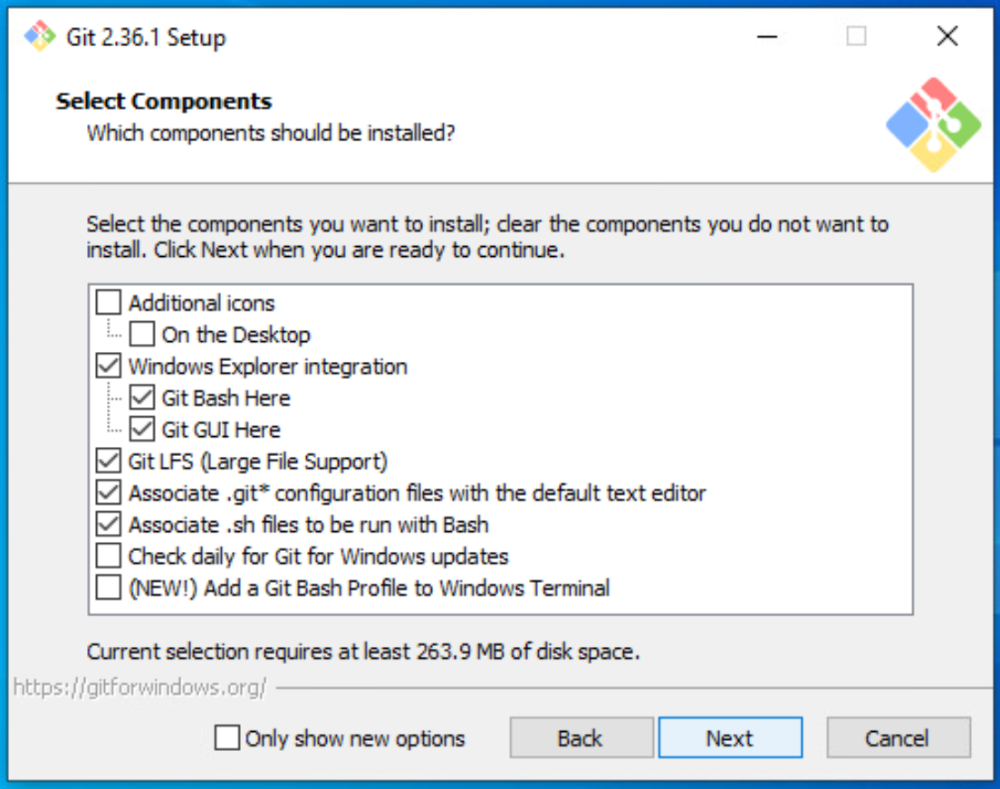
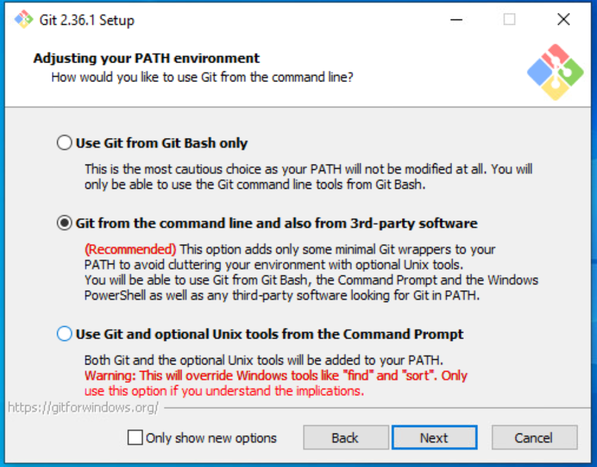
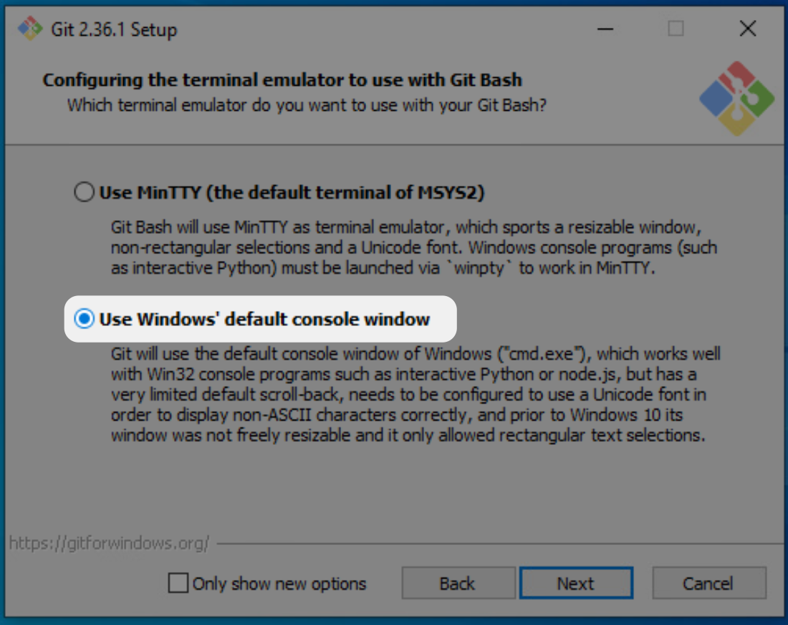
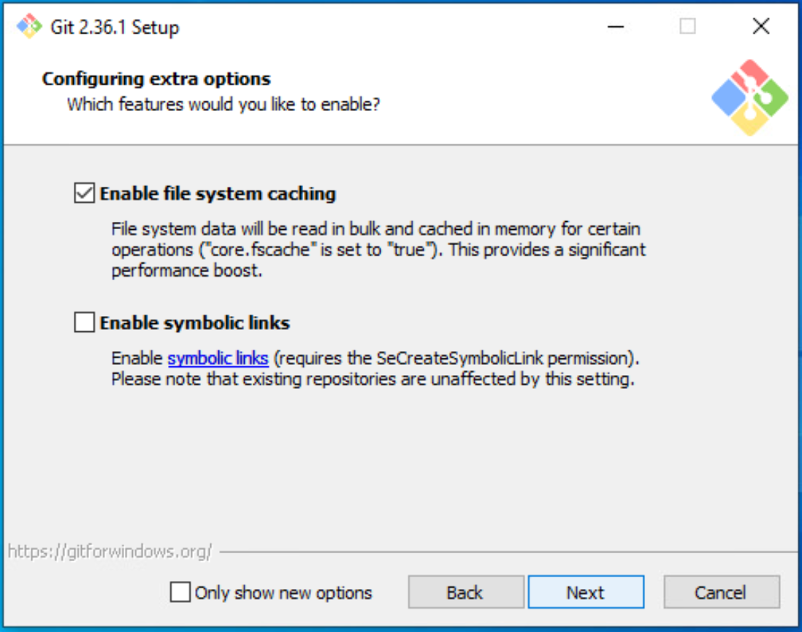
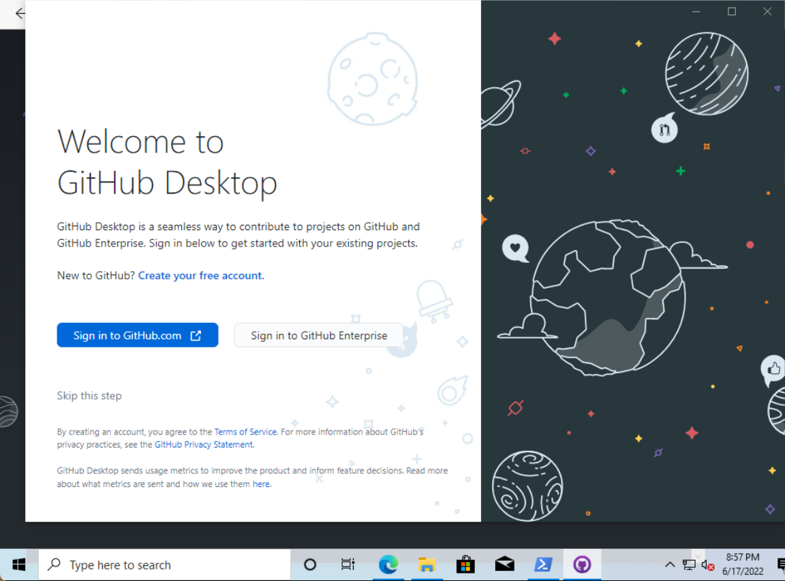
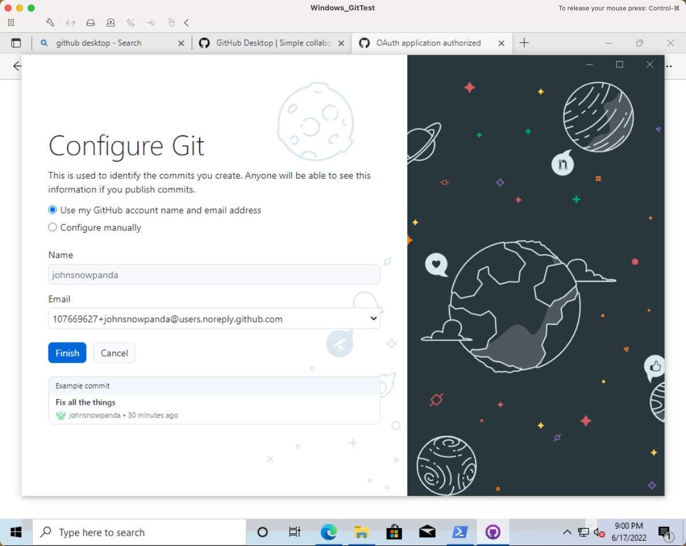

# Git, GitHubとは？ -- 準備ガイド
<!-- markdownlint-disable MD026 -->

これは, 「Git＆GitHubの概要」講義の準備をするためのガイドです。

講義の準備として (順番に)行う手順は次のとおりです。
  1. [GitHub.comアカウント](#githubcomアカウント)
  1. [Visual Studio Code (VS Code) + Command Line](#visual-studio-code-vs-code--command-line)
  1. [Git のインストール](#git-のインストール)
  1. [GitHub Desktop App](#github-desktop-app)
  1. [GitHub Command Line (GitHub CLI)](#github-command-line-github-cli)
  1. [Git を設定する](#git-を設定する)

---

## 概要 <!-- omit in toc -->
* [GitHub.comアカウント](#githubcomアカウント)
  * [Step 1 - GitHub.comアカウントを作成する](#step-1---githubcomアカウントを作成する)
  * [Step 2 - 2要素認証を設定する](#step-2---2要素認証を設定する)
* [Visual Studio Code (VS Code) + Command Line](#visual-studio-code-vs-code--command-line)
* [Git のインストール](#git-のインストール)
  * [MacOS - Git のインストール](#macos---git-のインストール)
  * [Windows 10 - Git のインストール](#windows-10---git-のインストール)
* [GitHub Desktop App](#github-desktop-app)
* [GitHub Command Line (GitHub CLI)](#github-command-line-github-cli)
  * [MacOS - GitHub CLI のインストール](#macos---github-cli-のインストール)
  * [Windows 10 - GitHub CLI のインストール](#windows-10---github-cli-のインストール)
* [Git を設定する](#git-を設定する)
* [次のセクション](#次のセクション)

---

## GitHub.comアカウント

### Step 1 - GitHub.comアカウントを作成する
ここでサインアップして, GitHub.comアカウントを作成します。
* [github.com/join](https://github.com/join)  

プロフィール写真に使用できる無料の画像については, unsplash.comをおすすめします：
* [unsplash.com/s/photos/cute](https://unsplash.com/s/photos/cute)
* [unsplash.com/s/photos/profile-dog](https://unsplash.com/s/photos/profile-dog)
* [unsplash.com/collections/410090/animals](https://unsplash.com/collections/410090/animals)

### Step 2 - 2要素認証を設定する
1. GitHub.com の `Two-factor authentication` 設定画面に移動します: [github.com/settings/security](https://github.com/settings/security)
     * Click on the `Enable two-factor authentication` button
     * `Enable two-factor authentication` (2要素認証を有効にする) ボタンをクリックします
     * `Set up using an app` (アプリを使用して設定する) オプションを選択し, `Continue` (続行) ボタンをクリックします
1. 二要素認証アプリでQRコードをスキャンする
      * おすすめの二要素認証アプリ:
        * [1Password](https://1password.com/)
        * [Microsoft](https://www.microsoft.com/en-us/account/authenticator)
        * [Authy](https://authy.com/guides/github/)
        * [Enpass](https://www.enpass.io/)
1. 二要素認証アプリから6桁のコードを入力します
1. リカバリコードをダウンロードして, `I have saved my recovery codes` (リカバリコードを保存しました) ボタンをクリックします
1. 最後に, `Done` (完了) ボタンをクリックします

これがステップ2のセクションを案内するgifです
* 

#### ドキュメンテーション <!-- omit in toc -->
* GitHub ドキュメンテーション: [2 要素認証を設定する](https://help.github.com/ja/github/authenticating-to-github/configuring-two-factor-authentication)
* YouTube: [GitHubで2FAをセットアップする方法 / How to setup 2FA with GitHub](https://youtu.be/5DKqXeorDHY)

---

## Visual Studio Code (VS Code) + Command Line
Visual Studio Codeダウンロードリンク：
* [code.visualstudio.com](https://code.visualstudio.com/)

コマンドラインからVSCodeを開く機能を設定します。
1. VSCodeAppを起動します
1. 次のショートカットを使用して `Command Palette` (コマンドパレット) を開きます。
    * Mac: `Command` + `Shift` + `P`
    * Windows: `Ctrl` + `Shift` + `P`
1. `shell` をタイプして `Shell Command: Install 'code' command in PATH` オプションを選択します
    * 
1. ターミナルを再起動します
1. ターミナルで,  `code .`と入力して, VSCodeで現在のフォルダーを開きます
    * Mac: [ターミナル](https://support.apple.com/ja-jp/guide/terminal/welcome/mac) を使う
    * Windows: [Command Prompt](https://en.wikipedia.org/wiki/Cmd.exe) を使う

---

## Git のインストール

### MacOS - Git のインストール
1. 次のコマンドで [Homebrew (brew.sh)](https://brew.sh/) をインストールします。

    ```shell
    /bin/bash -c "$(curl -fsSL https://raw.githubusercontent.com/Homebrew/install/HEAD/install.sh)"
    ```

1. 新しいパッケージをインストールする前に,  `brew` を更新およびアップグレードします

    ```sh
    brew update && brew upgrade
    ```

1. Homebrew で git をインストール

    ```sh
    brew install git
    ```

1. インストールの確認

    ```sh
    git --version

    # Gitのバージョンが表示されれば成功です
    git version 2.36.1
    ```

#### デバッグ <!-- omit in toc -->

|                                  |                                       |
| -------------------------------- | ------------------------------------- |
| もし次の結果が返ってきた場合     | `git version 1.7.10.2 (Apple Git-33)` |
| このコマンドを実行してください！ | `brew link --force git`               |
| またはこちらを実行してください！ | `export PATH=/usr/local/bin:$PATH`    |

詳細: [Git - Gitのインストール](https://git-scm.com/book/ja/v2/%E4%BD%BF%E3%81%84%E5%A7%8B%E3%82%81%E3%82%8B-Git%E3%81%AE%E3%82%A4%E3%83%B3%E3%82%B9%E3%83%88%E3%83%BC%E3%83%AB)

#### これで, Git をインストールする準備が整いました <!-- omit in toc -->
次のセクションは [GitHub Desktop App](#github-desktop-app) です

---

### Windows 10 - Git のインストール
1. [gitforwindows.org](https://gitforwindows.org/) に行ってWindowsのgitをインストールします。
1. **次の設定を除いて**, インストールウィザードのデフォルト設定を受け入れます。
    1. `Choosing the default editor used by Git` 設定で, `Use Visual Studio Code as Git's default editor` オプションを選択します
    1. [Gitで使用されるデフォルトのエディターを選択する]設定で, [VisualStudioCodeをGitのデフォルトのエディターとして使用する]オプションを選択します
    1. `Adjusting the name of the initial branch in new repositories` 設定で, `Override the default branch name for new repositories` オプションを選択します
    1. `Configuring the line ending conversions` 設定で, `Checkout as is, commit as is` オプションを選択します
    1. `Configuring the terminal emulator to use with Git Bash` 設定で, `Use Windows's default console window` オプションを選択します
    1. 最後の設定ページで, `Launch Git Bash` (Git Bashの起動) オプションを選択し,  `View Release Notes` (リリースノートの表示) オプションの選択を解除します

#### インストールウィザード設定のスクリーンショット <!-- omit in toc -->
デフォルト以外の設定が強調表示されます。

  |                                                            |                                                            |
  | ---------------------------------------------------------- | ---------------------------------------------------------- |
  |    |    |
  |    |    |
  |    |    |
  |    |    |
  |    |  |
  |  |  |
  |  |  |

#### これで, Git をインストールする準備が整いました <!-- omit in toc -->
次のセクションは [GitHub Desktop App](#github-desktop-app) です

---

## GitHub Desktop App

1. ここから GitHub デスクトップアプリをダウンロードします: [desktop.github.com](https://desktop.github.com/)
1. 次に, `Sign in to GitHub.com` (GitHub.comにサインイン) ボタンをクリックします
1. ブラウザウィンドウが起動します
1. 以下のスクリーンショットに従って,  GitHub.com アカウントにログインします。

      | 1                                                    | 2                                                    | 3                                                    | 4                                                    | 5                                                    | 6                                                    |
      | ---------------------------------------------------- | ---------------------------------------------------- | ---------------------------------------------------- | ---------------------------------------------------- | ---------------------------------------------------- | ---------------------------------------------------- |
      |  |  |  |  |  |  |

GitHub デスクトップアプリのドキュメント:
* English: [GitHub Desktop - GitHub Docs](https://docs.github.com/en/desktop)
* 日本語: [GitHub Desktopのドキュメント](https://docs.github.com/ja/desktop)

---

## GitHub Command Line (GitHub CLI)
GitHubコマンドライン (GitHub CLI)

### MacOS - GitHub CLI のインストール
1. 新しいパッケージをインストールする前に, brewを更新およびアップグレードします

    ```shell
    brew update && brew upgrade
    ```

1. 次のコマンドを使用して [GitHub CLI](https://cli.github.com/) をインストールします。

    ```shell
    brew install gh
    ```

1. GitHub CLI を使用する前にコンピューターを再起動してください

#### これで, GitHub CLI をインストールする準備が整いました <!-- omit in toc -->
次のセクションは [Git を設定する](#git-を設定する) です

### Windows 10 - GitHub CLI のインストール

1. Install [GitHub CLI](https://cli.github.com/) by going to [cli.github.com](https://cli.github.com) and clicking on the `Download for Windows` button
1. [cli.github.com](https://cli.github.com) に行って, `Download for Windows` ボタンをクリックして, [GitHub CLI](https://cli.github.com/) をインストールします
1. インストールウィザードのデフォルト設定を受け入れます
1. GitHub CLI を使用する前にコンピューターを再起動してください

#### これで, GitHub CLI をインストールする準備が整いました <!-- omit in toc -->
次のセクションは [Git を設定する](#git-を設定する) です

---

## Git を設定する
GitHub CLI の `gh auth login` コマンドを使用して GitHub ログインを構成します

git コマンド (`git`) と GitHub CLI コマンド (`gh`) はこちらを使って実行します:
* Mac: [ターミナル](https://support.apple.com/ja-jp/guide/terminal/welcome/mac) を使う
* Windows: [Command Prompt](https://en.wikipedia.org/wiki/Cmd.exe) を使う

コンピューターに git を設定するには, 次の手順を実行します:
1. `gh auth login` コマンドを実行します
1. `What account do you want to log into?` プロンプトで, `GitHub.com` オプションを選択します
1. `What is your preferred protocol for Git operations?` プロンプトで, `HTTPS` オプションを選択します
1. `Authenticate Git with your GitHub credentials? (Y/n)` プロンプトで, `y`と入力します
1. 9文字のコードをコピーして, `enter` キーを押します
1. ブラウザウィンドウが起動します
1. GitHub Webサイトに9文字のコードを入力します
1. `Authorize` ボタンをクリックします
1. 次のコマンドで設定を確認します。

    ```shell
    git config --global --list
    ```

---

## 次のセクション
[基本と設定 - 01_Start.md](01_Start.md) へ 💪
