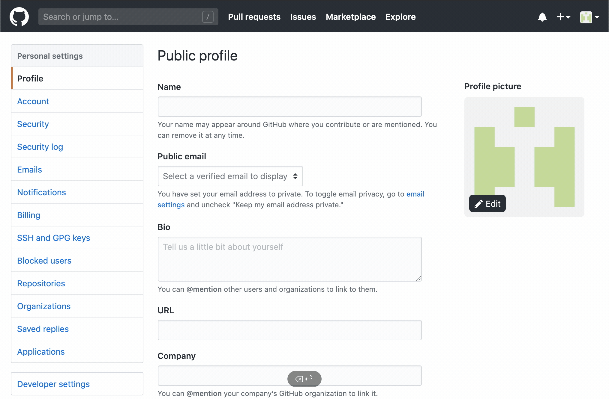
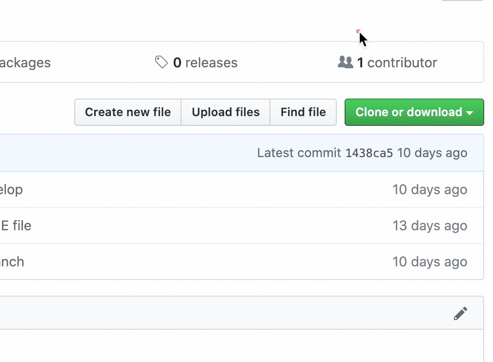

# Git, GitHubとは？ - 準備ガイド

これは、Git, GitHub の導入レクチャーに向けて準備するためのガイドです。

GitHub アカウントを持っていない場合は、[GitHubアカウント](#githubアカウント) セクションに従って作成してください。

PC に Git がインストールされていない場合は, [macOS](#macos---gitのインストール) または [Windows](#windows-10---gitのインストール) のインストール ガイドに従ってください。

---

## 概要 <!-- omit in toc -->
- [GitHub.comアカウント](#githubcomアカウント)
    - [Step 1 - GitHub.comアカウントを作成する](#step-1---githubcomアカウントを作成する)
    - [Step 2 - 2要素認証を設定する](#step-2---2要素認証を設定する)
    - [Step 3 - コマンドラインの個人アクセストークン](#step-3---コマンドラインの個人アクセストークン)
  - [Visual Studio Code (VS Code) + Command Line](#visual-studio-code-vs-code--command-line)
  - [MacOS - Gitのインストール](#macos---gitのインストール)
  - [Windows 10 - Gitのインストール](#windows-10---gitのインストール)
  - [Gitの設定をする](#gitの設定をする)

---

## GitHub.comアカウント

### Step 1 - GitHub.comアカウントを作成する
  - [github.com/join](https://github.com/join)  


### Step 2 - 2要素認証を設定する
  1. GitHub.comの設定画面に移動します: [github.com/settings/security](https://github.com/settings/security)
     - `Two-factor authentication` (2要素認証) の下で`Enable two-factor authentication` (2要素認証の有効化) をクリックしてください。
     - `Two-factor authentication` のページで、`Set up using an app` をクリックします。
  2. Authenticator Appを作成する
     - 提案: [Microsoft](https://www.microsoft.com/en-us/account/authenticator), [Authy](https://authy.com/guides/github/), [Enpass](https://www.enpass.io/)

#### Resources <!-- omit in toc -->
  - GitHub Help Doc: [2 要素認証を設定する](https://help.github.com/ja/github/authenticating-to-github/configuring-two-factor-authentication)
  - YouTube: [How to setup 2FA with GitHub](https://youtu.be/5DKqXeorDHY)


### Step 3 - コマンドラインの個人アクセストークン  

  1. パーソナルアクセストークンを作成する  
     - Settings > Developer settings > Personal access tokens
     - [github.com/settings/tokens/new](https://github.com/settings/tokens/new)  
  2. このtokenはターミナル経由でGitHubアカウントにアクセスする時に使用します  
     - Passwordの代わりにトークンを使用します
     - ユースケースごとにtokenを生成します

  3. GitHubの検証のためのtokenを作って保存してください。


#### Resources <!-- omit in toc -->
  - GitHub Docs: [個人アクセストークンを使用する](https://docs.github.com/ja/github/authenticating-to-github/creating-a-personal-access-token)

---

## Visual Studio Code (VS Code) + Command Line
コマンドラインからVSコードを実行する
  - VS Code を開く
  - Command Paletteを開く
  - `Command` \+ `Shift` \+ `P`
  - Shellと入力して& Shell Command: `Install code in PATH`を選択する
  - Terminalを再起動する
  - `code .` と入力することでVSCodeが開きます

Visual Studio Code Download Link:  
[code.visualstudio.com](https://code.visualstudio.com/)


---

## MacOS - Gitのインストール

手順:
  - [Step 0: Homebrewの確認](#step-0-homebrewの確認)
  - [Step 1: 新しいパッケージをインストールする前にはアップデートとアップグレードしましょう](#step-1-新しいパッケージをインストールする前にはアップデートとアップグレードしましょう)
  - [Step 2: Homebrew で git をインストール](#step-2-homebrew-で-git-をインストール)
  - [Step 3: インストールの確認](#step-3-インストールの確認)
  - [Gitのバージョンが表示されれば成功です](#gitのバージョンが表示されれば成功です)
  - [Debugging](#debugging)

### Step 0: Homebrewの確認
インストールされていなければ、最初に [Homebrew (brew.sh)](https://brew.sh/) をインストールします。

```sh
/bin/bash -c "$(curl -fsSL https://raw.githubusercontent.com/Homebrew/install/HEAD/install.sh)"
```

### Step 1: 新しいパッケージをインストールする前にはアップデートとアップグレードしましょう

```sh
brew update && brew upgrade
```

### Step 2: Homebrew で git をインストール

```sh
brew install git
```

### Step 3: インストールの確認

```sh
git --version
```

### Gitのバージョンが表示されれば成功です

```sh
git version 2.31.1
```

### Debugging

|                                  |                                       |
| -------------------------------- | ------------------------------------- |
| もし次の結果が返ってきた場合     | `git version 1.7.10.2 (Apple Git-33)` |
| このコマンドを実行してください！ | `brew link --force git`               |
| またはこちらを実行してください！ | `export PATH=/usr/local/bin:$PATH`    |

詳細: [Git - Gitのインストール](https://git-scm.com/book/ja/v2/%E4%BD%BF%E3%81%84%E5%A7%8B%E3%82%81%E3%82%8B-Git%E3%81%AE%E3%82%A4%E3%83%B3%E3%82%B9%E3%83%88%E3%83%BC%E3%83%AB)

### これで、Git をインストールする準備が整いました
[Git セットアップ](#git-setup) セクションまでスキップして、プロセスを完了してください!

---

## Windows 10 - Gitのインストール

手順:
  - [インストール Windows Subsystem for Linux (WSL)](#インストール-windows-subsystem-for-linux-wsl)
    - [手順](#手順)
    - [Step 1: Linux 用 Windows サブシステムを有効にする](#step-1-linux-用-windows-サブシステムを有効にする)
    - [Step 2: WSL 2 の実行に関する要件を確認する](#step-2-wsl-2-の実行に関する要件を確認する)
    - [Step 3: 仮想マシンの機能を有効にする](#step-3-仮想マシンの機能を有効にする)
    - [Step 4: Linux カーネル更新プログラム パッケージをダウンロードする](#step-4-linux-カーネル更新プログラム-パッケージをダウンロードする)
    - [Step 5: WSL 2 を既定のバージョンとして設定する](#step-5-wsl-2-を既定のバージョンとして設定する)
    - [Step 6: 選択した Linux ディストリビューションをインストールする](#step-6-選択した-linux-ディストリビューションをインストールする)
  - [WSLの初期化](#wslの初期化)
  - [Windows と WSL の間でコピーと貼り付けを有効にする (Ubuntu)](#windows-と-wsl-の間でコピーと貼り付けを有効にする-ubuntu)
  - [Gitをインストールする](#gitをインストールする)
  - [WSLを構成する](#wslを構成する)
  - [WSL & VS Code](#wsl--vs-code)
  - [Ubuntuの日本語版](#ubuntuの日本語版)
  - [Git + GitHub設定](#git--github設定)
  - [設定を確認](#設定を確認)
  - [VS Code + Explorer](#vs-code--explorer)
  - [Windows + WLS と GitHub](#windows--wls-と-github)

---


### インストール Windows Subsystem for Linux (WSL)

#### 手順
  - Step 1: Linux 用 Windows サブシステムを有効にする
  - Step 2: WSL 2 の実行に関する要件を確認する
  - Step 3: 仮想マシンの機能を有効にする
  - Step 4: Linux カーネル更新プログラム パッケージをダウンロードする
  - Step 5: WSL 2 を既定のバージョンとして設定する
  - Step 6: 選択した Linux ディストリビューションをインストールする

#### Resources <!-- omit in toc -->
  - [Windows 10 に WSL をインストールする](https://docs.microsoft.com/ja-jp/windows/wsl/install-win10)
  - [Install WSL on Windows 10](https://docs.microsoft.com/en-us/windows/wsl/install-win10)


#### Step 1: Linux 用 Windows サブシステムを有効にする

Windows 上に Linux ディストリビューションをインストールする前に、まず "Linux 用 Windows サブシステム" オプション機能を有効にする必要があります。

**管理者として** PowerShell を開き、以下を実行します。


```powershell
dism.exe /online /enable-feature /featurename:Microsoft-Windows-Subsystem-Linux /all /norestart
```

プロンプトが表示されたらコンピュータを再起動します。


#### Step 2: WSL 2 の実行に関する要件を確認する
  - 必ずWindows OSを更新してください
  - Windows 10 Version1709 (OS build16299) 以降である必要があります。
  - Windows OS 確認し方
    - `Start` ボタン > `Settings` > `Update & Security` > `Windows Update`
    - 


#### Step 3: 仮想マシンの機能を有効にする
  - "仮想マシン プラットフォーム" オプション機能を有効にする必要があります。
  - この機能を使用するには、コンピューターに仮想化機能が必要です。
  - 管理者として PowerShell を開き、以下を実行します。

    ```powershell
    dism.exe /online /enable-feature /featurename:VirtualMachinePlatform /all /norestart
    ```

  - お使いのマシンを 再起動 して WSL のインストールを完了し、WSL 2 に更新します。


#### Step 4: Linux カーネル更新プログラム パッケージをダウンロードする
1. 最新のパッケージをダウンロードします。
   - [x64 マシン用 WSL2 Linux カーネル更新プログラム パッケージ](https://wslstorestorage.blob.core.windows.net/wslblob/wsl_update_x64.msi)
2. 前の手順でダウンロードした更新プログラム パッケージを実行します。
   - ダブルクリックして実行します。管理者特権のアクセス許可を求めるメッセージが表示されます。
   - `はい` を選択して、このインストールを承認します。


#### Step 5: WSL 2 を既定のバージョンとして設定する
新しい Linux ディストリビューションをインストールする際の既定のバージョンとして `WSL 2` を設定します。  
PowerShell を開いて次のコマンドを実行:

```powershell
wsl --set-default-version 2
```


#### Step 6: 選択した Linux ディストリビューションをインストールする
`Ubuntu 18.04 LTS`で検索してLinux ディストリビューションをインストール
  - [Ubuntu 18.04 LTS を入手 - Microsoft Store](https://www.microsoft.com/store/apps/9N9TNGVNDL3Q)

---

### WSLの初期化

1. ディストリビューションを起動します（Ubuntu 18.04）
   - `Microsoft Store`アプリの `起動` ボタンをクリックします
     - 新しくインストールした Linux ディストリビューションを初めて起動すると、コンソール ウィンドウが開き、ファイルが圧縮解除されて PC に格納されるまで 1~2 分待つように求められます。
     - 今後のすべての起動には、1 秒もかかりません。
2. 新しいLinuxユーザーアカウントの設定
   - このユーザーアカウントは Windows ユーザー名に影響しません
   - `sudo` コマンドを実行するときにこの設定されたパスワードが必要です

```sh
... this may take a few minutes...
Please create a default UNIX user account. The username does not need to match your Windows username.
For more information visit: https://aka.ms/wslusers

Enter new UNIX username: panda
Enter new UNIX password:
Retype new UNIX password:

passwd: password updated successfully
Installation successful!
To run a command as administrator (user "root"), use "sudo <command>".
See "man sudo_root" for details.
```

#### Resources <!-- omit in toc -->
  - Microsoft Docs: [Linux ディストリビューションのユーザー アカウントを作成する](https://docs.microsoft.com/ja-jp/windows/wsl/user-support)
  - Microsoft Docs: [Create user account for Linux distribution](https://docs.microsoft.com/en-us/windows/wsl/user-support)

---

### Windows と WSL の間でコピーと貼り付けを有効にする (Ubuntu)
Ubuntu ウインドウの上タブの部分で右クリックします．

| English Settings                                                                                               | 日本語 設定                                                                                                                         |
| -------------------------------------------------------------------------------------------------------------- | ----------------------------------------------------------------------------------------------------------------------------------- |
| Ubuntu の Properties > `Options` > `Edit Options` <br> `Use Ctrl+Shift+C/V as Copy/Paste` プションを有効にする | Ubuntu の `プロパティ` > `オプション` > `編集オプション` <br> `Ctrl+Shift+C/V をコピー/貼り付けとして使用する` プションを有効にする |
|                                            |                                                                           |

---

### Gitをインストールする
1. ディストリビューションのパッケージを更新してアップグレードする
   - 「`続行しますか？[Y / n]`」と尋ねられたら、`Y` を入力します。

   ```sh
   sudo apt update && sudo apt upgrade
   ```

2. gitをインストールする

   ```sh
   sudo apt install git
   ```

---

### WSLを構成する
[wslgit](https://github.com/hangxingliu/wslgit) は Git のすべてのリクエストをWSLに転送するツールです．

1. [wslgit](https://github.com/hangxingliu/wslgit) リポジトリをダウンロードする

   ```sh
   git clone https://github.com/hangxingliu/wslgit
   ```

2. `wslgit` フォルダー内に移動

   ```sh
   cd wslgit/
   ```

3. `wslgit.sh` ファイルを `/usr/bin` のWSL実行可能ファイルの場所に移動します

   ```sh
   sudo mv wslgit.sh /usr/bin/wslgit.sh
   ```

4. ホームフォルダーに戻る

```sh
cd
```

---

### WSL & VS Code
1. [Remote - WSL VS Code Extension](https://marketplace.visualstudio.com/items?itemName=ms-vscode-remote.remote-wsl)をインストール
   - 

2. VSコード設定に移動して、`git.path` オブジェクトを変更します。
   - VS Code > File > Preferences > Setting
   - `git.path` を検索
   - `Edit in settings.json` をクリック

3. `REPLACE_WITH_WindowsUSER` と `REPLACE_WITH_UbuntuUSER` を独自のものに置き換えます。

テンプレート

```json
"C:\Users\REPLACE_WITH_WindowsUSER\AppData\Local\Packages\CanonicalGroupLimited.Ubuntu18.04onWindows_79rhkp1fndgsc\LocalState\rootfs\home\REPLACE_WITH_UbuntuUSER\wslgit\git.bat"
```

Windows ユーザー名として `a01234`, Ubuntu ユーザー名として `PANDA` を使用する例

```json
{
    "git.path": "C:\Users\a01234\AppData\Local\Packages\CanonicalGroupLimited.Ubuntu18.04onWindows_79rhkp1fndgsc\LocalState\rootfs\home\PANDA\wslgit\git.bat"
}
```

### Ubuntuの日本語版

1. 日本語パックをインストールする

   ```sh
   sudo apt -y install language-pack-ja
   ```

2. 日本語のマニュアルをインストールする

   ```sh
   sudo apt -y install manpages-ja manpages-ja-dev
   ```

3. 現地の言語を日本語に設定する

   ```sh
   sudo update-locale LANG=ja_JP.UTF8
   ```

4. Ubuntuを再起動します

### Git + GitHub設定

1. Ubuntu 中で SSHキーを生成する
   - GitHubとのリンクが必要です
   - 質問は空白のままにして、そのまま入力してください

   ```sh
   ssh-keygen

   Generating public/private rsa key pair.
   Enter file in which to save the key (/home/user/.ssh/id_rsa):
   Created directory '/home/user/.ssh'.
   Enter passphrase (empty for no passphrase):
   Enter same passphrase again:
   Your identification has been saved in /home/user/.ssh/id_rsa.
   Your public key has been saved in /home/user/.ssh/id_rsa.pub.
   …
   ```

2. キーをクリップボードにコピーします
   - これは、GitHub.comの設定ページに貼り付ける必要があります。

   ```sh
   cat ~/.ssh/id_rsa.pub|clip.exe
   ```

3. GitHub で新しい SSH キー を生成する
   - [New SSH key ボタン](https://github.com/settings/ssh/new)
   - タイトルにWindows WSLと入力します.
  - 公開キー (public key) を貼り付けます
    - `Add SSH key` ボタン



### 設定を確認

次のコマンドで設定を確認します

```sh
ssh -T git@github.com
```

```terminal
The authenticity of host 'github.com (13.114.40.48)' can't be established.
RSA key fingerprint is SHA256:xxx.
Are you sure you want to continue connecting (yes/no)? yes

Warning: Permanently added 'github.com,13.114.40.48' (RSA) to the list of known hosts.
Hi ahandsel! You've successfully authenticated, but GitHub does not provide shell access.
```

---

### VS Code + Explorer

現在のLinuxフォルダーからエクスプローラーを開くには、次のように入力します。
  - `explorer.exe .`

現在のLinuxフォルダーからVS Codeを開くには、次のように入力します。
  - エラーがある場合は、UbuntuとVSコードを再起動してください
  - `code .`

### Windows + WLS と GitHub

HTTPSを使用する代わりに --> SSHを使用

```sh
git clone https://github.com/.../a.git

git clone git@github.com:.../a.git
```



### これで、Git をインストールする準備が整いました
[Git セットアップ](#git-setup) セクションまでスキップして、プロセスを完了してください!

---

## Gitの設定をする
  - `git config` コマンドを使用して、Gitのユーザー名とメールを設定します。
  - `GitHub_UserName` と `example@email.com` 以下を自分のものに置き換えてください
  - Mac : Terminalを使用
  - Windows : Ubuntuを使用

```sh
git config --global user.name "GitHub_UserName"
git config --global user.email "example@email.com"
git config --global color.ui auto
```

設定が有効になったことを確認しましょう

```sh
git config --global --list
```

詳細: [Git - 最初のGitの構成](https://git-scm.com/book/ja/v2/%E4%BD%BF%E3%81%84%E5%A7%8B%E3%82%81%E3%82%8B-%E6%9C%80%E5%88%9D%E3%81%AEGit%E3%81%AE%E6%A7%8B%E6%88%90)

---

## 次の [基本と設定 - 01_Start.md](01_Start.md) へ!

---

## GitHub Desktop App

今後のハンズオン セクションは端末で行われます.  
ただし、プロジェクトで実際に Git と GitHub を使用する場合は、GitHub デスクトップ アプリの方が便利な場合があります.

ここから GitHub Desktop アプリをダウンロードできます:  
[GitHub Desktop | Simple collaboration from your desktop](https://desktop.github.com/)

GitHub Desktop アプリに関するドキュメンツはこちらです:  
[GitHub Desktopのドキュメント](https://docs.github.com/ja/desktop)
