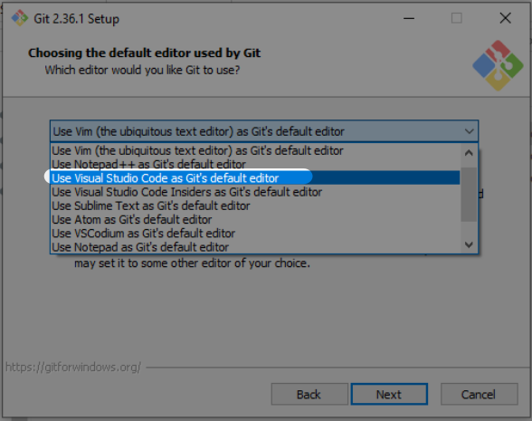

# What is Git & GitHub? -- Prep Guide
<!-- markdownlint-disable MD026 -->

This is a guide to get you ready for the `Intro to Git & GitHub` lecture.

Here are the four things you have to install and setup before the lecture (in order):
  1. [GitHub.com Account](#githubcom-account)
  1. [Visual Studio Code (VS Code) + Command Line](#visual-studio-code-vs-code--command-line)
  1. [Install Git](#install-git)
  1. [GitHub Desktop App](#github-desktop-app)
  1. [GitHub Command Line (GitHub CLI)](#github-command-line-github-cli)
  1. [Set Up Git](#set-up-git)

## Outline <!-- omit in toc -->
* [GitHub.com Account](#githubcom-account)
  * [Step 1 - Create a GitHub.com Account](#step-1---create-a-githubcom-account)
  * [Step 2 - Set up Two-Factor Authentication](#step-2---set-up-two-factor-authentication)
* [Visual Studio Code (VS Code) + Command Line](#visual-studio-code-vs-code--command-line)
* [Install Git](#install-git)
  * [Install Git for MacOS](#install-git-for-macos)
    * [Debugging](#debugging)
  * [Install Git for Windows 10](#install-git-for-windows-10)
    * [Settings to change from the default](#settings-to-change-from-the-default)
    * [Japanese step-by-step guide](#japanese-step-by-step-guide)
* [GitHub Desktop App](#github-desktop-app)
* [GitHub Command Line (GitHub CLI)](#github-command-line-github-cli)
  * [GitHub CLI for MacOS](#github-cli-for-macos)
  * [GitHub CLI for Windows](#github-cli-for-windows)
* [Set Up Git](#set-up-git)
* [Next section - Basics and Settings](#next-section---basics-and-settings)

---

## GitHub.com Account

### Step 1 - Create a GitHub.com Account
* [github.com/join](https://github.com/join)  

### Step 2 - Set up Two-Factor Authentication
1. Open GitHub.com's `Two-factor authentication` settings: [github.com/settings/security](https://github.com/settings/security)
    * Click on the `Enable two-factor authentication` button
    * Select `Set up using an app` option and click the `Continue` button
2. Scan the QR Code with a two-factor authentication app
    * Two-factor authentication app suggestions:
      * [Microsoft](https://www.microsoft.com/en-us/account/authenticator)
      * [Authy](https://authy.com/guides/github/)
      * [Enpass](https://www.enpass.io/)
3. Enter the 6-digit code from the two-factor authentication app
4. Download the recovery codes and click the `I have saved my recovery codes` button
5. Finally, click the `Done` button

Here is a gif that goes over Step 2:  
* 

### Resources <!-- omit in toc -->
* GitHub Help Doc: [Configuring two-factor authentication - GitHub Docs](https://docs.github.com/en/authentication/securing-your-account-with-two-factor-authentication-2fa/configuring-two-factor-authentication)
* YouTube: [How to setup 2FA with GitHub](https://youtu.be/5DKqXeorDHY)

---

## Visual Studio Code (VS Code) + Command Line
Install VS Code
* [code.visualstudio.com](https://code.visualstudio.com/)

Open VS Code from the command line
* Launch VS Code App
* Open the `Command Palette` with the following shortcut:
  * Mac: `Command` + `Shift` + `P`
  * Windows: `Ctrl` + `Shift` + `P`
* Type `shell` and select the `Shell Command: Install 'code' command in PATH` option
  * 
* Restart the Terminal
* In the Terminal, type `code .` to open the current folder in VS Code

---

## Install Git

### Install Git for MacOS

1. Install [Homebrew (brew.sh)](https://brew.sh/) with the following command:

    ```shell
    /bin/bash -c "$(curl -fsSL https://raw.githubusercontent.com/Homebrew/install/HEAD/install.sh)"
    ```

1. Update and upgrade brew before installing new packages

    ```shell
    brew update && brew upgrade
    ```

1. Install git with Homebrew

    ```shell
    brew install git
    ```

1. Confirm the install by checking the git version

    ```shell
    git --version

    # If you see this, you are all set!
    git version 2.36.1
    ```

#### Debugging

|                                     |                                       |
| ----------------------------------- | ------------------------------------- |
| If the following result is returned | `git version 1.7.10.2 (Apple Git-33)` |
| Run this command!                   | `brew link --force git`               |
| Or do this!                         | `export PATH=/usr/local/bin:$PATH`    |

#### Now you are ready! <!-- omit in toc -->

Skip to the [GitHub Desktop App](#github-desktop-app) section and complete the process!

---

### Install Git for Windows 10

1. Install git for windows from [gitforwindows.org](https://gitforwindows.org/)
1. Accept the Installation Wizard's default setting EXCEPT for the following settings:
    1. For `Choosing the default editor used by Git` setting, select `Use Visual Studio Code as Git's default editor` option
    1. For `Adjusting the name of the initial branch in new repositories` setting, select `Override the default branch name for new repositories` option
    1. For `Configuring the line ending conversions` setting, select `Checkout as is, commit as is` option
1. Launch `Git Bash` to confirm installation was successful

#### Settings to change from the default

| 1                                              | 2                                              | 3                                              |
| ---------------------------------------------- | ---------------------------------------------- | ---------------------------------------------- |
|  |  |  |


#### Japanese step-by-step guide

Watch this video for a step-by-step guide on the installation process:
* [youtube.com/watch?v=Ceq4yFGF3Qk&t=153s](https://www.youtube.com/watch?v=Ceq4yFGF3Qk&t=153s)

#### Now you are ready! <!-- omit in toc -->

Skip to the [GitHub Desktop App](#github-desktop-app) section and complete the process!

---

## GitHub Desktop App

1. Download the GitHub Desktop App from here: [desktop.github.com](https://desktop.github.com/)
1. Then click the `Sign in to GitHub.com` button
1. A browser window will launch
1. Log into your GitHub.com account by following the screenshots below:

      | 1                                                    | 2                                                    | 3                                                    | 4                                                    | 5                                                    | 6                                                    |
      | ---------------------------------------------------- | ---------------------------------------------------- | ---------------------------------------------------- | ---------------------------------------------------- | ---------------------------------------------------- | ---------------------------------------------------- |
      |  |  |  |  |  |  |

GitHub Desktop App's documentation:
* English: [GitHub Desktop - GitHub Docs](https://docs.github.com/en/desktop)
* Japanese: [GitHub Desktopのドキュメント](https://docs.github.com/ja/desktop)

---

## GitHub Command Line (GitHub CLI)

### GitHub CLI for MacOS

1. Update and upgrade brew before installing new packages

    ```shell
    brew update && brew upgrade
    ```

1. Install [GitHub CLI](https://cli.github.com/) with the following command:

    ```shell
    brew install gh
    ```

1. Restart the computer before using GitHub CLI
1. Go to the [Set Up Git](#set-up-git) section

### GitHub CLI for Windows

1. Install [GitHub CLI](https://cli.github.com/) by going to [cli.github.com](https://cli.github.com) and clicking on the `Download for Windows` button
1. Accept the Installation Wizard's default setting
1. Restart the computer before using GitHub CLI
1. Go to the [Set Up Git](#set-up-git) section

---

## Set Up Git

We will use GitHub CLI's `gh auth login` command to configure the GitHub login

For Mac users:
* Use the [Terminal](https://support.apple.com/guide/terminal/welcome/mac) for both git commands (`git`) and GitHub CLI commands (`gh`)

For Windows users:
* Run GitHub CLI commands (`gh`) with [Command Prompt](https://en.wikipedia.org/wiki/Cmd.exe)
* Run git commands (`git`) with [Git Bash](https://www.atlassian.com/git/tutorials/git-bash)

To set up git for your computer:
1. Run `gh auth login` command
1. For `What account do you want to log into?` prompt, select `GitHub.com` option
1. For `What is your preferred protocol for Git operations?` prompt, select `HTTPS` option
1. For `Authenticate Git with your GitHub credentials? (Y/n)` prompt, type `y`
1. Copy the 9-character code and hit `enter`
1. A browser window will launch
1. Enter the 9-character code to the GitHub website
1. Click the `Authorize` button
1. Confirm settings with the following command:

    ```shell
    git config --global --list
    ```

---

## Next section - Basics and Settings
Go to the [Basics and Settings - 01_Start_EN.md](01_Start_EN.md) section 💪
