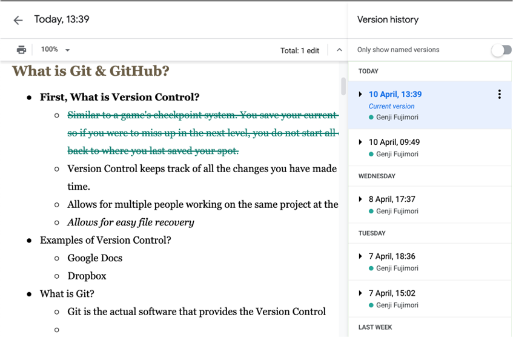

# Git, GitHubとは？ - 基本と設定

  - [コンテンツの目的](#コンテンツの目的)
  - [Overview](#overview)
  - [Git とは…](#git-とは)
    - [バージョン管理とは？](#バージョン管理とは)
    - [バージョン管理の例](#バージョン管理の例)
  - [GitHubとは…](#githubとは)
  - [Hands-On A - 設定](#hands-on-a---設定)
    - [ローカルでの設定](#ローカルでの設定)
    - [Gitの設定をする](#gitの設定をする)
    - [ローカルGitリポジトリを作成する](#ローカルgitリポジトリを作成する)
    - [README.mdファイルの追加](#readmemdファイルの追加)
    - [Gitのステータスを確認する](#gitのステータスを確認する)
    - [ステージングエリアにファイルを追加](#ステージングエリアにファイルを追加)
    - [Gitリポジトリにファイルを追加](#gitリポジトリにファイルを追加)
    - [GitHubリポジトリを作成する](#githubリポジトリを作成する)
    - [Local Git --> GitHub](#local-git----github)
    - [Hands-on Aが完了しました](#hands-on-aが完了しました)
  - [Appendix](#appendix)

## コンテンツの目的
SC本部メンバーが...
  1. Git と GitHub について理解できた
  2. GitHub でコードを管理できるようになった

## Overview
  - Gitの基本
  - GitHubの基本
  - ハンズオン
    - Gitをインストールする.
    - GitHubアカウントを作成する
    - リポジトリを作成する

---

## Git とは…
  - [Git](https://git-scm.com/) とは, ソフトウェア開発のための **バージョン管理** を提供するソフトウェアです.
  - Linux カーネル開発を管理するツールとして2005年に開始.
  - 無料で使えるオープンソースの分散バージョン管理システム.

### バージョン管理とは？

| 履歴                                                    | チームワーク                                            | バックアップ                                            |
| ------------------------------------------------------- | ------------------------------------------------------- | ------------------------------------------------------- |
| 時間とともに加えられていく変更を記録することができます. | 他のシステムを使う開発者と共同作業をすることができます. | 後で特定バージョンを呼び出すことができるようになります. |
|             |             |             |

ゲームのセーブポイント
  - "バージョン管理" は, ゲームのチェックポイント システムに似ています.
  - レベルをクリアすれば, ゲームの現在のレベルを保存します.
  - その後, 万が一乗り遅れた場合でも, 再起動する必要はありません.

### バージョン管理の例

| Google Docs                                              | Kintone                                              |
| -------------------------------------------------------- | ---------------------------------------------------- |
|  |  |

## GitHubとは…

  - [GitHub](https://github.com/) とは共同開発プラットフォームです
  - コードを見たり見せたりできる場所です.
    - Google Docs とちょっと似ていて, いろんな人たちがコードを同時に見たり編集できます.
    - `Remote repositories` (リモートリポジトリ) と聞いたら, GitHub だなっと考えてください.
  - 2008年に設立され, 現在はマイクロソフトの子会社です.

|                                |                                              |                                              |     |
| ------------------------------ | -------------------------------------------- | -------------------------------------------- | --- |
|  |  |  |

---

## Hands-On A - 設定

ローカルでの設定
  - フォルダを作成する.
  - フォルダをgitで管理するように構成する.

GitHub の設定
  - GitHub で "フォルダ" のようなものを作成する.
  - `Repository` (リポジトリ) と呼ばれています.

ローカルと GitHub を接続する
  - 接続するように2つを構成する.
  - ローカル側でファイルを作成して git コマンドを実行すると、ファイルは GitHub に表示されます.

---

### ローカルでの設定

### Gitの設定をする
  - `git config` コマンドを使用して、Gitのユーザー名とメールを設定します。
  - `GitHub_UserName` と `example@email.com` 以下を自分のものに置き換えてください
  - Mac : Terminalを使用
  - Windows : Ubuntuを使用

```sh
git config --global user.name "GitHub_UserName"
git config --global user.email "example@email.com"
git config --global color.ui auto
git config --global --list
```

[Git - 最初のGitの構成](https://git-scm.com/book/ja/v2/%E4%BD%BF%E3%81%84%E5%A7%8B%E3%82%81%E3%82%8B-%E6%9C%80%E5%88%9D%E3%81%AEGit%E3%81%AE%E6%A7%8B%E6%88%90)

### ローカルGitリポジトリを作成する

Document ディレクトリに移動し、 `learning_js` という名前のディレクトリを作成します

```sh
cd Documents
mkdir learning_js
cd learning_js
```

`pwd` コマンドを使用して、正しい場所にいることを確認します

```sh
❯ pwd
/Users/${UserName}/Documents/learning_js
```

`git init` コマンドで git リポジトリを初期化します.

```sh
git init
```

```terminal
Initialized empty Git repository in /Users/${UserName}/Documents/learning_js/.git/
```

Repository (リポジトリ) は, Repo と短縮されて呼ばれることもあります.

---

### git フォルダー内を確認する

```sh
$ pwd
/Users/g001494/Documents/learning_js

$ ls -la
total 8
drwxr-xr-x   4 g001494  staff  128 Jun  9 14:54 .
drwx------@ 20 g001494  staff  640 Jun  8 16:22 ..
drwxr-xr-x  12 g001494  staff  384 Jun  9 14:56 .git
-rw-r--r--   1 g001494  staff   85 Jun  9 14:54 README.md

$ cd .git

$ ls -la
total 40
drwxr-xr-x  12 g001494  staff  384 Jun  9 14:56 .
drwxr-xr-x   4 g001494  staff  128 Jun  9 14:54 ..
-rw-r--r--   1 g001494  staff   20 Jun  9 14:54 COMMIT_EDITMSG
-rw-r--r--   1 g001494  staff   23 Jun  9 14:54 HEAD
-rw-r--r--   1 g001494  staff  316 Jun  9 14:56 config
-rw-r--r--   1 g001494  staff   73 Jun  9 14:54 description
drwxr-xr-x  14 g001494  staff  448 Jun  9 14:54 hooks
-rw-r--r--   1 g001494  staff  137 Jun  9 14:54 index
drwxr-xr-x   3 g001494  staff   96 Jun  9 14:54 info
drwxr-xr-x   4 g001494  staff  128 Jun  9 14:54 logs
drwxr-xr-x   7 g001494  staff  224 Jun  9 14:54 objects
drwxr-xr-x   5 g001494  staff  160 Jun  9 14:56 refs
```

---

### README.mdファイルの追加

README.mdファイルを作成します.

```sh
touch README.md
```

README.md ファイルにリポジトリの説明を追加します.

```sh
vi README.md
```

```markdown
# Learning JS Repo
このフォルダは JavaScript や git の課題で使用します.
```

READMEファイルは、ソフトウェアや git リポジトリの目的や使用方法を説明するために使用されます.

---

### Gitのステータスを確認する

`git status` コマンド
  - 作業ディレクトリとステージングエリアを表示します
  - `Changes to be committed`: どのファイルに変更が加えられているのか確認できます
  - `Untracked files`: どのファイルはgitで追跡していないのかを確認できます

画像を確認すると、README\.mdを追跡する必要があることがわかります。

```sh
git status
```

```sh
On branch master
No commits yet
Untracked files:
  (use "git add <file>..." to include in what will be committed)
 README.md
nothing added to commit but untracked files present (use "git add" to track)
```

### ステージングエリアにファイルを追加

`git add <file/folder>`
  - ファイル/フォルダーをステージングエリアに追加するコマンド

```sh
git add README.md
```

現在README.mdはステージングエリアに存在します

```sh
git status
```

```sh
On branch master
No commits yet
Changes to be committed:
  (use "git rm --cached <file>..." to unstage)
 new file:   README.md
```

### Gitリポジトリにファイルを追加

`git commit -m "message"`
  - ファイル/フォルダをリポジトリに追加するコマンド
  - [Git - git-commit Documentation](https://git-scm.com/docs/git-commit)

README.mdがリポジトリに追加されました!!
  - `README.md` が `master` ブランチに追加されたことが分かります

```sh
git commit -m "README file created"

git status
```

```sh
$ git commit -m "README file created"
[master (root-commit) 03098e7] README file created
 1 file changed, 3 insertions(+)
 create mode 100644 README.md

$ git status
On branch master
nothing to commit, working tree clean
```

### GitHubリポジトリを作成する

リポジトリを作成する
  - [github.com/new](https://github.com/new)

`learning_js` という名前のリポジトリを作成します

READMEでリポジトリを初期化しないでください


### Local Git --> GitHub

repository を `push` しましょう！
GitHub の `Clone or download` ボタンをクリックし, HTTPS リンクをコピーして URL を取得します

`git remote add origin <link>`
  - ローカルリポジトリをGitHubのリモートリポジトリに接続します
  - `git remote` はリモートリポジトリを管理するコマンドです
  - [Git - git-remote Documentation](https://git-scm.com/docs/git-remote#_name)

```sh
git remote add origin https://github.com/ahandsel/learning_js.git
git push -u origin master
```

端末からの結果

```terminal
Enumerating objects: 3, done.
Counting objects: 100% (3/3), done.
Delta compression using up to 4 threads
Compressing objects: 100% (2/2), done.
Writing objects: 100% (3/3), 298 bytes | 298.00 KiB/s, done.
Total 3 (delta 0), reused 0 (delta 0), pack-reused 0
remote: This repository moved. Please use the new location:
remote:   https://github.com/ahandsel/learning_js.git
To https://github.com/ahandsel/learning_js.git
 * [new branch]      master -> master
Branch 'master' set up to track remote branch 'master' from 'origin'.
```

Documentation:
  - [リモートリポジトリを管理する - GitHub Docs](https://docs.github.com/ja/github/getting-started-with-github/getting-started-with-git/managing-remote-repositories)
  - [Git - git-remote Documentation](https://git-scm.com/docs/git-remote)
  - [Git - git-push Documentation](https://git-scm.com/docs/git-push)

---

### Hands-on Aが完了しました

| git を初期化する                        | GitHub を設定する                        | ローカルリポジトリを作成してプッシュする |
| --------------------------------------- | ---------------------------------------- | ---------------------------------------- |
| `git init` <br> `git remote add origin` | [github.com/new](https://github.com/new) | `git status` <br> `git commit -m`        |

---


```sh
git remote --verbose
```

```sh
origin https://github.com/ahandsel/learning_js.git (fetch)
origin https://github.com/ahandsel/learning_js.git (push)
```
