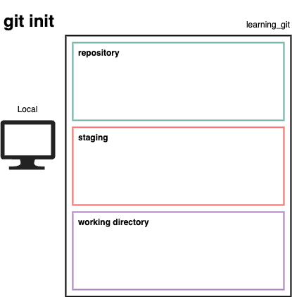
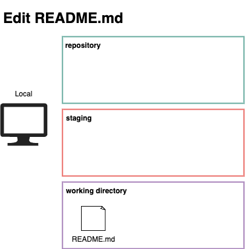

# What is Git & GitHub? -- Basics & First Repo

_🇯🇵 日本語版: [01_Start.md](01_Start.md)_

This section introduces you to Git and GitHub and goes over setting up your first repository.

## Overview
* Git Basics
* GitHub Basics
* Hands-On Section to Create a Repository
* Overview of Common Git Commands

## Outline <!-- omit in toc -->
- [What is Git \& GitHub? -- Basics \& First Repo](#what-is-git--github----basics--first-repo)
  - [Overview](#overview)
  - [What is Git?](#what-is-git)
  - [What is Version Control?](#what-is-version-control)
    - [Examples of Version Control](#examples-of-version-control)
  - [What is GitHub?](#what-is-github)
    - [GitHub Example - Apple](#github-example---apple)
  - [Creating a Repository - Hands-on](#creating-a-repository---hands-on)
    - [Create a Local Repository](#create-a-local-repository)
    - [Add a README.md File](#add-a-readmemd-file)
    - [Confirm the Git Status](#confirm-the-git-status)
  - [Translations Missing!!!](#translations-missing)
  - [Next Section](#next-section)

---

## What is Git?
* [Git](https://git-scm.com/) is a software development tool that provides __version control__!
* Started in 2005 as a tool to manage Linux kernel development
* Free and open source distributed version control system

## What is Version Control?
History ⌛
* Record changes made over time

Teamwork 💪
* Collaborate with developers who use other systems.

Backup 💾
* Be able to restore to a specific version

A Save Point in a Game 📌
* "Version control" is similar to how games save your progress.
* You save your progress once your clear the level.
* After that, even if you make a mistake in the next level, you do not restart the whole game.

### Examples of Version Control

  | Google Docs                                                  | Kintone                                                |
  | ------------------------------------------------------------ | ------------------------------------------------------ |
  |  |  |

## What is GitHub?

* [GitHub](https://github.com/) is a co-development platform
* A place where you can see and show code.
  * Similar to Google Docs, GitHub allows multiple people to view & edit code at the same time.
  * When you hear `Remote repositories`, think GitHub.
* Founded in 2008, it is now a subsidiary of Microsoft.

  |                                                       |                                                  |
  | ----------------------------------------------------- | ------------------------------------------------ |
  |  |  |

### GitHub Example - Apple
Apple has released a set of tools and resources for app developers such as password managers to help them generate strong passwords for free.

[github.com/apple/password-manager-resources](https://github.com/apple/password-manager-resources)

[Apple publishes free resources to improve password security | ZDNet](https://www.zdnet.com/article/apple-publishes-free-resources-to-improve-password-security/)

---

## Creating a Repository - Hands-on
Local Settings
* Create a folder
* Set the folder to be managed by Git

GitHub Settings
* Create a "folder" like thing on GitHub
* It is called a `Repository`

Connect the Local Folder with GitHub
* Configure git so the local folder and GitHub are connected
* Then when you create a file within the folder, it will appear on GitHub.

---

### Create a Local Repository



⚠️ Verify that you went through the Prep Guide: [Prep - 00_Prep_EN.md](00_Prep_EN.md)

⚡ Where to run the commands?
* Mac: Use the [Terminal](https://support.apple.com/guide/terminal/welcome/mac)
* Windows: Use the [Command Prompt](https://en.wikipedia.org/wiki/Cmd.exe)

1. Go to a easily accessible folder (e.g., Documents) and create a folder named `learning_git`

    ```sh
    cd Documents
    mkdir learning_git
    cd learning_git
    ```

1. Use `pwd` command to verify the current location

    ```sh
    pwd

    /Users/YourUserName/Documents/learning_git
    ```

1. Initialize git with `git init` command

    ```sh
    git init

    Initialized empty Git repository in /Users/YourUserName/Documents/learning_git/.git/
    ```

⚡ Repo is short for Repository

---

### Add a README.md File



1. Create a README.md file

    ```sh
    touch README.md
    ```

1. Describe the repo in the README.md file

    ```sh
    vi README.md

    # or

    code README.md
    ```

    ```markdown
    # Learning JS Repo
    A repository for my JavaScript lectures and assignments.
    ```

⚡ README.md describes the software's or the repo's goals and purpose.

---

### Confirm the Git Status

`git status` command
* Shows the __working directory__ and __staging area__
* `Untracked files`: See which files are not being tracked by Git
* `Changes to be committed`: See which files have changed

We can see that README.md file needs to be tracked by Git.

```sh
git status
```

```sh
On branch main
No commits yet
Untracked files:
    (use "git add <file>..." to include in what will be committed)
    README.md

nothing added to commit but untracked files present (use "git add" to track)
```

---
Translations Missing!!!
---

<details>
  <summary>Answers</summary>

1. How is Git & GitHub related?
    * GitHub is the __hub__ or the collection of everyone's Git
    * GitHub is a popular __remote repo__ option
1. Which do you start with, `git add` or `git commit`?
    * First, use `git add` to gather the individual changes
    * Then, use `git commit` to bundle the changes
1. What is the `git push` command?
    * Use `git push` to upload the __commit__ to the remote repo
    * Use `git fetch` to retrieve the latest version of the repo

</details>

---

## Next Section
[Create & Merge Branches - 02_Branches_EN.md](02_Branches_EN.md)

## List of Lecture Guides <!-- omit in toc -->
[README_EN.md](README_EN.md) ⚙️
