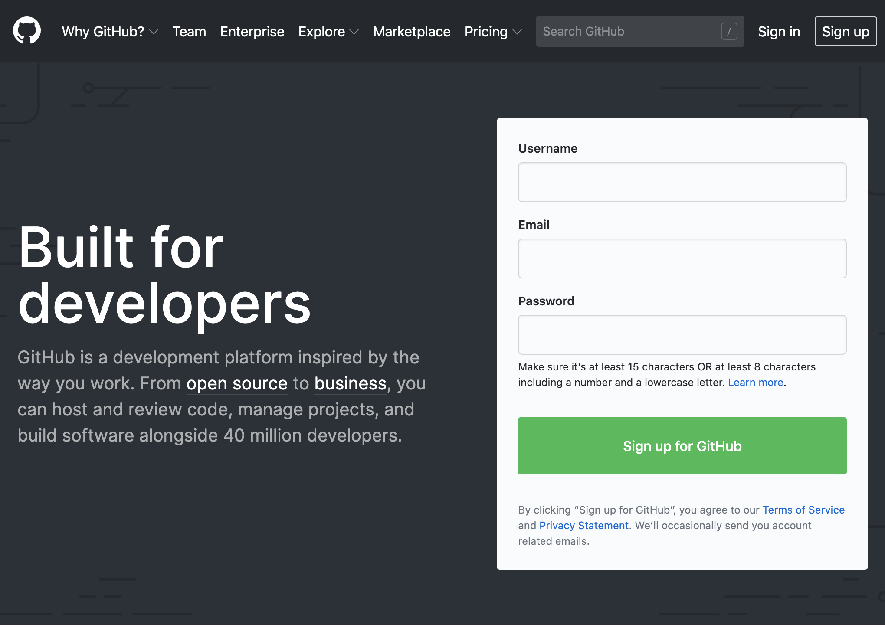
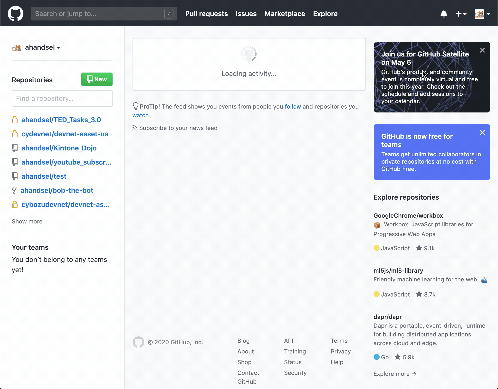

# What is Git & GitHub? -- Basics & First Repo

_🇯🇵 日本語版: [01_Start.md](01_Start.md)_

This section introduces you to Git and GitHub and goes over setting up your first repository.

## Overview
* Git Basics
* GitHub Basics
* Hands-On Section to Create a Repository
* Overview of Common Git Commands

## Outline <!-- omit in toc -->
* [Overview](#overview)
* [What is Git?](#what-is-git)
* [What is Version Control?](#what-is-version-control)

---

## What is Git?
* [Git](https://git-scm.com/) is a software development tool that provides **version control**!
* Started in 2005 as a tool to manage Linux kernel development
* Free and open source distributed version control system

Git is a free and open source distributed version control system designed to handle everything from small to very large projects with speed and efficiency.

## What is Version Control?
History ⌛
* Record changes made over time

Teamwork 💪
* Collaborate with developers who use other systems.

Backup 💾
* Be able to restore to a specific version

A Save Point in a Game 📌
* "Version control" is similar to how games save your progress.
* You save your progress once your clear the level.
* After that, even if you make a mistake in the next level, you do not restart the whole game.

### Examples of Version Control

  | Google Docs                                                  | Kintone                                                |
  | ------------------------------------------------------------ | ------------------------------------------------------ |
  |  |  |

## What is GitHub?

* [GitHub](https://github.com/) is a co-development platform
* A place where you can see and show code.
  * Similar to Google Docs, GitHub allows multiple people to view & edit code at the same time.
  * When you hear `Remote repositories`, think GitHub.
* Founded in 2008, it is now a subsidiary of Microsoft.

  |                                                       |                                                  |
  | ----------------------------------------------------- | ------------------------------------------------ |
  |  |  |

### GitHub Example - Apple
Apple has released a set of tools and resources for app developers such as password managers to help them generate strong passwords for free.

[github.com/apple/password-manager-resources](https://github.com/apple/password-manager-resources)

[Apple publishes free resources to improve password security | ZDNet](https://www.zdnet.com/article/apple-publishes-free-resources-to-improve-password-security/)

---

## Creating a Repository - Hands-on
Local Settings
* Create a folder
* Set the folder to be managed by Git

GitHub Settings
* Create a "folder" like thing on GitHub
* It is called a `Repository`

Connect the Local Folder with GitHub
* Configure git so the local folder and GitHub are connected
* Then when you create a file within the folder, it will appear on GitHub.

---

### Create a Local Repository

⚠️ Verify that you went through the Prep Guide: [Prep - 00_Prep_EN.md](00_Prep_EN.md)

⚡ Where to run the commands?
* Mac: Use the [Terminal](https://support.apple.com/guide/terminal/welcome/mac)
* Windows: Use the [Command Prompt](https://en.wikipedia.org/wiki/Cmd.exe)

1. Go to a easily accessible folder (e.g., Documents) and create a folder named `learning_js`

    ```sh
    cd Documents
    mkdir learning_js
    cd learning_js
    ```

1. Use `pwd` command to verify the current location

    ```sh
    pwd

    /Users/YourUserName/Documents/learning_js
    ```

1. Initialize git with `git init` command

    ```sh
    git init

    Initialized empty Git repository in /Users/YourUserName/Documents/learning_js/.git/
    ```

⚡ Repo is short for Repository

---

### Add a README.md File

1. Create a README.md file

    ```sh
    touch README.md
    ```

1. Describe the repo in the README.md file

    ```sh
    vi README.md

    # or

    code README.md
    ```

    ```markdown
    # Learning JS Repo
    A repository for my JavaScript lectures and assignments.
    ```

⚡ README.md describes the software's or the repo's goals and purpose.

---

### Confirm the Git Status

`git status` command
* Shows the **working directory** and **staging area**
* `Changes to be committed`: See which files have changed
* `Untracked files`: See which files are not being tracked by Git

We can see that README.md file needs to be tracked by Git.

```sh
git status
```

```sh
On branch main
No commits yet
Untracked files:
  (use "git add <file>..." to include in what will be committed)
 README.md
nothing added to commit but untracked files present (use "git add" to track)
```

### ステージングエリアにファイルを追加

`git add <file/folder>`
* ファイル/フォルダーをステージングエリアに追加するcommand

```sh
git add README.md
```

現在README.mdはステージングエリアに存在します

```sh
git status
```

```sh
On branch main
No commits yet
Changes to be committed:
  (use "git rm --cached <file>..." to unstage)
 new file:   README.md
```

### Gitリポジトリにファイルを追加

`git commit -m "message"`
* ファイル/フォルダをリポジトリに追加するcommand
* [Git - git-commit Documentation](https://git-scm.com/docs/git-commit)

README.mdがリポジトリに追加されました!!
* `README.md` が `main` ブランチに追加されたことが分かります

```sh
git commit -m "README file created"

git status
```

```sh
$ git commit -m "README file created"
[main (root-commit) 03098e7] README file created
 1 file changed, 3 insertions(+)
 create mode 100644 README.md

$ git status
On branch main
nothing to commit, working tree clean
```

### GitHub リポジトリを作成する

リポジトリを作成する
* [github.com/new](https://github.com/new)

`learning_js` という名前のリポジトリを作成します

READMEでリポジトリを初期化しないでください



### Local Git --> GitHub

repository を `push` しましょう！
GitHub の `Clone or download` ボタンをクリックし, HTTPS リンクをコピーして URL を取得します

`git remote add origin <link>`
* ローカルリポジトリを GitHub のリモートリポジトリに接続します
* `git remote` はリモートリポジトリを管理するcommandです
* [Git - git-remote Documentation](https://git-scm.com/docs/git-remote#_name)

```sh
git remote add origin https://github.com/Your_GitHub_UserName/learning_js.git
git push -u origin main
```

端末からの結果

```terminal
Enumerating objects: 3, done.
Counting objects: 100% (3/3), done.
Delta compression using up to 4 threads
Compressing objects: 100% (2/2), done.
Writing objects: 100% (3/3), 298 bytes | 298.00 KiB/s, done.
Total 3 (delta 0), reused 0 (delta 0), pack-reused 0
remote: This repository moved. Please use the new location:
remote:   https://github.com/ahandsel/learning_js.git
To https://github.com/ahandsel/learning_js.git
 * [new branch]      main -> main
Branch 'main' set up to track remote branch 'main' from 'origin'.
```

#### デバッグ
ローカルと GitHub の間で同期する最初のリポジトリを設定するときに, ログイン問題が発生する可能性があります。

1. リモートリポジトリ設定を削除

    ```sh
    git remote remove origin
    ```

2. 新しいパーソナルアクセストークンを作成する  
    * [github.com/settings/tokens/new](https://github.com/settings/tokens/new)
    * 端末から GitHub アカウントにログインするときに, Github パスワードの代わりにトークンを使用します

3. もう一度試してみましょう

    ```sh
    git remote add origin https://github.com/Your_GitHub_UserName/learning_js.git
    git push -u origin main
    ```

4. Github.com のリポジトリをチェックして, プッシュが機能したことを確認します。
    * `https://github.com/`Your_GitHub_UserName`/learning_js.git`


#### Documentation <!-- omit in toc -->
* [リモートリポジトリを管理する - GitHub Docs](https://docs.github.com/ja/github/getting-started-with-github/getting-started-with-git/managing-remote-repositories)
* [Git - git-remote Documentation](https://git-scm.com/docs/git-remote)
* [Git - git-push Documentation](https://git-scm.com/docs/git-push)

---

### Hands-on A が完了しました

| Git を初期化する                        | GitHub を設定する                        | ローカルリポジトリを作成してプッシュする |
| --------------------------------------- | ---------------------------------------- | ---------------------------------------- |
| `git init` <br> `git remote add origin` | [github.com/new](https://github.com/new) | `git status` <br> `git commit -m`        |

---

## Git の基本的なcommandの概要

### Git での変更の保存方法

スペース間でアイテムを転送する2つのcommandがあります:
* `git add` & `git commit`

ファイル, フォルダの変更が保存される3つのスペースがあります:
* `working directory` (作業ディレクトリ)
* `staging area` (ステージングステージング)
* `repository` (リポジトリ)


|       |                                  |
| :---: | :------------------------------: |
|       |     [ working directory ✍️ ]      |
|       |         ↘️  `git add` 📥 ↘️         |
|       |        [ staging area 📂 ]        |
|       |       ↘️  `git commit` 💾 ↘️        |
|       |         [ repository 🗄️ ]         |
|       |        ↘️  `git push` 🔄 ↘️         |
|       | [ remote repository (GitHub) 🌐 ] |

---

|       |                                  |
| :---: | :------------------------------: |
|   ➡️   |     [ working directory ✍️ ]      |
|   ➡️   |         ↘️  `git add` 📥 ↘️         |
|   ➡️   |        [ staging area 📂 ]        |
|       |       ↘️  `git commit` 💾 ↘️        |
|       |         [ repository 🗄️ ]         |
|       |        ↘️  `git push` 🔄 ↘️         |
|       | [ remote repository (GitHub) 🌐 ] |

`working directory` (作業ディレクトリ) ✍️
* すべての変更は最初に作業ディレクトリーで行われます

`git add` 📩
* 作業ディレクトリからステージングエリアへ追加するcommand

`staging area` (ステージングステージング) 📂
* 作業ディレクトリとリポジトリの間のバッファ用スペース
* 以前は「インデックス」と呼ばれていました
* ある特定の変更のみを追加し, まとめてリポジトリに追加する準備を行うことができます

---

#### 待って，ステージングエリアが必要な理由？ 🤔
* ファイルをステージングする = コミットのためのファイルを準備する

あなたが音楽を作っていると想像してください 🎶
* あなたは様々なメッセージを含められた曲を書いています
  * 怒りの歌から愛の歌まですべて
* すべての音楽をランダムにアップロードしますか？
  * いいえ, テーマを付けたアルバムを作りますよね

ロマンチックなアルバムを作成するには 🎶
* ラブソングだけを `git add` します
* すべてのラブソングを追加するまでの間決められたラブソングは `Staging Area`で保存されています.
* アルバム内の必要なすべての曲を `Staging Area` に保存したら, コミットする時間です
* `git commit -m` する時, "Love Song" ってアルバムのタイトルをコメント追加してコミットします

---

|       |                                  |
| :---: | :------------------------------: |
|       |     [ working directory ✍️ ]      |
|       |         ↘️  `git add` 📥 ↘️         |
|       |        [ staging area 📂 ]        |
|   ➡️   |       ↘️  `git commit` 💾 ↘️        |
|   ➡️   |         [ repository 🗄️ ]         |
|       |        ↘️  `git push` 🔄 ↘️         |
|       | [ remote repository (GitHub) 🌐 ] |

`git commit` 💾
* リポジトリへ変更を記録するcommand
* 変更を保存したいファイルがステージングエリアに配置されたら, `git commit` commandを使用します
* ボスを倒してゲームの進行状況を保存したいときに使用するイメージです
* コミットごとにどんな変更を記録するのかを把握するためのコメントを残します

`repository` 🗄️
* Git リポジトリは, プロジェクト内の `.git` フォルダで管理されています
* リポジトリは, プロジェクトの変更を追跡できます。

#### Git フォルダーの中身は何ですか? 🤔

```sh
$ pwd
/Users/UserName/Documents/learning_js

$ ls -la
total 8
drwxr-xr-x   4 UserName  staff  128 Jun  9 14:54 .
drwx------@ 20 UserName  staff  640 Jun  8 16:22 ..
drwxr-xr-x  12 UserName  staff  384 Jun  9 14:56 .git
-rw-r--r--   1 UserName  staff   85 Jun  9 14:54 README.md

$ cd .git

$ ls -la
total 40
drwxr-xr-x  12 UserName  staff  384 Jun  9 14:56 .
drwxr-xr-x   4 UserName  staff  128 Jun  9 14:54 ..
-rw-r--r--   1 UserName  staff   20 Jun  9 14:54 COMMIT_EDITMSG
-rw-r--r--   1 UserName  staff   23 Jun  9 14:54 HEAD
-rw-r--r--   1 UserName  staff  316 Jun  9 14:56 config
-rw-r--r--   1 UserName  staff   73 Jun  9 14:54 description
drwxr-xr-x  14 UserName  staff  448 Jun  9 14:54 hooks
-rw-r--r--   1 UserName  staff  137 Jun  9 14:54 index
drwxr-xr-x   3 UserName  staff   96 Jun  9 14:54 info
drwxr-xr-x   4 UserName  staff  128 Jun  9 14:54 logs
drwxr-xr-x   7 UserName  staff  224 Jun  9 14:54 objects
drwxr-xr-x   5 UserName  staff  160 Jun  9 14:56 refs
```

---

|       |                                  |
| :---: | :------------------------------: |
|       |     [ working directory ✍️ ]      |
|       |         ↘️  `git add` 📥 ↘️         |
|       |        [ staging area 📂 ]        |
|       |       ↘️  `git commit` 💾 ↘️        |
|       |         [ repository 🗄️ ]         |
|   ➡️   |        ↘️  `git push` 🔄 ↘️         |
|   ➡️   | [ remote repository (GitHub) 🌐 ] |

`git push <remote> <branch>` 🔄
* Local Repo --> Remote Repo
* ローカルリポジトリをリモートリポジトリにアップロードするcommandです
* コミットをエクスポートします

`remote repository` (GitHub) 🌐
* GitHub のサーバー上のリポジトリであり, コードを他のユーザーが確認できるようにします

---

### リモートリポジトリの操作

`git remote add origin <link>`
* ローカルマシンにリモートリポジトリのクローンを作成すると, Git によって `alias` が作成されます。
* `origin` はリモートリポジトリのURLのニックネームのようなものです
* 最も一般的な `alias` は 「 `origin` 」 と呼ばれます。
* 次のcommandはどちらも同じ内容を実行します

   ```sh
   $ git push -u https://github.com/ahandsel/demo.git main
   ```

   ```sh
   $ git remote add ALIAS https://github.com/ahandsel/demo.git 
   $ git push -u ALIAS main
   ```

`git remote`
* ローカルとリモートのリポジトリ間の接続を管理します

`git remote --verbose`
* Gitが保存しているURLと, そのリモートリポジトリへの読み書き時に使用できるエイリアス (ニックネーム)を一覧表示します。

    ```sh
    git remote --verbose
    ```

    ```sh
    origin https://github.com/ahandsel/learning_js.git (fetch)
    origin https://github.com/ahandsel/learning_js.git (push)
    ```

#### Documentation <!-- omit in toc -->
* [Git - リモートでの作業](https://git-scm.com/book/ja/v2/Git-%E3%81%AE%E5%9F%BA%E6%9C%AC-%E3%83%AA%E3%83%A2%E3%83%BC%E3%83%88%E3%81%A7%E3%81%AE%E4%BD%9C%E6%A5%AD)
* [Git - Working with Remotes](https://git-scm.com/book/en/v2/Git-Basics-Working-with-Remotes)
* [Git - git-remote Documentation](https://git-scm.com/docs/git-remote)

---

### git push?
`git push <remote> <branch>` 🔄
* Local Repo --> Remote Repo | コミットをエクスポートします
* `git fetch` の対応
  * ローカルリポジトリへのインポートコミット
* ⚠️ 注: プッシュすると, 変更が上書きされる可能性があります。

`git push` commandは, 最後のプッシュまたはクローン以降に変更されていないリモートリポジトリに対してのみ機能します
* つまり, リモートリポジトリを変更した人は他にいません
* あなたと別のクローンが同時にあなたの前に上流にプッシュした場合, そのプッシュは正しく拒否されます。
* 最初に彼らの仕事をフェッチしてプッシュに含める必要があります

#### ゲームの例-どうぶつの森
* Genji は島にテントを追加しました。
* Genji がゲームステータスを GitHub にアップロードしました。
* Piyoも島に家を追加しました。
* しかし, GitHub にアップロードする前に...
  * GitHub から最新のゲームステータスを取得する必要があります
  * ( Genji がテントを追加したため)

#### Documentation <!-- omit in toc -->
* [Git - git-push Documentation](https://git-scm.com/docs/git-push)

## ハンズオン A レビュー

Git での保存

|                                  |    音楽 🎶    |
| :------------------------------: | :----------: |
|     [ working directory ✍️ ]      |   個別の曲   |
|         ↘️  `git add` 📥 ↘️         |              |
|        [ staging area 📂 ]        |   アルバム   |
|       ↘️  `git commit` 💾 ↘️        |              |
|         [ repository 🗄️ ]         | プレイリスト |
|        ↘️  `git push` 🔄 ↘️         |              |
| [ remote repository (GitHub) 🌐 ] |   Spotify    |

`git remote`  
ローカルとリモートのリポジトリ間の接続を管理するcommand

`git push`  
ローカルリポジトリをリモートリポジトリにアップロードするcommand

## Quiz Time

1. Git と GitHub はどのように関係していますか？  
   * ヒント: `hub` とは, 活動またはネットワークの中心点です。
2. `git add` と `git commit` のどちらを初めに使いますか？
   * ヒント: `commit` とは, 特定の行動（結婚など）を約束することです。
3. `git push` commandは何をしますか？
   * ヒント: `git push` commandは `git fetch` commandの逆の行動を行います。

## Next Section
[Create & Merge Branches - 02_Branches_EN.md](02_Branches_EN.md)

## List of Lecture Guides <!-- omit in toc -->
[README_EN.md](README_EN.md) ⚙️
