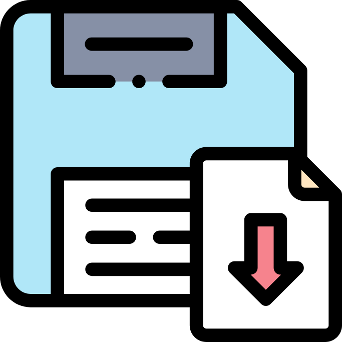
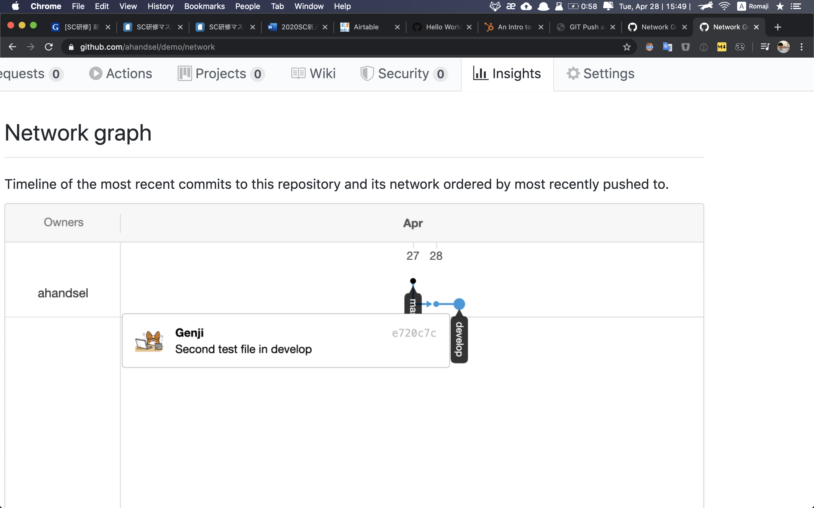
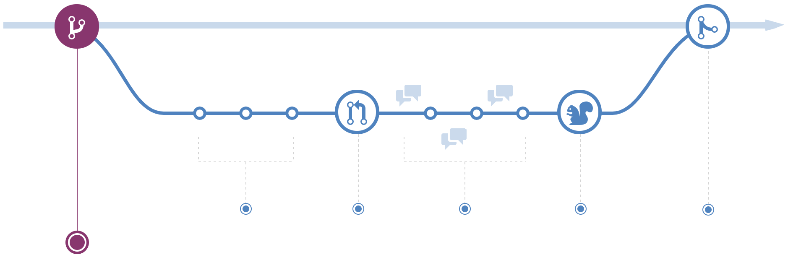
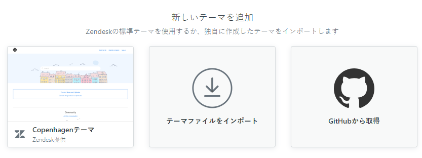

ハンズオンAの確認

# クイズの時間!

GitとGitHubはどのように関係していますか？

「git push」コマンドは何をしますか？

「git add」と「git commit」のどちらを初めに使いますか？

ヒント：「hub」とは、 活動またはネットワークの中心点です。

ヒント：「commit」とは、特定の行動（結婚など）を約束することです。

ヒント：「git push」コマンドは「git fetch」コマンドの逆の行動を行います。

# Quiz Time!

How is Git & GitHub related?

What does         "git push" command do?

Which comes first\, "git add" or "git commit"?

Hint: "hub" means the center of an activity or network\.

Hint: "commit" means to pledge yourself to a certain action \(like marriage\)\.

Hint: "git push" command does the opposite of "git fetch" command\.

# GitHub 例 - Apple

* アップル、「Password Manager Resources」をオープンソースで公開
  * [japan\.zdnet\.com/article/35154931/](https://japan.zdnet.com/article/35154931/)
* Appleが、パスワードマネージャーなどのアプリの開発者向けに、強力なパスワードを生成できるよう支援するための一連のツールとリソースを無償公開している。[https://github\.com/apple/password\-manager\-resources](https://github.com/apple/password-manager-resources)

ブランチの作成とマージ！

Hands\-on B

Branches

# 新しいブランチを作成する

* __$ git checkout \-b develop__
  * __Switched to a new branch 'develop'__
* __$ git branch__
  * __\*__  _develop_
  * __master__

* リポジトリにはデフォルトで __master__ ブランチが存在します。
* まず、 __develop__ という名前のブランチを作成します
* __[git checkout –b \<branch name>](http://git-scm.com/docs/git-checkout)__
  * リポジトリに新しいブランチを作成して、そのブランチに移動するコマンド
* __[git branch](http://git-scm.com/docs/git-branch)__
  * ブランチ一覧を表示するコマンド
  * アスタリスク（\*）がついているブランチが現在のブランチです

Branches

# developブランチへの変更

* _$_  __touch__  __develop\_file\.md__
* _$_  __git add__  __develop\_file\.md__
* _$_  __git commit \-m "develop only"__
  * _\[develop f946eb0\] File only in develop branch_
  * _1 file changed\, 0 insertions\(\+\)\, 0 deletions\(\-\)_
  * _create mode 100644_  _develop\_file\.md_
* _$_  __git status__
  * _On branch develop_
  * _nothing to commit\, working tree clean_
* _$_  __git push \-u origin develop__

* __develop__ ブランチ上でファイルを作成します。
* __git add__ と __git commit__ を実行して、ローカルリポジトリに保存します。
* __git status__ を実行して、変更が保存されたことを確認します。
* __git push__ を実行して、GitHubリポジトリに変更をプッシュします。

Branches

# GitHubでの変更の確認

__develop__ ブランチでのみ新しいファイルが追加されました

__develop__ ブランチに別のファイルを追加します

次に、 __Network graph__ を表示します

https://github\.com/ _USER_ / _REPO_ /network

Branches

# プルリクエストの作成とマージ

* __Pull Requests__ で、実際にファイルが変更される前に、他のユーザーの変更などを確認できます。
  * コードレビューなどに使われます\.
* __develop__ ブランチを __master__ ブランチにマージするために、GitHubで __P__  __ull request__ を作成します。
* 変更を確認し、Pull Requestをマージします。
* masterブランチに2つの新しいファイルが表示されました！

Branches

# GitHub repoからLocal repoへの更新

* $ git checkout master
  * Switched to branch 'master'
  * Your branch is behind 'origin/master' by 4 commits & can be fast\-forwarded
  * \(use "git pull" to update your local branch\)
* $ git pull origin master
  * remote: Enumerating objects: 1\, done\.
  * remote: Counting objects: 100% \(1/1\)\, done\.
  * remote: Total 1 \(delta 0\)\, reused 0 \(delta 0\)\, pack\-reused 0
  * Unpacking objects: 100% \(1/1\)\, 631 bytes | 210\.00 KiB/s\, done\.
  * From https://github\.com/ahandsel/kintone\_dojo
  * \* branch            master     \-> FETCH\_HEAD
  * 5f9f89b\.\.1438ca5  master     \-> origin/master
  * Updating d775d42\.\.1438ca5
  * Fast\-forward
  * 2nd\_file\.md     | 0
  * develop\_file\.md| 0
  * 2 files changed\, 0 insertions\(\+\)\, 0 deletions\(\-\)
  * create mode 100644 2nd\_file\.md
  * create mode 100644develop\_file\.md
* $ git branch \-d develop
  * Deleted branch develop \(was c6e6c83\)\.
* $ git branch
  * \* master

__$ git checkout master__

__$ git__  __pull origin master__

__$ git branch \-d develop__

__$ git branch__

* 現在、GitHubリポジトリはローカルリポジトリよりもファイルが最新になっています。
  * __git pull__ コマンドを使用して対応します
* __git pull origin master__
  * 最新のリポジトリのバージョンをGitHubからローカルにpullします

ブランチとは？

ハンズオンBの概要

Branches

# Gitブランチ

ブランチとは？

なぜブランチを使うのですか？

* コミットの動くポインタ。
* 複数のタイムラインで管理し、メインラインに影響を与えることなく変更することができます
* __git checkout__
  * ブランチを切り替えるコマンド。
* __git branch \-d \<branch\-name>__
  * ブランチを削除するコマンド。

安定した版、開発版、実験版などを離隔するため。

例：このGitHubスライド

各ハンズオンとコンセプトセクションをブランチにすることができます。

それぞれを同時に開発できます。

[3\.1 Git](https://git-scm.com/book/ja/v2/Git-%E3%81%AE%E3%83%96%E3%83%A9%E3%83%B3%E3%83%81%E6%A9%9F%E8%83%BD-%E3%83%96%E3%83%A9%E3%83%B3%E3%83%81%E3%81%A8%E3%81%AF)[のブランチ機能](https://git-scm.com/book/ja/v2/Git-%E3%81%AE%E3%83%96%E3%83%A9%E3%83%B3%E3%83%81%E6%A9%9F%E8%83%BD-%E3%83%96%E3%83%A9%E3%83%B3%E3%83%81%E3%81%A8%E3%81%AF)[\-](https://git-scm.com/book/ja/v2/Git-%E3%81%AE%E3%83%96%E3%83%A9%E3%83%B3%E3%83%81%E6%A9%9F%E8%83%BD-%E3%83%96%E3%83%A9%E3%83%B3%E3%83%81%E3%81%A8%E3%81%AF)[ブランチとは](https://git-scm.com/book/ja/v2/Git-%E3%81%AE%E3%83%96%E3%83%A9%E3%83%B3%E3%83%81%E6%A9%9F%E8%83%BD-%E3%83%96%E3%83%A9%E3%83%B3%E3%83%81%E3%81%A8%E3%81%AF)

Branches

# ブランチ - ウェブサイト

* __master__ ブランチには、Webサイトを実行するコードが存在します。
  * もしmasterブランチで変更が加わると、ユーザーに影響を与えてしまいます！！
* 2人の開発者が同時にWebサイトを変更したい場合、3つのブランチを作成します
  * __master__ ライブコード
  * __feature\_A__ 開発者Aが実装する
  * __feature\_B__ 開発者Bが実装する
* 開発が完了したら、ブランチをマージします！

Git Push vs Pull

# Git Push vs Pull - Teamwork

git push

git pull

* 「アップロード」コマンド
* 「プッシュ」は、ターゲットリポジトリに変更を強制します。
  * \[あなたのコード\]\-プッシュ\-> \[ターゲット\]
* 「プッシュリクエスト」は、変更をプッシュするように要求するターゲットリポジトリです。

* 「ダウンロード」コマンド
* 「プル」はターゲットリポジトリから変更を取得します
  * \[あなたのコード\]\}\-プル\-\[ターゲット\]
* 「プルリクエスト」とは、変更を取得するためにターゲットリポジトリをリクエストすることです。

# Hands-on C Review

Pull Requestsとgit pull

ブランチを使う理由

git checkout \-b develop

「プルリクエスト」とは、変更を取得するためにターゲットリポジトリをリクエストすることです。

コードの開発、テスト、公開バージョンなどを分離する

GitHub Workflow

__https://__  __guides\.github\.com__  __/introduction/flow/__

GitHub Workflow

# #1 - Create a Branch

__$ git checkout \-b develop__

__$ git branch__

* webサイトの本番コードはmasterブランチに保管します。
  * masterでの変更はユーザーにも影響を与えてしまいます！
* もし新しいページを作成したい場合、まず新しくfeatureブランチを作成します。
  * featureブランチで新しいページの開発を行います。

GitHub Workflow

# #2 - Making a Commit

featureブランチでコードを実装します。

コード実装が完了したら、commitを作成します。

Commitを作成することで変更履歴を確認できます。

コミットにより、ロールバックと参照が可能になります。

GitHub Workflow

# #3 - Open a Pull Request

実装内容を他の人と共有する準備ができたら、 PullRequestを作成します。

Pull Requestを作成することでコードレビューの準備を行います。

GitHubの\[プルリクエスト\]タブでコメントを作成します。

GitHub Workflow

# #4 - Test

コードレビューの後、コードをテスト環境にデプロイして問題なく機能することを確認します。

例：Webサイトのレイアウトや動作が期待どおりかどうかをZendeskThemes版などでテストします。

GitHub Workflow

# #5 - Merge to Master!

* コードをmasterブランチにマージ\!
  * これで実装内容が有効になり、ユーザーもwebサイトの変更を確認できます。
* 統合すると、 Pull Requestは参照点として機能します。
* 例：新しいロゴのプルリクエストは、ロゴ変更の「前」と「後」を示す参照点になります。

GitHub Workflow

# Overview of GitHub Workflow

__https://__  __commonflow\.org__  __/spec/1\.0\.0\-rc\.5\.html__

Kintone Dojo Workflow

Kintone Dojo

# Setup

* GithubのKintone\_Dojoリポジトリに移動します。
  * 例:[github\.com/ahandsel/kintone\_dojo](https://github.com/ahandsel/learning_js)
* \[ ⚙️ Settings\]
* > \[ Manage access \]
* > \[ Invite a collaborator \]
* SoheiMiyakura\(miyass\)
* Genji Fujimori \(ahandsel\)

Kintone Dojo

Go to yourKintone\_Dojorepo onGithub

Example:[https://github\.com/ahandsel/kintone\_dojo](https://github.com/ahandsel/learning_js)

\[ ⚙️ Settings\]

> \[ Manage access \]

> \[ Invite a collaborator \]

SoheiMiyakura\(miyass\)

Genji Fujimori \(ahandsel\)

Kintone Dojo

# Workflow

* __master__ ブランチ
  * 最終的なコードとメモが格納される場所です。
  * つまり、コードレビューに合格したファイルが保存される場所。
* __develop__ ブランチ
  * 開発中のコードが格納される場所です。

Kintone Dojo

* __master__ branch
  * This is where code and notes that is working and final is stored\.
  * i\.e\. passed the code review
* __develop__ branch
  * This is where code undergoing development is stored\.
  * i\.e\. you are writing the code

Kintone Dojo

* \#1 \-割り当てごとにフォルダを作成します。 （masterブランチ上）
* \#2 \- __develop\-task\-\#__ ブランチを作成する
  * \# =タスク番号
  * 例：develop\-task\-01はタスク番号1用です。
  * 進行中のHTMLおよびJSファイルをここに保存します。
  * Markdown（\.md）ファイルとして関連するメモを含めます。
* \#3 \-コードレビューが必要なときにプルリクエストを行う
  * SoheiやGenjiをタグする。
* \#4 \-レビューが成功した後
  * developブランチをmasterにマージ！

Kintone Dojo

* \#1 \- Create a folder per assignment\. \(On Master\)
* \#2 \- Create a __develop__ branch
  * Keep your in\-progress HTML and JS files here\.
  * Including relevant notes as Markdown \(\.md\) files\.
* \#3 \- Make a __Pull Request__ When you want a code review
  * TagSoheior Genji
* \#4 \- After successful review
  * Merge __develop__ branch into __master\!__

GitHub Website Overview

GitHubの概要

# GitHub Repository

* GitHub Repository \- Code
  * コードやドキュメントなど、プロジェクトに関連するすべてのファイルを保持するコンテナです。
  * GitHubに保存されているすべてのファイルは、gitでバージョン管理されています
  * リポジトリはしばしば「リポ」と短縮されて呼ばれます
* README\.md
  * リポジトリの下部に表示される、プロジェクトの紹介などを表示するためのファイルです

GitHubの概要

# GitHub Issues & Pull Request

* Issues
  * ユーザーがリポジトリの内容に関して議論する場所
  * 課題をユーザーに割り当て、ラベルを追加して読みやすくすることができます

* Pull Request
  * ユーザーがリポジトリに変更を加えたいときに使われます
  * 例：README\.mdファイルを新しく追加したい時

GitHubの概要

# GitHubの概要

* Project boards：KANBAN形式でのタスクボードです
* Wiki：関連するプロジェクトドキュメントの作成と保存ができます
* Insight：リポジトリの分析ツール：
  * __Network__ グラフ：コミットとブランチをタイムラインで視覚化します
  * __Pulse__ ：進行中、あるいは完了したタスクを表示します

GitHubの概要

# GitHubのパーツ

* Branch
  * コードの代替タイムライン
  * 例：マスター、開発、機能/ xxx
* Commit
  * ファイルの変更をリポジトリに保存する

* Pull Request
  * 提案している変更を他の人と共有する
* Merge Pull Request
  * 実際にブランチ（マスターなど）を変更して更新し、

