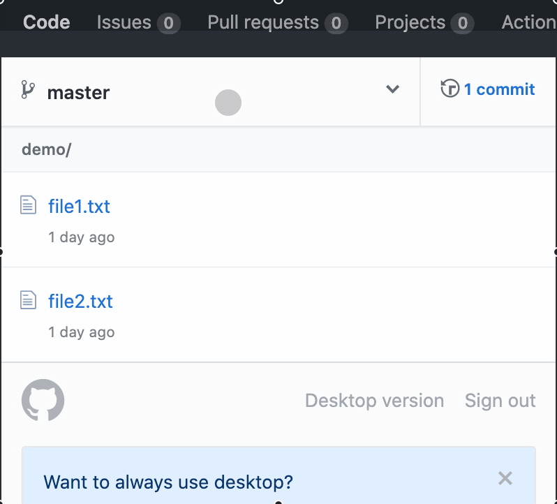
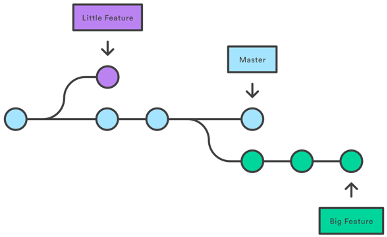
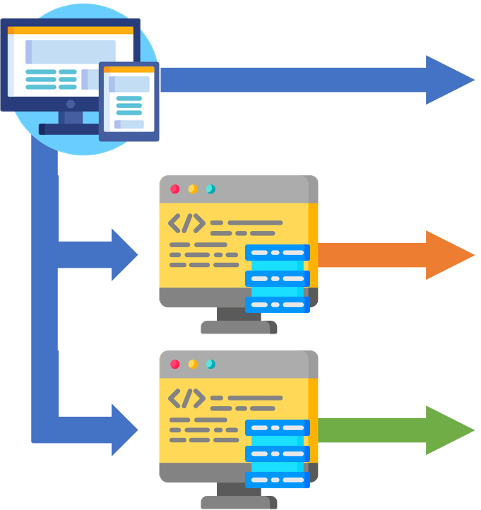
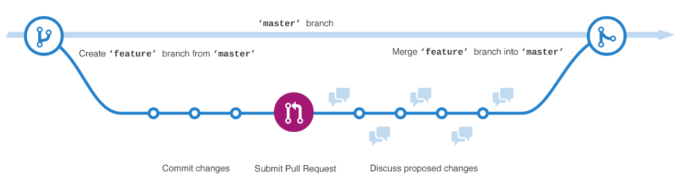
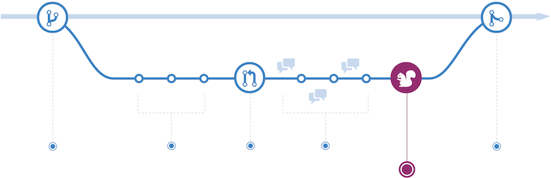

# Git, GitHubとは？ - ブランチの作成とマージ

## Git Branch?
まず, learning_js リポジトリに戻ります

```sh
~ % cd Documents/learning_js
```

`git branch` と入力して, 現在のブランチと現在のブランチを確認します.

`git branch`
  - [git-branch](http://git-scm.com/docs/git-branch)
  - ブランチ一覧を表示するコマンド
  - アスタリスク（\*）がついているブランチが現在のブランチです

  ```sh
  git branch
  ```

  ```terminal
  * master
  ```

リポジトリにはデフォルトで `master` ブランチが存在します.

## 新しいブランチを作成する

まず, `develop` という名前のブランチを作成して移動しましょう．

```sh
git checkout -b develop
```

```terminal
Switched to a new branch 'develop'
```

`git checkout –b <branch name>`
  - リポジトリに新しいブランチを作成して、そのブランチに移動するコマンドです．
  - [git-checkout Doc](https://git-scm.com/docs/git-checkout)


## develop ブランチへの変更

`develop` ブランチ上でファイルを作成します.

  ```sh
  touch develop_file.md
  ```

`git add` と `git commit` を実行して, ローカルリポジトリに保存します.

  ```sh
  git add develop_file.md
  ```

  ```sh
  git commit -m "develop only"
  ```
  ```terminal
  [develop 4f98baf] develop only
  1 file changed, 0 insertions(+), 0 deletions(-)
  create mode 100644 develop_file.md
  ```

`git status` を実行して, 変更が保存されたことを確認します.

  ```sh
  git status
  ```
  ```terminal
  On branch develop
  nothing to commit, working tree clean
  ```

`git push` を実行して, GitHubリポジトリに変更をプッシュします.

  ```sh
  git push -u origin develop
  ```
  ```terminal
  Enumerating objects: 4, done.
  Counting objects: 100% (4/4), done.
  Delta compression using up to 4 threads
  Compressing objects: 100% (2/2), done.
  Writing objects: 100% (3/3), 277 bytes | 277.00 KiB/s, done.
  Total 3 (delta 0), reused 0 (delta 0), pack-reused 0
  remote: This repository moved. Please use the new location:
  remote:   https://github.com/ahandsel/learning_js_3.git
  remote:
  remote: Create a pull request for 'develop' on GitHub by visiting:
  remote:      https://github.com/ahandsel/learning_js_3/pull/new/develop
  remote:
  To https://github.com/ahandsel/learning_js_3.git
  * [new branch]      develop -> develop
  Branch 'develop' set up to track remote branch 'develop' from 'origin'.
  ```

---

## GitHubでの変更の確認

`develop` ブランチでのみ新しいファイルが追加されました

`develop` ブランチに別のファイルを追加します

次に, `Network graph` を表示します

`https://github.com/USER/REPO/network`

|                                                |                                                                    |                                                                      |
| ---------------------------------------------- | ------------------------------------------------------------------ | -------------------------------------------------------------------- |
|  |  |  |

---

## プルリクエストの作成とマージ

`Pull Requests` で, 実際にファイルが変更される前に, 他のユーザーの変更などを確認できます.
  - コードレビューなどに使われます.

`develop` ブランチを `master` ブランチにマージするために, GitHub で `Pull request` を作成します.
  - 変更を確認し, `Pull Request` をマージします.


`master` ブランチに2つの新しいファイルが表示されました！


## GitHub repo から Local repo への更新

`master` ブランチに移動しましょう.

```sh
git checkout master
```

現在, GitHubリポジトリはローカルリポジトリよりもファイルが最新になっています.

```sh
  Switched to branch 'master'
  Your branch is behind 'origin/master' by 4 commits & can be fast-forwarded
    (use "git pull" to update your local branch)
```

`git pull` コマンドを使用して対応します  
`git pull origin master` で最新のリポジトリのバージョンを GitHub からローカルに pull します

```sh
git pull origin master
```
```sh
  remote: Enumerating objects: 1, done.
  remote: Counting objects: 100% (1/1), done.
  remote: Total 1 (delta 0), reused 0 (delta 0), pack-reused 0
  Unpacking objects: 100% (1/1), 631 bytes | 210.00 KiB/s, done.
  From https://github.com/ahandsel/kintone_dojo
  * branch            master     -> FETCH_HEAD
    5f9f89b..1438ca5  master     -> origin/master
  Updating d775d42..1438ca5
  Fast-forward
  2nd_file.md     | 0
  develop_file.md | 0
  2 files changed, 0 insertions(+), 0 deletions(-)
  create mode 100644 2nd_file.md
  create mode 100644 develop_file.md
```

これで `master` ブランチと `develop` ブランチは同じ状態になりました.  
なので`develop` ブランチを削除しましょう．

```sh
git branch -d develop
```
```sh
  Deleted branch develop (was c6e6c83).
```

`git branch` コマンドで確認しましょう

```sh
git branch
```
```sh
  * master
```

## Git Branch とは？

### ブランチとは？
  - コミットの動くポインタ.
  - 複数のタイムラインで管理し, メインラインに影響を与えることなく変更することができます
  - `git checkout`
    - ブランチを切り替えるコマンド.
  - `git branch -d <branch-name>`
    - ブランチを削除するコマンド.

### なぜブランチを使うのですか？
  - 安定した版, 開発版, 実験版などを離隔するため.
  - 例: このGitHubスライド
    - 各ハンズオンとコンセプトセクションをブランチにすることができます.
    - それぞれを同時に開発できます.



[Git - ブランチとは](https://git-scm.com/book/ja/v2/Git-%E3%81%AE%E3%83%96%E3%83%A9%E3%83%B3%E3%83%81%E6%A9%9F%E8%83%BD-%E3%83%96%E3%83%A9%E3%83%B3%E3%83%81%E3%81%A8%E3%81%AF)

## Branch と ウェブサイト

`master` ブランチには, Webサイトを実行するコードが存在します.
  - もし `master` ブランチで変更が加わると, ユーザーに影響を与えてしまいます！！

2人の開発者が同時にWebサイトを変更したい場合, 3つのブランチを作成します
  - `master` → ライブコード
  - `feature_A` → 開発者Aが実装する
  - `feature_B` → 開発者Bが実装する

開発が完了したら, ブランチをマージします！



## Git Push vs Pull - Teamwork

| `git push`                                                                          | `git pull`                                                                                |
| ----------------------------------------------------------------------------------- | ----------------------------------------------------------------------------------------- |
| 「アップロード」 コマンド                                                           | 「ダウンロード」 コマンド                                                                 |
| 「プッシュ」は, ターゲットリポジトリに変更を強制します.                             | 「プル」はターゲットリポジトリから変更を取得します                                        |
| `[あなたのコード] ⟾ プッシュ ⟾ [ターゲット]`                                        | `[あなたのコード] ⏎ プル ⏎ [ターゲット]`                                                  |
| 「プッシュリクエスト」は, 変更をプッシュするように要求するターゲットリポジトリです. | 「プルリクエスト」とは, 変更を取得するためにターゲットリポジトリをリクエストすることです. |
|                                     |                                           |

## Hands-on C Review

`git checkout -b develop`
- ブランチを切り替えるコマンド。

ブランチを使う理由
- コードの開発、テスト、公開バージョンなどを分離する

`Pull Requests` と `git pull`
- 「プルリクエスト」とは, 変更を取得するためにターゲットリポジトリをリクエストすることです.

---

## GitHub Workflow

[Understanding the GitHub flow · GitHub Guides](https://guides.github.com/introduction/flow/)



| #   | Step            | Notes                                                                                                                              |
| --- | --------------- | ---------------------------------------------------------------------------------------------------------------------------------- |
| 1   | Create a branch | `master` から `feature` ブランチを作成して開発を開始します                                                                         |
| 2   | Commit changes  | コード実装が完了したら, `commit` を作成します. <br> `commit` を作成することで変更履歴を確認できて, ロールバックと参照が可能になります. |
| 3 | Open a Pull Request | 実装内容を他の人と共有する準備ができたら, Pull Request を作成します. | 
| 4 | Discuss & Review Code |
| 5 | Deploy & Test |
| 6 | Merge to Master | 

コードレビューの後, コードをテスト環境にデプロイして問題なく機能することを確認します.

例: Webサイトのレイアウトや動作が期待どおりかどうかをZendeskThemes版などでテストします.
---


Pull Request を作成することでコードレビューの準備を行います.

GitHub の Pull Request タブでコメントを作成します.


### 4 - Discuss & Review Code


### 5 - Deploy & Test



コードレビューの後, コードをテスト環境にデプロイして問題なく機能することを確認します.

例: Webサイトのレイアウトや動作が期待どおりかどうかをZendeskThemes版などでテストします.

### 6 - Merge to Master


コードを`master` ブランチにマージ!
    - これで実装内容が有効になり, ユーザーもwebサイトの変更を確認できます.

統合すると, Pull Request は参照点として機能します.

例: 新しいロゴのプルリクエストは, ロゴ変更の「前」と「後」を示す参照点になります.

## Overview of GitHub Workflow


[Git Common-Flow 1.0.0-rc.5 | Git Common Flow](https://commonflow.org/spec/1.0.0-rc.5.html)

## GitHubの概要 - GitHub Website Overview

### GitHub Repository


GitHub Repository - Code
  - コードやドキュメントなど, プロジェクトに関連するすべてのファイルを保持するコンテナです.
  - GitHubに保存されているすべてのファイルは, gitでバージョン管理されています
  - リポジトリはしばしば「リポ」と短縮されて呼ばれます
README.md
  - リポジトリの下部に表示される, プロジェクトの紹介などを表示するためのファイルです

### GitHub Issues


  - ユーザーがリポジトリの内容に関して議論する場所
  - 課題をユーザーに割り当て, ラベルを追加して読みやすくすることができます

### GitHub Pull Request


  - ユーザーがリポジトリに変更を加えたいときに使われます
  - 例: README\.mdファイルを新しく追加したい時

### GitHubの概要

Project boards: KANBAN形式でのタスクボードです

Wiki: 関連するプロジェクトドキュメントの作成と保存ができます

Insight: リポジトリの分析ツール: 
  - `Network` グラフ: コミットとブランチをタイムラインで視覚化します
  - `Pulse` : 進行中, あるいは完了したタスクを表示します

## GitHub のパーツ

Branch
  - コードの代替タイムライン
  - 例: マスター, 開発, 機能/ xxx

Commit
  - ファイルの変更をリポジトリに保存する

Pull Request
  - 提案している変更を他の人と共有する

Merge Pull Request
  - 実際にブランチ（マスターなど）を変更して更新し

