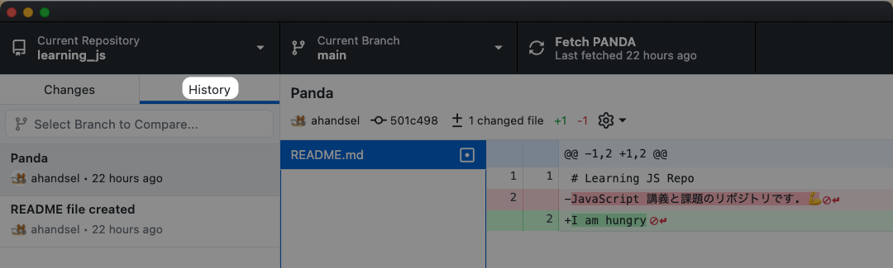
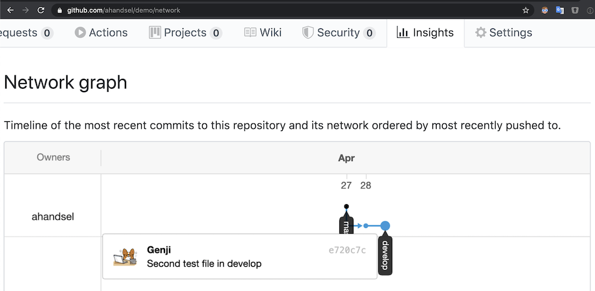
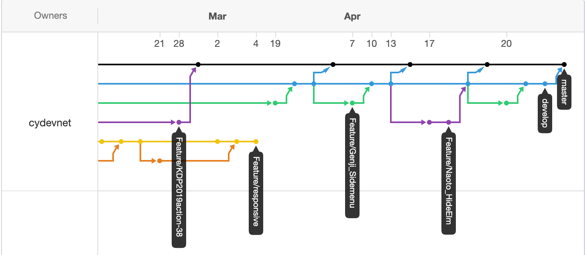
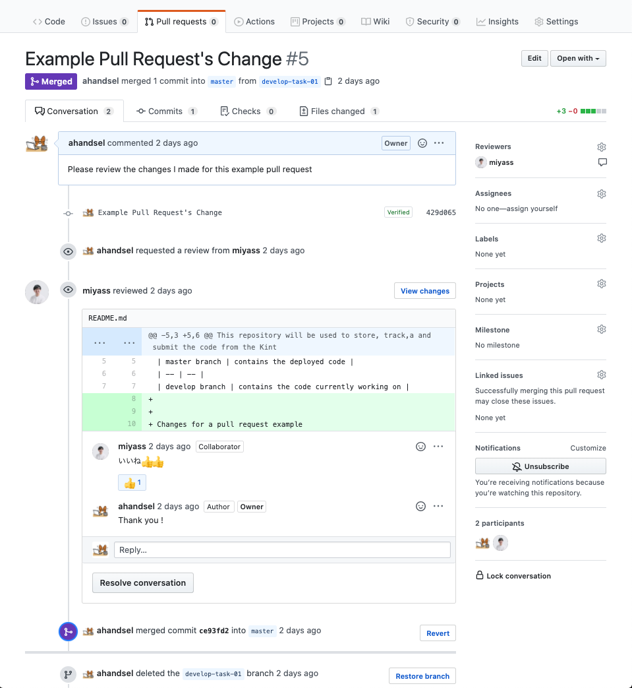
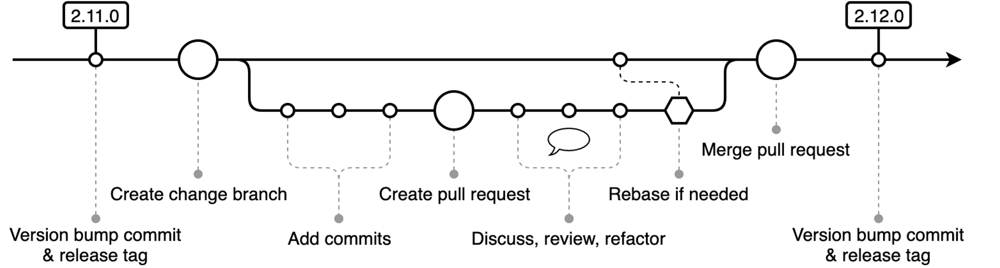
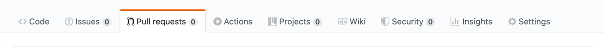

# What is Git & GitHub? -- Create & Merge Branches

_🇯🇵 日本語版: [02_Branches.md](02_Branches.md)_

This section goes over Git branches and how to work with your first branch.

## Overview Overview
* [Overview Overview](#overview-overview)
* [git branch command](#git-branch-command)
  * [`git branch`](#git-branch)
* [Create a new branch](#create-a-new-branch)
  * [`git checkout -b <branch name>`](#git-checkout--b-branch-name)
* [Add a file to the develop branch](#add-a-file-to-the-develop-branch)
  * [Verify on GitHub Desktop App](#verify-on-github-desktop-app)
* [See the changes on GitHub](#see-the-changes-on-github)
* [Create & Merge a Pull Request](#create--merge-a-pull-request)
* [Update local repo from GitHub repo](#update-local-repo-from-github-repo)
* [What is Git Branch?](#what-is-git-branch)
  * [What is a branch?](#what-is-a-branch)
  * [Why use a branch?](#why-use-a-branch)
* [Branch and website](#branch-and-website)
* [Git Push vs Pull --Teamwork](#git-push-vs-pull---teamwork)
* [Hands-on C Review](#hands-on-c-review)
* [GitHub Workflow](#github-workflow)
  * [Detailed Overview of the GitHub Workflow](#detailed-overview-of-the-github-workflow)
* [GitHub Overview-GitHub Website Overview](#github-overview-github-website-overview)
  * [GitHub Repository](#github-repository)
  * [GitHub Issues](#github-issues)
  * [GitHub Pull Request](#github-pull-request)
  * [Overview of GitHub](#overview-of-github)
* [GitHub parts](#github-parts)
* [Quiz time](#quiz-time)
* [Next Section](#next-section)

## git branch command
1. First, go back to the `learning_git` repository

    ```sh
    cd Documents/learning_git
    ```

2. Use `git branch` command to see all of the branches in your repo & which branch you are currently on.

    ```sh
    git branch

    * main
    ```

### `git branch`
* [git-branch](http://git-scm.com/docs/git-branch)
* Command to display branch list
* The branch with an asterisk (*) is the current branch
* If your default branch name is `master`, change it with the following command:
  * `git config --global init.defaultBranch main`

## Create a new branch
First, let's create a branch named `develop` and switch to it.

  ```sh
  git checkout -b develop

  ...

  Switched to a new branch 'develop'
  ```

### `git checkout -b <branch name>`
* This command creates a new branch in the repo & switches to it.
* [git-checkout Doc](https://git-scm.com/docs/git-checkout)

## Add a file to the develop branch

1. Create a file on the `develop` branch

    ```sh
    touch develop_file.md
    ```

1. Use `git add` & `git commit` commands to save it in your local repo

    ```sh
    git add develop_file.md
    git commit -m "develop only"
    ```

    ```sh
    [develop 4f98baf] develop only
    1 file changed, 0 insertions(+), 0 deletions(-)
    create mode 100644 develop_file.md
    ```

1. Use `git status` command to verify changes

    ```sh
    git status
    ```

    ```sh
    On branch develop
    nothing to commit, working tree clean
    ```

1. Use `git push` command to upload changes to GitHub

    ```sh
    git push -u origin develop
    ```

    ```sh
    Enumerating objects: 4, done.
    Counting objects: 100% (4/4), done.
    Delta compression using up to 4 threads
    Compressing objects: 100% (2/2), done.
    Writing objects: 100% (3/3), 277 bytes | 277.00 KiB/s, done.
    Total 3 (delta 0), reused 0 (delta 0), pack-reused 0
    remote: This repository moved. Please use the new location:
    remote:   https://github.com/ahandsel/learning_git_3.git
    remote:
    remote: Create a pull request for 'develop' on GitHub by visiting:
    remote:      https://github.com/ahandsel/learning_git_3/pull/new/develop
    remote:
    To https://github.com/ahandsel/learning_git_3.git
    * [new branch]      develop -> develop
    Branch 'develop' set up to track remote branch 'develop' from 'origin'.
    ```

### Verify on GitHub Desktop App
Let's verify the changes by viewing it on the GitHub Desktop App

1. Open the app with the following command:

    ```shell
    cd learning_git
    github .
    ```

2. App will open to a `Add Local Repository` setting page, click the `Add Repository` button

3. Click `History` Tab to view the changes you have made
    * 

---

## See the changes on GitHub

Go to the `Network graph` setting on your GitHub repo to see the changes you have made
* `https://github.com/USER/REPO/network`
* Example: `https://github.com/ahandsel/Git_GitHub_Slides/network`

|                                                                                          |                                                                                                              |                                                                                                                |
| ---------------------------------------------------------------------------------------- | ------------------------------------------------------------------------------------------------------------ | -------------------------------------------------------------------------------------------------------------- |
|  |  |  |

---

## Create & Merge a Pull Request

`Pull Requests`So, you can check other users' changes etc. before the file is actually changed.

* Used for code reviews, etc.

`develop`Create in `main`GitHub to merge the branch into the branch.`Pull request`

* Review your changes and `Pull Request`merge.


`main`You see two new files in your branch!



## Update local repo from GitHub repo
`main` Let's move to the branch.

```sh
git checkout main
```

Currently, GitHub repositories have more up-to-date files than local repositories.

```sh
  Switched to branch 'main'
  Your branch is behind 'origin/main' by 4 commits & can be fast-forwarded
    (use "git pull" to update your local branch)
```

Use the `git pull` command to handle this.

Pull the latest version of the repo from GitHub with `git pull origin main`

```sh
git pull origin main
```

```sh
remote: Enumerating objects: 1, done.
remote: Counting objects: 100% (1/1), done.
remote: Total 1 (delta 0), reused 0 (delta 0), pack-reused 0
Unpacking objects: 100% (1/1), 631 bytes | 210.00 KiB/s, done.
From https://github.com/ahandsel/kintone_dojo
* branch            main     -> FETCH_HEAD
  5f9f89b..1438ca5  main     -> origin/main
Updating d775d42..1438ca5
Fast-forward
2nd_file.md     | 0
develop_file.md | 0
2 files changed, 0 insertions(+), 0 deletions(-)
create mode 100644 2nd_file.md
create mode 100644 develop_file.md
```

Now the `main`branch and `develop`the branch are in the same state,\
so `develop`let's delete the branch.

```sh
git branch -d develop
```

```sh
  Deleted branch develop (was c6e6c83).
```

`git branch`Let's check with the command

```sh
git branch
```

```sh
  * main
```

## What is Git Branch?

### What is a branch?
* A moving pointer to the commit.
* It can be managed in multiple timelines and changed without affecting the mainline.
* `git checkout`
  * Command to switch branches.
* `git branch -d <branch-name>`
  * Command to delete a branch.

### Why use a branch?
* To separate stable version, development version, experimental version, etc.
* Example: This GitHub slide
  * Each hands-on and concept section can be a branch.
  * You can develop each at the same time.


Ref: [Git - Branches in a Nutshell](https://git-scm.com/book/en/v2/Git-Branching-Branches-in-a-Nutshell)

## Branch and website
`main`In the branch, there is code that runs the website.

* If `main`changes are made in the branch, it will affect the user! !!

If two developers want to change their website at the same time, create three branches

* `main`→ Live code
* `feature_A`→ Implemented by developer A
* `feature_B`→ Implemented by developer B

When development is complete, merge the branches!


## Git Push vs Pull --Teamwork

| `git push`                                                                                 | `git pull`                                                                                 |
| ------------------------------------------------------------------------------------------ | ------------------------------------------------------------------------------------------ |
| Upload command                                                                             | Download command                                                                           |
| "Push" forces changes to the target repository.                                            | "Pull" gets changes from the target repository                                             |
| `[あなたのコード] ⟾ プッシュ ⟾ [ターゲット]`                                               | `[あなたのコード] ⏎ プル ⏎ [ターゲット]`                                                   |
| A "push request" is a target repository that requests you to push changes.                 | A "pull request" is to request the target repository to get changes.                       |
|  |  |

## Hands-on C Review


|                               |                                                                      |
| ----------------------------- | -------------------------------------------------------------------- |
| `git checkout -b develop`     | Command to switch branches                                           |
| Reasons to use a branch       | Separate code development, testing, public version, etc.             |
| `Pull Requests`When`git pull` | A "pull request" is to request the target repository to get changes. |

---

## GitHub Workflow


[Understanding the GitHub flow - GitHub Guides](https://guides.github.com/introduction/flow/)


| #                                                                                        | Step                  | Notes                                                                                            |
| ---------------------------------------------------------------------------------------- | --------------------- | ------------------------------------------------------------------------------------------------ |
| 1                                                                                        | Create a branch       | `main``feature`Create a branch from and start development                                        |
| 2                                                                                        | Commit changes        | After the code implementation is complete, `commit`create. You\                                  |
| `commit`can check the change history by creating, and you can roll back and refer to it. |
| 3                                                                                        | Open a Pull Request   | When you're ready to share your implementation with others, create a Pull Request.               |
| Four                                                                                     | Discuss & Review Code | Get code reviews from teen members and discuss them.                                             |
| Five                                                                                     | Deploy & Test         | Deploy the code to your test environment to make sure it works.                                  |
| 6                                                                                        | Merge to main         | The implementation is now in effect and the Pull Request keeps a record of changes to your code. |

### Detailed Overview of the GitHub Workflow



[Git Common-Flow 1.0.0-rc.5 --Git Common Flow](https://commonflow.org/spec/1.0.0-rc.5.html)

---

## GitHub Overview-GitHub Website Overview


### GitHub Repository


GitHub Repository --Code

* A container that holds all the files related to your project, such as code and documentation.
* All files stored on GitHub are versioned with git
* Repositories are often abbreviated as "repo"
* It is a file to display the introduction of the project etc. displayed at the bottom of the repository.

### GitHub Issues


* Where users discuss the contents of the repository
* You can assign issues to users and add labels to make them easier to read.

### GitHub Pull Request



* Used when the user wants to make changes to the repository
* Example: When you want to add a new README.md file

### Overview of GitHub

Project boards: Task boards in KANBAN format

Wiki: Allows you to create and save related project documents

Insight: Repository analysis tool

* `Network Graph`: Visualize commits and branches in the timeline
* `Pulse`: Shows tasks in progress or completed

## GitHub parts


|                                             |                                                     |
| ------------------------------------------- | --------------------------------------------------- |
| Branch                                      | Code alternative timeline\                          |
| example: main, Development, Feature / xxx |
| Commit                                      | Save file changes to repository                     |
| Pull Request                                | Share your proposed changes with others             |
| Merge Pull Request                          | Actually change the branch (main etc.) and update |

## Quiz time

* What does the `git checkout -b develop` command do?
* Why use a branch?
* What is a `Pull Request`?

## Next Section
[Revert - 03_Revert_EN.md](03_Revert_EN.md)

## List of Lecture Guides <!-- omit in toc -->
[README_EN.md](README_EN.md) ⚙️
