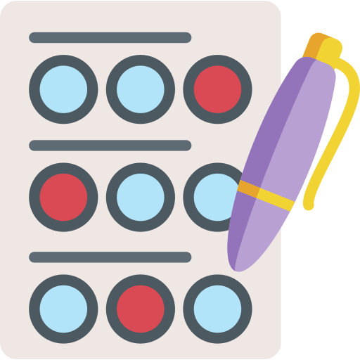
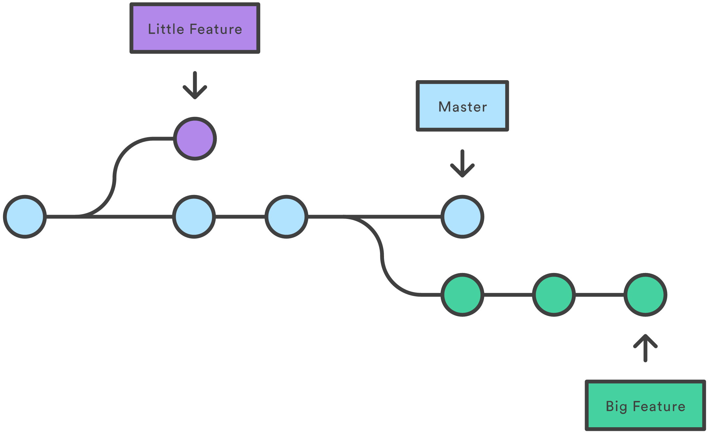
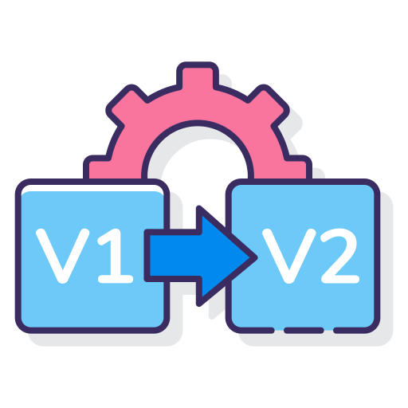
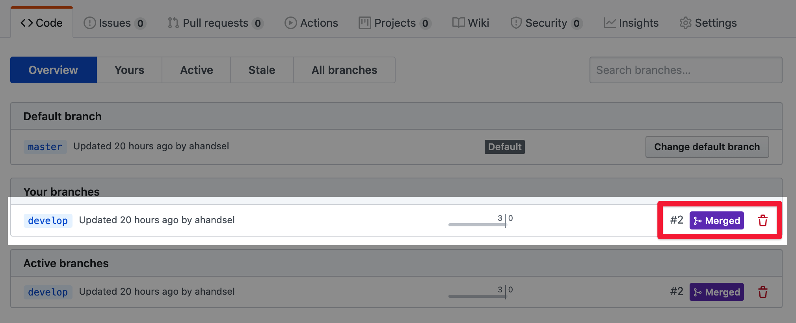

ハンズオンBの確認

Hands\-on B's Recap

# クイズの時間!

「git checkout \-b develop」は何しますか？

Pull Request

_プルリクエスト_

とは？

ブランチを使う理由は？

新しいブランチ（develop）を作成して、そのブランチに移動するコマンド。

コードの開発、テスト、公開バージョンなどを分離するため。

変更を取得するためにターゲットリポジトリをリクエストすることです。

ハンズオンCの準備

Prep for Hands\-on C

Prep

# 準備 - local git

昨日、「develop」ブランチを作成、マージ、削除しました。

「master」ブランチだけにしましょう。

「develop」ブランチがまだある場合。削除して。

develop\_file\.mdファイルも削除して。

__$ cd Documents/Kintone\_Dojo__

__$ git status__

__$ git branch__

__$ git branch \-\-delete develop__

__$rm develop\_file\.md__

Prep

# 準備 - GitHub

* Github\.comのKintone\_Dojoリポジトリに移動します。
* github\.com/ __USR__ /Kintone\_Dojo
* ブランチが1つだけかどうかを確認する。
* developブランチがあれば[ブランチを削除](https://help.github.com/ja/github/collaborating-with-issues-and-pull-requests/creating-and-deleting-branches-within-your-repository#deleting-a-branch)してください。

Prep

# 準備 -タイムトラベル

__$ git checkout master__

__$ git checkout \-b timeline__

__$ touch yr\_1__

__$ git add yr\_1__

__$ git commit \-m "Year 1"__

__$ touch yr\_2__

__$ git add yr\_2__

__$ git commit \-m "Year 2"__

* 「timeline」ブランチを作成します。
* _遊ぶためにファイルを作成する。_
* 次のファイルを作成して別々にコミットします\.
  * yr\_1    yr\_2    yr\_3

元に戻す：

時計を巻き戻す\!

ハンズオンC

Revert

# 歴史を見る

* __$ ls__
  * __README\.md yr\_1 yr\_2 yr\_3__
* __$ git log \-\-oneline__
  *  __489ca71 \(__    __HEAD \->__    __timeline__    __\)__   __Year 3__
  *  __7470790__   __Year 2__
  *  __444b696__   __Year 1__
  *  __8766df2 \(__    __origin/master__    __\,__    __master__    __\)__   __…__
* __$ git push origin timeline__

* __git log \-\-oneline__
* ブランチ上でのコミットを一覧表示します。
* チェックアウトおよび復帰コマンドに提供されたコミットハッシュを使用する。
* __git push origin timeline__
* これで、 __timeline__ ブランチはGitHub\.comにプッシュされています。ブラウザでリポジトリにアクセスして確認します。

# GitHub.com - timeline branch

# GitHub.com - timeline's commits

Revert

# 過去を訪ねる

* __$ $ git log \-\-oneline__
  *  __489ca71 \(__    __HEAD \->__    __timeline\,__    __origin/timeline__    __\)__   __Year 3__
  *  __7470790__   __Year 2__
  * _444b696_  __Year 1__
  *  __8766df2 \(__    __origin/master__    __\,__    __master__    __\)__   __…__
* __$ git checkout__  _444b696_
* __$ ls__
  * __README\.md  yr\_1__

* __git log \-\-oneline__
  * ブランチ上でのコミットを一覧表示します
  * チェックアウトおよび復帰コマンドに提供されたコミットハッシュを使用する
* __git checkout \[commit hash\]__
  * 作業ディレクトリを\[commit\]とまったく同じ状態に変換します。
  * これが元に戻すコミットかどうかを確認します。
  * この状況で行われた変更は保存されません。

Revert

# 1 Commit文過去に戻る

* __$ git checkout timeline__
  * __Switched to branch 'timeline'__
* __$ ls__
* __README\.md  yr\_1  yr\_2  yr\_3__
* __$ git revert HEAD__
  * __Removing yr\_3\.md__
* __$ ls__
* __README\.md  yr\_1  yr\_2__

* __git revert HEAD__
* 1コミット前に戻ります。

Revert

# コミットハッシュで過去に戻る

__$ git log \-\-oneline__

 __727642d \(__    __HEAD \->__    __timeline__    __\)__   __Revert "Year 3"__

 __f7cf1cb \(__    __origin/timeline__    __\)__   __Year 3__

 __f7fb07c__   __Year 2__

 __e4df7f2__   __Year 1__

 __03098e7 \(__    __origin/master__    __\,__    __master__   __\) README file created__

__$ git push origin timeline__

__…__

__Your branch is up to date with 'origin/timeline'\.__

Revert

Revert

__$ git log \-\-oneline__

 __727642d \(__    __HEAD \->__    __timeline__    __\,__    __origin/timeline__    __\)__   __Revert "Year 3"__

 __f7cf1cb__   __Year 3__

 __f7fb07c__   __Year 2__

 __e4df7f2__   __Year 1__

 __03098e7 \(__    __origin/master__    __\,__    __master__   __\) README file created__

Revert

__$ git revert__   __f7fb07c__   __// Year 2 commit's hash__

__Removing yr\_2__

__…__

__$ git log \-\-oneline__

 __f3fc335 \(__    __HEAD \->__    __timeline__    __\)__   __Revert "Year 2"__

 __727642d \(__    __origin/timeline__    __\)__   __Revert "Year 3"__

 __f7cf1cb__   __Year 3__

 __f7fb07c__   __Year 2__

 __e4df7f2__   __Year 1__

 __03098e7 \(__    __origin/master__    __\,__    __master__    __\)__   __README file created__

Revert

__$ ls__

_README\.md yr\_1_

__$ git push origin timeline__

__git revert \[commit hash\]__

前進する取り消しコマンド 。

指定された\[commit\]によって加えられた変更を反転し、新しいコミットとして結果を追加します。

Revert

# Reset vs Revert

git reset \[commit\]

git revert \[commit\]

元に戻す取り消し操作の削除

過去の\[commit\]に戻り、それまでのすべてのコミットを削除します。

これはすべてをクリーンアップします。

ただし、削除されたコミットの履歴は失われます。

前進する取り消し操作

過去の\[commit\]で新しいコミットを作成します。

コミットは削除されません。

公開/共有リポジトリに使用

Git Command\-Lineカンニングペーパー

Git Command Line

# Create a Repository

URL例= https://github\.com/user/repo

[https://github\.github\.com/training\-kit/downloads/ja/github\-git\-cheat\-sheet/](https://github.github.com/training-kit/downloads/ja/github-git-cheat-sheet/)

Git Command Line

# Branches

Git Command Line

# Sync Changes Between Local & Remote

Git Command Line

# Snapshotting

Git Command Line

# Make Changes

Git Command Line

# Redo Commits

GitHub Desktop App

# GitHub Desktop App

GitHub Desktopのドキュメント

[https://help\.github\.com/ja/desktop](https://help.github.com/ja/desktop)

ダウンロード:

[https://desktop\.github\.com/](https://desktop.github.com/)

# 

__$  cd Documents/Kintone\_Dojo\_3__

__$  git branch__

__master__

__\* timeline__

__$  git log \-\-__  __oneline__

 __1c787bb \(__    __HEAD \->__    __timeline__    __\,__    __origin/timeline__    __\)__    __Revert "Year 2"__ 

 __7c60e0e__    __Revert "Year 3"__ 

 __f0c82a0__    __Year 3__ 

 __62c6bd2__    __Year 2__ 

 __128c014__    __Year 1__ 

 __03098e7 \(__    __master__    __\)__    __README file created__ 

__$  git reset f0c82a0__

__Unstaged__  __changes after reset:__

__D yr\_2__

__D yr\_3__

$ git log \-\-  oneline

f0c82a0 \(   __HEAD \->__    __timeline__   \)  Year 3

62c6bd2  Year 2

128c014  Year 1

03098e7 \(   __master__   \)  README file created

__$  git push origin timeline__

__To https://__  __github\.com__  __/__  __ahandsel__  __/kintone\_dojo\_3\.git__

__\! \[rejected\]        timeline \-> timeline \(fetch first\)__

__error: failed to push some refs to 'https://__  __github\.com__  __/__  __ahandsel__  __/kintone\_dojo\_3\.git'__

__hint: Updates were rejected because the remote contains work that you do not have locally\. This is usually caused by another repository pushing to the same ref\. You may want to first integrate the remote changes \(e\.g\.\, 'git pull \.\.\.'\) before pushing again\.__

__hint: See the 'Note about fast\-forwards' in 'git push \-\-help' for details\.__

