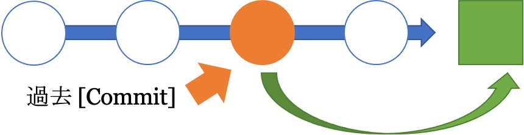

# Git, GitHubとは？ - 巻き戻す

このセクションでは `git revert` を紹介し, Git でファイルを元に戻すやり方について説明します

* [タイムトラベルの準備](#タイムトラベルの準備)
  * [Local Git](#local-git)
  * [GitHub](#github)
  * [サンプル ファイル と ブランチ を作成する](#サンプル-ファイル-と-ブランチ-を作成する)
* [元に戻す: 時計を巻き戻す](#元に戻す-時計を巻き戻す)
  * [歴史を見る](#歴史を見る)
  * [GitHub - timeline branch](#github---timeline-branch)
  * [GitHub - timeline's commits](#github---timelines-commits)
* [過去を訪ねる](#過去を訪ねる)
* [1コミット文過去に戻る](#1コミット文過去に戻る)
* [コミットハッシュで過去に戻る](#コミットハッシュで過去に戻る)
* [Reset vs Revert](#reset-vs-revert)
* [次のセクション](#次のセクション)

## タイムトラベルの準備

### Local Git

前のセクションでは, `develop` ブランチを作成, マージ, 削除しました.

`main` ブランチだけにしましょう.  
`develop` ブランチがまだある場合削除してください.

1. `learning_js` フォルダーに移動します

   ```sh
   cd ~/learning_js
   ```

2. Gitの現状を確認

   ```sh
   git status
   ```

   ```terminal
   On branch develop
   Your branch is up to date with 'origin/develop'.
   nothing to commit, working tree clean
   ```

3. リポジトリのブランチを確認する

   ```sh
   git branch
   ```

   ```terminal
   - develop
     main
   ```

4. `develop` ブランチにいるので, `main`に切り替えます

   ```sh
   git checkout main
   ```

   ```terminal
   Switched to branch 'main'
   Your branch is up to date with 'origin/main'.
   ```

5. `develop` ブランチを削除する

   ```sh
   git branch --delete develop
   ```

   ```terminal
   warning: deleting branch 'develop' that has been merged to
            'refs/remotes/origin/develop', but not yet merged to HEAD.
   Deleted branch develop (was 4f98baf).
   ```

6. develop_file.md ファイルも削除しましょう．

   ```sh
   rm develop_file.md
   ```

### GitHub
1. Github の `learning_js` リポジトリに移動します.
    * github.com/`UserName`/learning_js
2. ブランチが1つだけかどうかを確認する.
    * github.com/`UserName`/learning_js/branches
3. `develop` ブランチがあれば[ブランチを削除](https://docs.github.com/ja/github/collaborating-with-pull-requests/proposing-changes-to-your-work-with-pull-requests/creating-and-deleting-branches-within-your-repository#deleting-a-branch)
    * 

---

### サンプル ファイル と ブランチ を作成する
タイムトラベルためにファイルを作成する

1. `main` ブランチに切り替える

    ```sh
    git checkout main
    ```

2. `timeline` ブランチを作成します.

    ```sh
    git checkout -b timeline
    ```

    ```terminal
    Switched to a new branch 'timeline'
    ```

3. 次のファイルを作成して別々にコミットします.
    * `yr_1`, `yr_2`, `yr_3`

   ```sh
   touch yr_1
   git add yr_1
   git commit -m "Year 1"
   ```

   ```sh
   touch yr_2
   git add yr_2
   git commit -m "Year 2"
   ```

   ```sh
   touch yr_3
   git add yr_3
   git commit -m "Year 3"
   ```

## 元に戻す: 時計を巻き戻す

### 歴史を見る

次の 4 つのファイルがリポジトリ内にあるはずです

   ```sh
   ls
   ```

   ```terminal
   README.md   yr_1   yr_2   yr_3
   ```

`git log --oneline`
* ブランチ上でのコミットを一覧表示します.
* チェックアウトおよび復帰コマンドに提供されたコミットハッシュを使用する.

   ```sh
   git log --oneline
   ```

   ```terminal
   7a5bbf4 (HEAD -> timeline) Year 3
   5215f6d Year 2
   f10f791 Year 1
   03098e7 (origin/main, main) README file created
   ```

`git push origin timeline`
* これで `timeline` ブランチは GitHub にプッシュされています.
* ブラウザでリポジトリにアクセスして確認します.

```sh
git push origin timeline
```

### GitHub - timeline branch


### GitHub - timeline's commits


## 過去を訪ねる

`git log --oneline`
* ブランチ上でのコミットを一覧表示します
* チェックアウトおよび復帰コマンドに提供されたコミットハッシュを使用する

   ```sh
   git log --oneline
   ```

   ```terminal
   7a5bbf4 (HEAD -> timeline, origin/timeline) Year 3
   5215f6d Year 2
   f10f791 Year 1
   03098e7 (origin/main, main) README file created
   ```

`git checkout [commit hash]`
* 作業ディレクトリを [`commit`]とまったく同じ状態に変換します.
* これが元に戻すコミットかどうかを確認します.
* この状況で行われた変更は保存されません.

   ```sh
   git checkout f10f791
   ```

   ```terminal
   Note: switching to 'f10f791'.

   You are in 'detached HEAD' state. You can look around, make experimental
   changes and commit them, and you can discard any commits you make in this
   state without impacting any branches by switching back to a branch.

   If you want to create a new branch to retain commits you create, you may
   do so (now or later) by using -c with the switch command. Example:

     git switch -c <new-branch-name>

   Or undo this operation with:

     git switch -

   Turn off this advice by setting config variable advice.detachedHead to false

   HEAD is now at f10f791 Year 1
   ```

   ```sh
   ls
   ```

   ```terminal
   README.md  yr_1
   ```

## 1コミット文過去に戻る

`git revert HEAD`
* 1コミット前に戻ります.

    ```sh
    git checkout timeline
    ```

    ```terminal
    Previous HEAD position was f10f791 Year 1
    Switched to branch 'timeline'
    ```

    ```sh
    ls
    ```

    ```terminal
    README.md  yr_1  yr_2  yr_3
    ```

    ```sh
    git revert HEAD
    ```

    ```terminal
    Removing yr_3
    [timeline 450d385] Revert "Year 3"
    1 file changed, 0 insertions(+), 0 deletions(-)
    delete mode 100644 yr_3
    ```

    ```sh
    ls
    ```

    ```terminal
    README.md  yr_1  yr_2
    ```

## コミットハッシュで過去に戻る

```sh
git log --oneline
```

```terminal
2fb96f6 (HEAD -> timeline) Revert "Year 3"
7a5bbf4 (origin/timeline) Year 3
5215f6d Year 2
f10f791 Year 1
03098e7 (origin/main, main) README file created
```

`7a5bbf4 (origin/timeline) Year 3`行に注意してください.  
これは, GitHub (origin) に `Revert "Year 3"` コミットが実装されていないことを意味します。

`git push`

```sh
git push origin timeline
```

```terminal
Enumerating objects: 3, done.
Counting objects: 100% (3/3), done.
Delta compression using up to 4 threads
Compressing objects: 100% (2/2), done.
Writing objects: 100% (2/2), 240 bytes | 240.00 KiB/s, done.
Total 2 (delta 1), reused 0 (delta 0), pack-reused 0
remote: Resolving deltas: 100% (1/1), completed with 1 local object.
remote: This repository moved. Please use the new location:
remote:   https://github.com/ahandsel/learning_js_3.git
To https://github.com/ahandsel/learning_js_3.git
   f0c82a0..53a0f3e  timeline -> timeline
```


`git log --oneline`

<span style="color:#AAAB25"> __727642d \(__ </span>  <span style="color:#38B9C7"> __HEAD \->__ </span>  <span style="color:#39C026"> __timeline__ </span>  <span style="color:#AAAB25"> __\,__ </span>  <span style="color:#CA3323"> __origin/timeline__ </span>  <span style="color:#AAAB25"> __\)__ </span>  __Revert "Year 3"__  
<span style="color:#AAAB25"> __f7cf1cb__ </span>  __Year 3__  
<span style="color:#AAAB25"> __f7fb07c__ </span>  __Year 2__  
<span style="color:#AAAB25"> __e4df7f2__ </span>  __Year 1__  
<span style="color:#AAAB25"> __03098e7 \(__ </span>  <span style="color:#CA3323"> __origin/main__ </span>  <span style="color:#AAAB25"> __\,__ </span>  <span style="color:#39C026"> __main__ </span>  __\) README file created__  

`git revert f7fb07` Year 2 commit's hash

```sh
git revert 5215f6d

Removing yr_2
[timeline 6c3367a] Revert "Year 2"
 1 file changed, 0 insertions(+), 0 deletions(-)
 delete mode 100644 yr_2
```

`git log --oneline`

<span style="color:#AAAB25"> __f3fc335 \(__ </span>  <span style="color:#38B9C7"> __HEAD \->__ </span>  <span style="color:#39C026"> __timeline__ </span>  <span style="color:#AAAB25"> __\)__ </span>  __Revert "Year 2"__

<span style="color:#AAAB25"> __727642d \(__ </span>  <span style="color:#CA3323"> __origin/timeline__ </span>  <span style="color:#AAAB25"> __\)__ </span>  __Revert "Year 3"__

<span style="color:#AAAB25"> __f7cf1cb__ </span>  __Year 3__

<span style="color:#AAAB25"> __f7fb07c__ </span>  __Year 2__

<span style="color:#AAAB25"> __e4df7f2__ </span>  __Year 1__

<span style="color:#AAAB25"> __03098e7 \(__ </span>  <span style="color:#CA3323"> __origin/main__ </span>  <span style="color:#AAAB25"> __\,__ </span>  <span style="color:#39C026"> __main__ </span>  <span style="color:#AAAB25"> __\)__ </span>  __README file created__

Revert

`ls`

README.md yr_1

`git push origin timeline`

git revert [commit hash]

`git revert [commit hash]`
* 前進する取り消しコマンド
* 指定された[ `commit` ]によって加えられた変更を反転し, 新しいコミットとして結果を追加します.

## Reset vs Revert

| `git reset [commit]`                                              | `git revert [commit]`                           |
| ----------------------------------------------------------------- | ----------------------------------------------- |
| 元に戻す取り消し操作の削除                                        | 前進する取り消し操作                            |
| 過去の [`commit`] に戻り, それまでのすべてのコミットを削除します. | 過去の[ `commit` ]で新しいコミットを作成します. |
| これはすべてをクリーンアップします.                               | コミットは削除されません.                       |
| ただし, 削除されたコミットの履歴は失われます.                     | 公開/共有リポジトリに使用                       |



## 次のセクション
[巻き戻す - 03_Revert.md](03_Revert.md) へ 💪

## 講義ガイド一覧 <!-- omit in toc -->
[README.md](README.md) ⚙️
