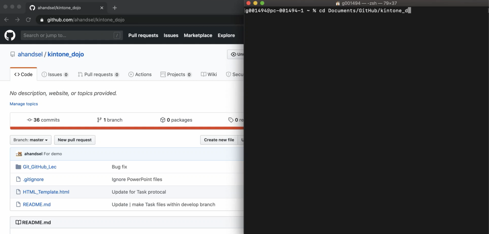
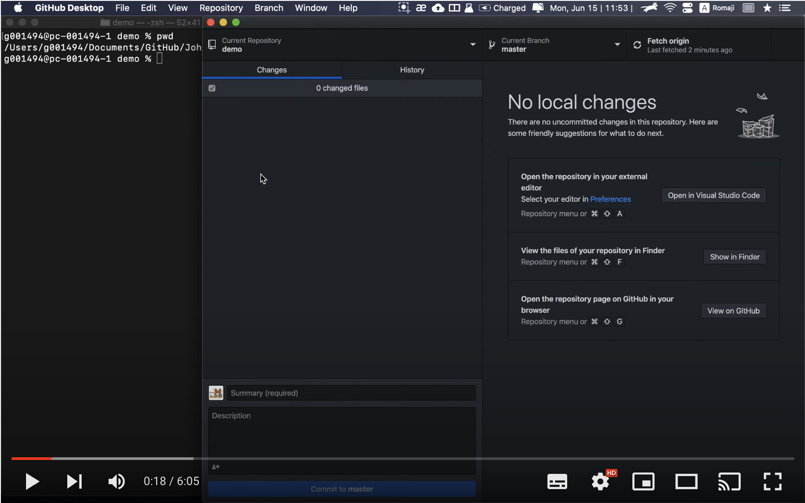

# Kintone Dojo Code Review

_🇯🇵 日本語版: [05_CodeReview.md](05_CodeReview.md)_

## Outline <!-- omit in toc -->
* [How to use `kintone_dojo` Repo](#how-to-use-kintone_dojo-repo)
* [When starting a `kintone_dojo` assignment](#when-starting-a-kintone_dojo-assignment)
* [Demo YouTube Videos](#demo-youtube-videos)
  * [`kintone_dojo` Task Demo](#kintone_dojo-task-demo)
  * [GitHub Code Review + GitHub Desktop App](#github-code-review--github-desktop-app)

## How to use `kintone_dojo` Repo
* ⚠️ Use this repository for only your `kintone_dojo` assignments!
* ⚡ Save your lecture notes somewhere else.
* This is to prevent problems with `git` or GitHub from interfering with your ability to take notes during the lecture

## When starting a `kintone_dojo` assignment
1. From the main branch, create a new branch titled `task##`.
    * `git checkout -b task01`
2. Create a **Task##** folder in the new branch.
    * `mkdir Task01`
3. Write your code and commit to this folder.
    * `git add Task01.html Task01.js`
    * `git commit -m "Task01 - first draft"`

When you are ready for a code review:
  1. Push the branch to GitHub
     * `git push origin task01`
  2. Create a pull request to merge the `task##` branch with `main`.
  3. Assign your reviewer

## Demo YouTube Videos

### `kintone_dojo` Task Demo
* 

### GitHub Code Review + GitHub Desktop App
* 

## List of Lecture Guides <!-- omit in toc -->
[README_EN.md](README_EN.md) ⚙️
