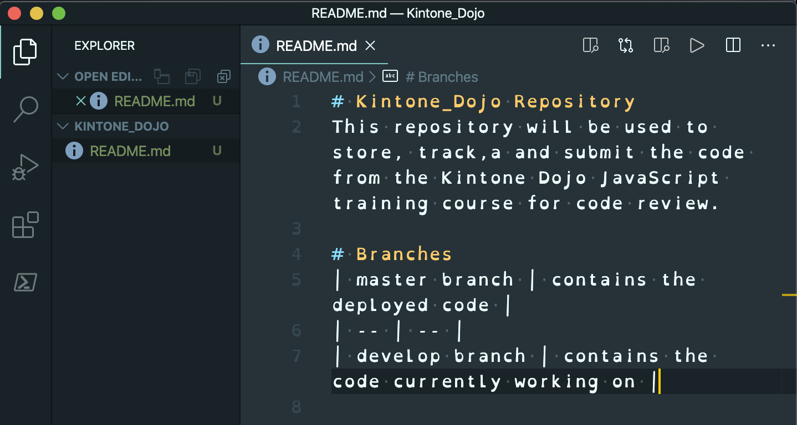
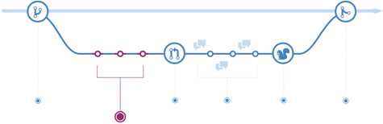
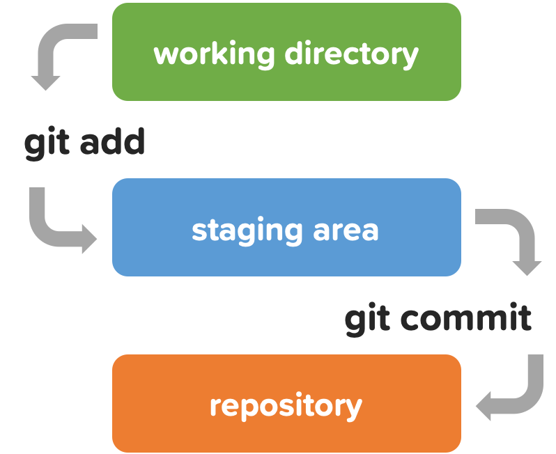
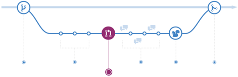
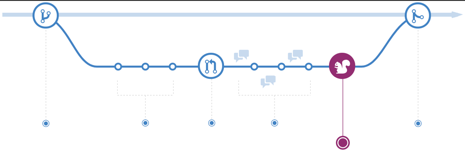
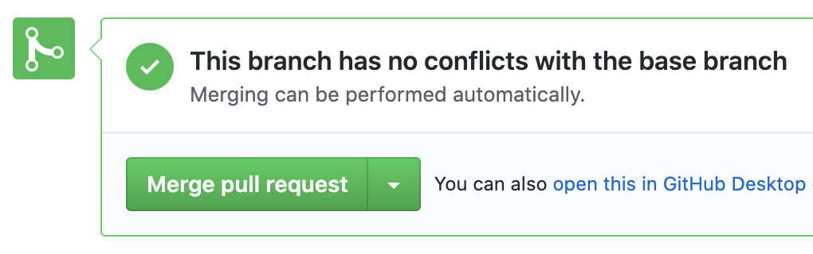

What is

Git & GitHub?

Icons made by [Freepik](https://www.flaticon.com/authors/freepik)  from [www\.flaticon\.com](http://www.flaticon.com/)

# Lessons' Objective

For everyone to…

  * Understand what is Git and GitHub

  * Successfully manage their code projects with Git and GitHub

# Overview

__Hands\-On  Sections__

__What is GitHub?__

__What is Git?__

Install Git

Create GitHub account

Start a repository

Git

# Git is…

Git is the  __actual__   __software__  that provides the  __version control __ to manage software development

Started in 2005 as a tool to manage Linux kernel development

Free & open\-source distributed version control system

Git

# What is Version Control?

* __History__  \- Keeps track of all the changes made to the files over time
* __Teamwork__  \- Allows for multiple people working on the same project at the same time
* __Backup__  \- Allows for easy file and folder recovery

Git

# Version Control Examples

Google Docs

Kintone

GitHub

# GitHub is…

* GitHub\.com is a collaboration platform\.
* This is where you store code for others to see\!
  * Similar to Google Docs as many users share and edit the same file\.
  * Think "GitHub" whenever you hear "remote repositories"\.
* Founded in 2008 and now a Microsoft subsidiary\.

Preparation

\+ Installation

# Preparation Overview

__VS Code \(Optional\)__

__Install Git__

__Create a GitHub Account__

Creating a GitHub Account

GitHub

# Create a GitHub Account

* Create a GitHub account  [github\.com](https://github.com/)
* Add 2\-Factor Authentication \([help doc](https://help.github.com/en/github/authenticating-to-github/configuring-two-factor-authentication)\)
  * Go to GitHub Settings:
  * Profile Photo > Settings > Security > Two\-factor authentication
  * [https://github\.com/settings/security](https://github.com/settings/security)
* Install an Authenticator App:
  * e\.g\. [Microsoft](https://www.microsoft.com/en-us/account/authenticator)\, [Authy](https://authy.com/guides/github/)\, [Enpass](https://www.enpass.io/)

GitHub

# Personal Access Token

* Generate a Personal Access Tokens
  * Settings > Developer settings > Personal access tokens
  * [https://github\.com/settings/tokens/new](https://github.com/settings/tokens/new)
* Use this token when accessing your GitHub account via Terminal
  * Use Tokens instead of passwords\.
  * Generate a token per use\-case\.
* Create and save a token for later use for this installation process\!

__https://help\.github\.com/en/github/authenticating\-to\-github/creating\-a\-personal\-access\-token\-for\-the\-command\-line__

VS Code

Visual Studio Code

VS Code

# Install VS Code

__Visual Studio Code \(VS Code\)__

Install: [code\.visualstudio\.com](https://code.visualstudio.com/)

A free source\-code editor made by Microsoft\.

Numerious\, powerful extensions makes VS Code a popular code editor\.

Simply type "VS Code Extensions" on dev\.to for inspiration\.

VS Code

# VS Code + Command Line

* __Run VS Code from Command Line __
* Open VS Code
* Open Command Palette
  * by pressing  __Command__  \+  __Shift__  \+  __P__
* Then type  __Shell__  & select  __Shell Command : Install code in PATH__
* Restart the terminal
* Open VS Code in current directory by typing " __Code \.__ " in the your terminal\.

VS Code

# Recommend Plugins for VS Code

[zenkaku](https://marketplace.visualstudio.com/items?itemName=mosapride.zenkaku)

[Trailing Spaces](https://marketplace.visualstudio.com/items?itemName=shardulm94.trailing-spaces)

[Simple icons](https://marketplace.visualstudio.com/items?itemName=LaurentTreguier.vscode-simple-icons)

[Settings Sync](https://marketplace.visualstudio.com/items?itemName=Shan.code-settings-sync)

[Replace curly quotes](https://marketplace.visualstudio.com/items?itemName=jinhyuk.replace-curly-quotes)

[Rainbow CSV](https://marketplace.visualstudio.com/items?itemName=mechatroner.rainbow-csv)

[Markdown All in One](https://marketplace.visualstudio.com/items?itemName=yzhang.markdown-all-in-one)

[Live Server](https://marketplace.visualstudio.com/items?itemName=ritwickdey.LiveServer)

[Github Markdown Preview](https://marketplace.visualstudio.com/items?itemName=bierner.github-markdown-preview)

[DupChecker](https://marketplace.visualstudio.com/items?itemName=jianbingfang.dupchecker)

[Community Material Theme](https://marketplace.visualstudio.com/items?itemName=Equinusocio.vsc-community-material-theme)

[Code Spell Checker](https://marketplace.visualstudio.com/items?itemName=streetsidesoftware.code-spell-checker)

[Code Runner](https://marketplace.visualstudio.com/items?itemName=formulahendry.code-runner)

[Bracket Pair Colorizer](https://marketplace.visualstudio.com/items?itemName=CoenraadS.bracket-pair-colorizer)

[Beautify](https://marketplace.visualstudio.com/items?itemName=HookyQR.beautify)

[:emojisense:](https://marketplace.visualstudio.com/items?itemName=bierner.emojisense)

[Auto Close Tag](https://marketplace.visualstudio.com/items?itemName=formulahendry.auto-close-tag)

[Auto Rename Tag](https://marketplace.visualstudio.com/items?itemName=formulahendry.auto-rename-tag)

Git on MacOS

Installation

# Install Git - MacOS

Install git with Homebrew:

Confirm installation:

Expected result:

__Do you have Homebrew?__

If not\, install Homebrew first:

If so\, be sure to upgrade it:

__$ brew install git__

__ https://__  __brew\.sh__  __/__

__$ brew update && brew upgrade__

__git version 2\.26\.2__

__https://git\-scm\.com/book/en/v2/Getting\-Started\-Installing\-Git__

Installation

# Install Git - MacOS - Potential Issue

If you get the following result:

Try:

Or try:

__$ brew link \-\-force git__

__git version 1\.7\.10\.2 \(Apple Git\-33\) __

__export PATH=/usr/local/bin:$PATH __

Git on Windows

# Installing Git on Windows

__\#3 Configure Git__

__\#1 Install Windows Subsystem for Linux \(WSL\)__

__\#2 Configure WSL__

Ubuntu 18\.04 LTS

[github\.com/hangxingliu/wslgit](https://github.com/hangxingliu/wslgit)

__git clone __  __git@github\.com:user__  __/__  __a\.git__

Windows

# WSL's Required Environment

__Start__   button

>  __Settings__

>  __Update & Security__

>  __Windows Update__

Update your Windows OS

Must be Windows 10 Version 1709 \(OS build 16299\) or later\!

Windows

# Enable WSL

__dism\.exe__  __ /online /enable\-feature /__  __featurename:Microsoft\-Windows\-Subsystem\-Linux__  __ /all /__  __norestart__

Enable "Windows Subsystem for Linux" \(WSL\) optional feature

Open  __PowerShell as Administrator __ and run the command

Restart your computer when prompted\.

[https://docs\.microsoft\.com/en\-us/windows/wsl/install\-win10](https://docs.microsoft.com/en-us/windows/wsl/install-win10)

__dism\.exe__  __ /online /enable\-feature /__  __featurename:Microsoft\-Windows\-Subsystem\-Linux__  __ /all /__  __norestart__

Both code blocks are the same\.

The smaller code block is for easy copy\-&\-paste\.

Windows

# Install Ubuntu

* Install your Linux Distribution of Choice
* Download and install from the Microsoft Store \(see below\)
* [Ubuntu 18\.04 LTS](https://www.microsoft.com/store/apps/9N9TNGVNDL3Q)
  * [microsoft\.com](https://www.microsoft.com/store/apps/9N9TNGVNDL3Q)[/store/apps/9N9TNGVNDL3Q](https://www.microsoft.com/store/apps/9N9TNGVNDL3Q)

Windows

# Initialize WSL

__\, this may take a few minutes\.\.\.__

__Please create a default UNIX user account\. The username does not need to match your Windows username\.__

__For more information visit: https://__  __aka\.ms__  __/__  __wslusers__

__Enter new UNIX username: __   __panda__ 

__Enter new UNIX password:__

__Retype new UNIX password:__

__passwd: password updated successfully__

__Installation successful\!__

__To run a command as administrator \(user "root"\)\, use "__  __sudo__  __ \<command>"\.__

__See "man __  __sudo\_root__  __" for details\.__

* Launch the distro \(Ubuntu 18\.04\)
* Click the  __launch__  button in the Microsoft Store App
* Setting up a new Linux user account
* This user account will not impact your Windows username
* The password is needed when running  __sudo__  __ __ commands

Windows

# Update WSL & Install Git

* Update & upgrade your distro's packages
  * Enter  __Y__  when asked "Do you want to continue? \[Y/n\]"
* Install git

__sudo__  __ apt update && __  __sudo__  __ apt upgrade__

__sudo__  __ apt install git__

Windows

# Install wslgit

* Download the [wslgit](https://github.com/hangxingliu/wslgit) repository
  * tool to forward all requests for git to WSL
* Go inside the wslgit folder
* Move the  __wslgit\.sh__  __ __ file to the WSL executable location in  __/__  __usr__  __/bin__
* Get back to home folder

__$ git clone https://__  __github\.com__  __/__  __hangxingliu__  __/__  __wslgit__

__$ cd __  __wslgit__  __/__

__$ __  __sudo__  __ mv __  __wslgit\.sh__  __ /__  __usr__  __/bin/__  __wslgit\.sh__

__$ cd__

Windows

# Configure VS Code

Download Remote \- WSL VS Code Extension

[https://marketplace\.visualstudio\.com/items?itemName=ms\-vscode\-remote\.remote\-wsl](https://marketplace.visualstudio.com/items?itemName=ms-vscode-remote.remote-wsl)

Windows

Go to VS Code Settings to change the git\.path object\.

Replace  _WindowsUSER_  and  _UbuntuUSER_  with your own\.

Tip: write the path on PowerShell and tab to verify it is correct\.

 __\{ __    __"__    __git\.path__    __"__    __: __    __"C:\\\\path\\\\to\\\\__    __git\.bat__    __"__    __ \}__ 

 __\{__   __ __   __"__    __git\.path__    __"__    __: __    __"C:__    __\\U__    __sers__    __\\__   _WindowsUSER_   __\\__    __A__    __ppData__    __\\L__    __ocal__    __\\P__    __ackages__    __\\C__    __anonicalGroupLimited\.Ubuntu18\.04onWindows\_79rhkp1fndgsc__    __\\__    __L__    __ocalState__    __\\__    __r__    __ootfs__    __\\h__    __ome__    __\\__   _UbuntuUSER_   __\\__    __w__    __slgit__    __\\__    __g__    __it\.bat__    __"__   __ __   __\}__ 

Windows

# Japanese version of Ubuntu

__sudo__  __ apt \-y install language\-pack\-ja__

__sudo__  __ update\-locale LANG=ja\_JP\.UTF8__

__sudo__  __ apt \-y install __  __manpages__  __\-ja __  __manpages__  __\-ja\-dev__

Install the Japanese language pack

Set local language to Japanese

Restart Ubuntu

Install Japanese manuals

[https://qiita\.com/asazuke/items/f8eff69bce0bee083fcf](https://qiita.com/asazuke/items/f8eff69bce0bee083fcf)

Windows

# Configure Git + GitHub

__$ __  __ssh__  __\-keygen__

__Generating public/private __  __rsa__  __ key pair\.__

__Enter file in which to save the key \(/home/user/\.__  __ssh__  __/__  __id\_rsa__  __\):__

__Created directory '/home/user/\.__  __ssh__  __'\.__

__Enter passphrase \(empty for no passphrase\):__

__Enter same passphrase again:__

__Your identification has been saved in /home/user/\.__  __ssh__  __/__  __id\_rsa__  __\.__

__Your public key has been saved in /home/user/\.__  __ssh__  __/__  __id\_rsa\.pub__  __\.__

__…__

Generate an SSH key

It is required to link with GitHub

Leave the questions blank and just ENTER

Windows

Copy the key to the clipboard

This is needed to be pasted into GitHub\.com's setting page\.

__ cat ~/\.__  __ssh__  __/__  __id\_rsa\.pub__  __ | __  __clip\.exe__  __ __

Windows

GitHub\.com/settings

> SSH and GPG Keys

> click  __New SSH key__  button

Type Windows WSL for Title

Paste the public key

> click  __Add SSH key __ button

Windows

# Confirm the Settings

Confirm the settings with the following commands

__$ __  __ssh__  __ \-T __  __git@github\.com__

__The authenticity of host '__  __github\.com__  __ \(13\.114\.40\.48\)' can't be established\.__

__RSA key fingerprint is SHA256:xxx\.__

__Are you sure you want to continue connecting \(yes/no\)? yes__

__Warning: Permanently added 'github\.com\,13\.114\.40\.48' \(RSA\) to the list of known hosts\.__

__Hi __  __User\_Name__  __\_\! You've successfully authenticated\, but GitHub does not provide shell access\.__

Windows

# VS Code + Explorer

* To open the Explorer from the current Linux folder\, enter:
* To open the VS Code from the current Linux folder\, enter:

Windows

# Windows + WLS and GitHub

Instead of using HTTPS  Use SSH

__ git clone https://__  __github\.com__  __/\.\.\./__  __a\.git__

__ git clone __  __git@github\.com__  __:\.\.\./__  __a\.git__

Getting Started

Hands\-on A

# Hands-On A Overview

__Linking Local & GitHub__

__GitHub Configuration__

__Local Configuration__

Create a folder

Configure it to be managed by git

Configure that the two are linked

Create a file on the local side

Run git commands

Verify that the file appeared on GitHub\.com

Create a "folder" like thing on GitHub

It is called repository

Hands\-On A

# Configure Git

* Configure your Git username and email with  __git config__
  * For Mac\, use Terminal
  * For Windows\, use PowerShell or Git Bash

__ $ git config \-\-global user\.name "GitHub\_UserName"__

__ $ git config \-\-global user\.email "example@email\.com"__

__ $ git config \-\-global color\.ui auto__

__ $ git config \-\-global \-\-__  __list__

__https://git\-scm\.com/book/en/v2/Getting\-Started\-First\-Time\-Git\-Setup__

Hands\-On A

# Create a Local Git Repository

__$ cd Documents__

__$ __  __mkdir__  __ dojo__

__$ cd dojo__

__$ git init__

__Initialized empty Git repository in \.\.\./Documents/Dojo/\.git/__

* With your terminal\, go to  __Documents__  and create a directory named  __dojo__
  * $ pwd ~/Documents/dojo
* In there\, initialize a git repository
* Repository is often shortened to Repo

Hands\-On A

# Add a README.md file to the Local Repo

__$ touch README\.md__

__$ code \.__

* Create a README\.md file
* Open the current dojo directory with VS Code
  * See appendix for setup
* Add a description of your repository in the markdown file

Hands\-On A

# Check Git's Status

__$ git status__

__On branch master__

__No commits yet__

__Untracked files:__

__\(use "git add \<file>…" to …__

 __	__    __README\.md__ 

__nothing added to commit but untracked files present__

__  \(use "git add" to track\)__

* __git status__
* command that shows the working directory's & staging area's state
  * __Changes to be committed: __ See which changes have & have not been staged
  * __Untracked files: __ see which files are not being tracked by git
* See that the README\.md needs to be tracked by git

Hands\-On A

# Saving #1 - Add a File to Git's Staging Area

* __$ git add README\.md__
* __$ git status__
  * __On branch master__
  * __No commits yet__
  * __Changes to be committed:__
  * __  \(use "git rm \-\-cached \<file>…" to unstage\)__
  * _  new file: README\.md_

* __git add__   __\[file/folder\]__
  * command to add the \[file/folder\] to the staging area
* Now the README\.md is now in staging area\!

Hands\-On A

# Saving #2 - Add a File to Git Repo

* __git commit \-m "message" __
  * command to add the file/folder to the repository
* Now the README\.md is now in the repository
  * specifically the  __master__  branch

__$ git commit \-m "README file created"__

__\[master \(root\-commit\) d775d42\] First version of README file __

__  1 file changed\, 7 insertions\(\+\)__

__  create mode 100644 __  __README\.md__

__$ git status__

__On branch master__

__nothing to commit\, working tree clean__

Hands\-On A

# Create a GitHub Repository

__Create a Repository__

[https://github\.com/new](https://github.com/new)

Name your repository  __dojo__

Do not initialize repository with README

Hands\-On A

# Local Git  GitHub

* __Push __ the existing repository\!
  * Get the URL by clicking on  __Clone or download __ button & copying the HTTPS link
* __[git remote add origin \<link>](https://git-scm.com/docs/git-remote)__
  * connects the git managed local repository with GitHub's remote
* __[git remote ](https://git-scm.com/docs/git-remote)__
  * command to manage the remote repos

Hands\-On A

* __$ git remote add origin https://__  __github\.com__  __/__  __User\_Name__  __\_/__  __dojo\.git__
* __$ git push \-u origin master__
* __Username for '__  __github\.com__  __': __  __User\_Name__  __\___
* __Password for 'User\_Name\_@__  __github\.com__  __': <__  __Token\_Here__  __>__
  * __Counting objects: 100% \(3/3\)\, done\.__
  * __Delta compression using up to 4 threads__
  * __Compressing objects: 100% \(2/2\)\, done\.__
  * __Writing objects: 100% \(3/3\)\, 434 bytes | 86\.00 KiB/s\, done\.__
  * __Total 3 \(delta 0\)\, reused 0 \(delta 0\)\, pack\-reused 0__
  * __To https://__  __github\.com__  __/__  __User\_Name__  __\_/__  __dojo\.git__
  * __ \* \[new branch\]      master \-> master__
  * __Branch 'master' set up to track remote branch 'master' from 'origin'\.__

# Hands-on A is Completed!

__Create & push a local repository__

__Create & Configure GitHub__

__Install & Configure git on PC__

* __$ git config __
  * __\-\-global __
  * __user\.name __
  * __user\.email __
  * __\-\-list__

__$ git init__

__$ git status__

__$ git commit \-m__

Saving with Git & Remote Repos

Overview of Hands\-on A

Saving with Git

# Saving Changes with Git

__working directory__

__There are 2 commands to transfer the items between the "locations"__

__There are 3 "locations" where files\, folders\, and changes are stored__

__https://git\-scm\.com/__

Saving with Git

__working directory__

* __working directory__
  * the current local directory that you are working on\.
  * all changes first takes place here
* __git add__
  * command that promotes a change from working directory to staging area

Saving with Git

__working directory__

* __staging area__
  * the buffer between the working directory & the repository
  * used to be called the 'index'
  * the promoted changes are bundled together\, waiting for the next commit

Saving with Git

# Why have Staging Area?

* To stage a file = prepare the file for a commit
* __Staging Area Metaphor \- Music__
* Imagine you are a musiation and you are writing various songs with varying messages\. \(Everything from hateful to loving songs\)
* Now do you want to upload all your songs randomly onto a website?
* No\! You want to upload the songs bundled as albums with a theme\.

Saving with Git

__To make a romantic album:__

you  __git add__  only your love songs

As you are still searching for and selecting songs to include in the romatic album\, the selected songs are stored in the  __Staging Area__

Once you have all the songs you want in the album \(stored in the Staging Area\)\, time to commit\!

you  __git commit \-m__  with the album title\, "Love Song"

Saving with Git

# Saving Changes with Git

__working directory__

* __git commit__
  * command to record changes to the repository
  * use once all the files with the changes you want to be saved together are in staging area
  * Game Check\-In
    * Similar to when you defeated a boss & want to save your game's progress
  * comments per commit  provides a natural documentation

Saving with Git

__working directory__

* __repository__
  * git repository is the actual  " __\.git__ " __ __ folder inside a project
  * the folder tracks all the changes made in the project
  * i\.e\. the historian
* __remote repository \(GitHub\)__
  * the repository on GitHub's server\, allowing the code to be viewed by others

Remote Repos

# Working with Remote Repos

* __$ git remote \-verbose __
  * __origin https://github\.com/user/repo \(fetch\) __
  * __origin https://github\.com /user/repo \(push\)__

* __git remote __ command
  * manages the connection between your local & remote repositories
* __git remote \-\-verbose__
  * lists out the URLs that Git has stored & alias \(nickname\) that can be used when reading & writing to that remote repo

Remote Repos

* __[git remote add origin \<link>](https://git-scm.com/docs/git-remote)__
* git creates an  __alias__  of the remote repository when you clone a remote repository to your local machine
  * i\.e\. nickname is assigned per remote repository's URL
* Most common alias is called " __[origin](https://git-scm.com/book/en/v2/Git-Basics-Working-with-Remotes)__ \."
* Thus\, both following commands does the same thing:
  * git push \-u  _https://github\.com/user/_  _repo\.git_  _ _ master
  * git remote add  __ALIAS__   _https://_  _github\.com_  _/user/repo\.git_
  * git push \-u  __ALIAS__  master

Remote Repos

# git push?

* __git push \[remote\] \[branch\]__
  * command to upload local repo content to a remote repo
    * i\.e\. export the commits from your local  remote repo
  * counterpart to  __git fetch__  \(import commits to local repo\)
* Note: Pushing can potentially overwrite changes\!

Remote Repos

* __git push__  command works only for remote repo that has not been modified since your last push or clone
  * i\.e\. No one else changed the remote repo after you
* if you & another user cloned at the same time and they push upstream before you\, your push will rightly be rejected
  * you will need to fetch their work and include it in your push first

# Hands-on A Review

__git push__

__git remote__

__Saving with Git__

Command to upload local repo content to a remote repo

Command to manage the connection between the local & remote repos

Make & Merge Branches\!

Hands\-on B

Branches

# Create a New Branch

* By default\, the repository has the  __master__  branch
* Create a branch named  __develop__
* __[git checkout \-b \<branch name>](http://git-scm.com/docs/git-checkout)__
  * command to create a new branch & switch to it
* __[git branch](http://git-scm.com/docs/git-branch)__
  * command to view a list of branches
  * current branch has the asterisk \(\*\)

* __$ git checkout \-b develop__
  * __Switched to a new branch 'develop'__
* __$ git branch__
  * __\* __  _develop_
  * __  master__

Branches

# Changing develop Branch

* __$ touch __  __develop\_file\.md__
* __$ git add __  __develop\_file\.md__
* __$ git commit \-m "develop only"__
  * __\[develop f946eb0\] File only in develop branch__
  * __ 1 file changed\, 0 insertions\(\+\)\, 0 deletions\(\-\)__
  * __ create mode 100644 __  __develop\_file\.md__
* __$ git status__
  * __On branch develop__
  * __nothing to commit\, working tree clean__
* __$ git push \-u origin develop__

* While being in the  __develop__  branch\, create a file\.
* Run  __git add __ and __ git commit __ to save it to the local repo\.
* Run  __git status__  to confirm the changes\.
* Run  __git push __ to push the changes to GitHub repo

Branches

# Confirming the Change on GitHub

* Only the  __develop__  branch included the new file
* Add another file in  __develop __ branch
* Then view the  __Network graph __
  * https://github\.com/ _USER_ / _REPO_ /network

Branches

# Create & Merge Pull Request

* __Pull Requests __ shows others your changes without actual modifying
  * useful for code review
* On GitHub\.com\, create the  __pull request__  to merge  __develop__  \->  __master__  branch\.
* Confirm the changes and Merge the Pull request\.
* This results in  __master__  branch having the two new files\!

Branches

# GitHub repo  Update Local repo

* $ git checkout master
  * Switched to branch 'master'
  * Your branch is behind 'origin/master' by 4 commits & can be fast\-forwarded
  * \(use "git pull" to update your local branch\)
* $ git pull origin master
  * remote: Enumerating objects: 1\, done\.
  * remote: Counting objects: 100% \(1/1\)\, done\.
  * remote: Total 1 \(delta 0\)\, reused 0 \(delta 0\)\, pack\-reused 0
  * Unpacking objects: 100% \(1/1\)\, 631 bytes | 210\.00 KiB/s\, done\.
  * From https://github\.com/User\_Name\_/dojo
  * \* branch            master     \-> FETCH\_HEAD
  * 5f9f89b\.\.1438ca5  master     \-> origin/master
  * Updating d775d42\.\.1438ca5
  * Fast\-forward
  * 2nd\_file\.md     | 0
  * develop\_file\.md | 0
  * 2 files changed\, 0 insertions\(\+\)\, 0 deletions\(\-\)
  * create mode 100644 2nd\_file\.md
  * create mode 100644 develop\_file\.md
* $ git branch \-d develop
  * Deleted branch develop \(was c6e6c83\)\.
* $ git branch
  * \* master

__$ git checkout master__

__$ git __  __pull origin master__

__$ git branch \-d develop__

__$ git branch__

* Currently\, your GitHub repo is ahead of the local copy
  * Use  __git pull__  command to address this
* __git pull origin master__
  * pull the latest repo version from GitHub to the local repo

What are branches?

Overview of Hands\-on B

Branches

# Git Branches

What are branches?

Why use branches?

* movable pointer to a commit
* mechanism that manages multiple timelines\, allowing for changes without impacting the main line
* __git checkout__
  * command to switch branches
* __git branch \-d <__  __branch\_name__  __> __
  * command to delete branches

* allows for a separation between stable\, in\-development\, and experimental changes
* Example: This GitHub Slides
  * Each Hands\-on and concept section can be a branch\.
  * Each can be developed in parallel\.

Branches

# Branches - Website

* __master__  branch contains the 'live' code that runs the website\.
  * changes in  __master __ impacts users
* Two coders want to modify the website at the same time\. Make 3x branches:
  * __master__   live code
  * __feature\_A__  __ __  for coder A to modify
  * __feature\_B__   for coder B to modify
* Once the code developments are done\, merge the branches\.

Git Pull vs Push

# Git Pull vs Push

git push

git pull

* the 'upload' command
* "Push" is forcing the changes to the target repo\.
  * \[ your code \] \-\- pushing \-\-> \[target\]
* A "push request" would be the target repo requesting you to push your changes\.

* the 'download' command
* "Pull" is the target repo grabbing your changes
  * \[ your code\] \}\-\- pulling \-\- \[target\]
* A "pull request" is you requesting the target repository to please grab your changes\.

GitHub Workflow

GitHub Workflow

# #1 - Create a Branch

__$ git checkout \-b develop__

__$ git branch__

* The code for the live website is in the  __master__  branch
  * Any changes to here will effect the users\!
* If you want to create a new page\, first create a new  __feature__  branch\.
  * This is where you will do the development for the new page\.

https://guides\.github\.com/introduction/flow/

GitHub Workflow

# #2 - Making a Commit

In your  __feature__  branch\, you are modifying code\.

Each time you want to save a change\, make a  __commit\.__

This keeps track of changes and provides a transparent history\.

Commits allow for roll backs and references\.

GitHub Workflow

# #3 - Open a Pull Request

When you are ready to share your changes to others\, open a  __Pull Request__ \.

Pull Requests are the start of code review\.

Make & review comments at the Pull Request tab on GitHub\.

GitHub Workflow

# #4 - Test

After code review\, deploy your code in a testing environment to make sure everything works\.

Example: Test if the website looks and acts as expected on Zendesk Preview mode\.

GitHub Workflow

# #5 - Merge to Master!

* Merge your code into the  __master__  branch\.
  * Now your changes are live & visible the users\.
* Once merged\,  __Pull Requests __ acts as reference points\.
* Example: Pull Request for new logo will become a reference point to indicate the "before" and the "after" of the logo change\.

GitHub Workflow

# Overview of GitHub Workflow

https://commonflow\.org/spec/1\.0\.0\-rc\.5\.html

Revert:

Rewind the Clock

Hands\-on C

Revert

# Preparation for Time Travel

__$ git checkout master__

__$ git checkout \-b timeline__

__$ touch yr\_1__

__$ git add yr\_1__

__$ git commit \-m "Year 1"__

__$ …__

* Create a branch  __timeline__
* Create and commit changes three times\.
  * yr\_1   yr\_2   yr\_3

Revert

# Check the Past

* __$ ls__
  * __README\.md  yr\_1 yr\_2 yr\_3__
* __$ git log \-\-__  __oneline__
  * 489ca71 \(  HEAD \->   timeline  \)    Year 3
  * 7470790    Year 2
  * 444b696    Year 1
  * 8766df2 \(  origin/master  \,   master  \)  …
* __$ git checkout 444b696__
* __$ ls__
  * __README\.md  yr\_1__

* __git log \-\-__  __oneline__
  * Lists out the commits of the branch
  * Use the commit hash provided for checkout and revert commands
* __git checkout \[commit hash\]__
  * Convert the working directory to be the exact state as the \[commit\]\.
  * Check if this is the commit you want to revert back to\.
  * No changes made in this situation will be saved\.

Revert

# Time Travel Back 2 Commits

* __$ git checkout timeline__
  * __Switched to branch 'timeline'__
* __$ git revert HEAD~2\.\.HEAD__
  * __Removing yr\_3__
  * __Removing yr\_2__
* __$ git log \-\-__  __oneline__
  * d4f441f \(  HEAD \->   timeline  \)    Revert "Year 2"
  * 843f802    Revert "Year 3"
  * 489ca71  Year 3
  * 7470790    Year 2
  * 444b696    Year 1
  * 8766df2 \(  origin/master  \,   master  \)  …

* __git revert \[commit hash\]__
  * Forward\-moving undo command
  * It inverts the changes made by the specified \[commit\] and appends the result as a new commit\.
* __git revert HEAD__
  * Goes back by 1 commit
* __git revert HEAD~\[\#\]\.\.\.HEAD__
  * Goes back by \[\#\] commits

Revert

# Reset vs Revert

git reset \[commit\]

git revert \[commit\]

Past\-deleting undo operation

Goes back to the past \[commit\] and removes all commits between now till then\.

This cleans up everything\.

However\, the history of the deleted commits are lost\.

Forward\-moving undo operation

Creates a new commit with the past \[commit\]\.

No commits are deleted\.

Use for a public/ shared repos

GitHub

Website Overview

GitHub Overview

# GitHub Repository

* GitHub Repository \- Code
  * Container that holds everything related to the project like code and documentation\.
  * All files stored here are managed with git version control
  * Repository is often shorted to 'repo'
* README\.md
  * File that introduces the project and is displayed in repository's bottom\.

GitHub Overview

# GitHub Issues & Pull Request

* Issues
  * Where users discuss about the code
  * Issues can be assigned to users and add label for easy reading

* Pull request
  * represents change that a user wants to make to the repository
  * Example: Bob creates a Pull request to add the new README\.md file\.

GitHub Overview

# GitHub Overview

* Project boards: Kanban\-style task tracking board
* Wiki: Create & store relevant project documentation
* Insights: Analytics tools for your repository including:
  * __Network__  Graph: Timeline visualization of the commits & branches
  * __Pulse__ : View completed &                                                                                      \.                in\-progress tasks

Git Command\-Line Cheat Sheet

Git Command Line

# Create a Repository

| Command | Description |
| :-: | :-: |
| git init | Initialize a local Git repository |
| git clone [url] | Clone (download) a repo from GitHub |
| git remote add origin [url] | Link a local repo to a remote repo |

Example URL = https://github\.com/user/repo

Git Command Line

# Branches

| Command | Description |
| :-: | :-: |
| git status -v | see which branch is the current one |
| git branch [branch-name] | Create a new branch |
| git branch -d [branch] | Delete the specified branch |
| git checkout [branch] | switch the working directory |
| git merge [branch] | Merges the specified branch's history into the current branch. |

Git Command Line

# Sync Changes Between Local & Remote

| Command | Description |
| :-: | :-: |
| git fetch [remote] [branch] | Download history from the remote branch |
| git push [remote] [branch] | uploads the specified branch to [remote] |
| git pull [remote] | fetch & download content from [remote] |

Git Command Line

# Snapshotting

| Command | Description |
| :-: | :-: |
| git add [file] | adds [file] to staging area |
| git status | Checks file status |
| git add -A | Add all new & modified files to the staging area |
| git commit -m "[message]" | Commit changes with a message |
| git rm -r [file] | Remove a file or directory |

Git Command Line

# Make Changes

| Command | Description |
| :-: | :-: |
| git log | lists version history of the current branch |
| git log --follow [file] | version history specific to [file] |
| git diff [branch A] [branch B] | Shows the difference between the branches |
| git show [commit] | view details on the [commit] |

Git Command Line

# Redo Commits

| Command | Description |
| :-: | :-: |
| git reset [commit] | revert back to [commit] Past-deleting undo operation |
| git revert [commit] | 'safe' way to revert back to [commit] Forward-moving undo operation  |
| git revert HEAD | Create a new commit with the inverse of the last commit |

Appendix

Windows

# Window Specific Tutorials

[https://www\.datacamp\.com/community/tutorials/git\-push\-pull](https://www.datacamp.com/community/tutorials/git-push-pull)

# Resources

[https://product\.hubspot\.com/blog/git\-and\-github\-tutorial\-for\-beginners](https://product.hubspot.com/blog/git-and-github-tutorial-for-beginners)

[https://guides\.github\.com](https://guides.github.com/activities/hello-world/)[/activities/hello\-world/](https://guides.github.com/activities/hello-world/)

