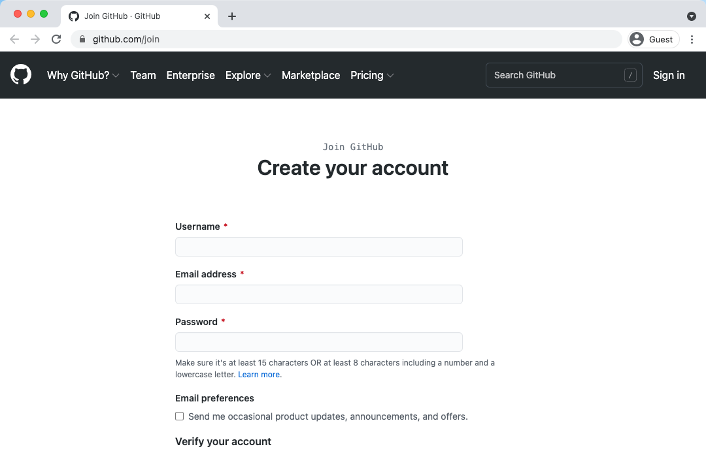

# Git, GitHubとは？ - 準備手順
by [Kintone Developer Program](https://developer.kintone.io/hc/en-us/)

 

<!-- block-start: grid, sns-box -->
<!-- account: github, ahandsel -->
<!-- block-end -->

---

## Overview

### コンテンツの目的
SC本部メンバーが。。。
  1. Git と GitHub について理解できた
  2. GitHub でコードを管理できるようになった

### 概要
<!-- block-start: grid -->

<!-- block-start: column -->

#### Gitの基本

<!-- block-end -->

<!-- block-start: column -->

#### GitHubの基本

<!-- block-end -->

<!-- block-start: column -->

#### ハンズオン
  - Gitをインストールする
  - GitHubアカウントを作成する
  - リポジトリを作成する

<!-- block-end -->
<!-- block-end -->

---

## GitHubアカウント

### GitHubアカウントを作成する
[github.com/join](https://github.com/join)  

---

### 2要素認証を設定する
  1. GitHub設定画面に移動します: [github.com/settings/security](https://github.com/settings/security)
     - `Two-factor authentication` (2要素認証) の下で`Enable two-factor authentication` (2要素認証の有効化) をクリックしてください。
     - `Two-factor authentication` のページで、`Set up using an app` をクリックします。
  2. Authenticator Appを作成する
     - 提案: [Microsoft](https://www.microsoft.com/en-us/account/authenticator), [Authy](https://authy.com/guides/github/), [Enpass](https://www.enpass.io/)

#### Resources
  - [GitHub help doc](https://help.github.com/ja/github/authenticating-to-github/configuring-two-factor-authentication)
  - YouTube: [How to setup 2FA with GitHub](https://youtu.be/5DKqXeorDHY)

---

##
