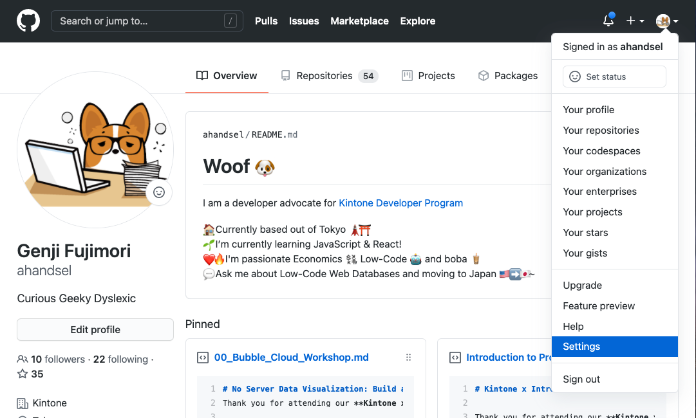
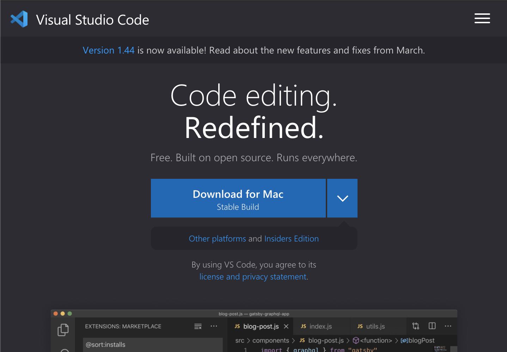
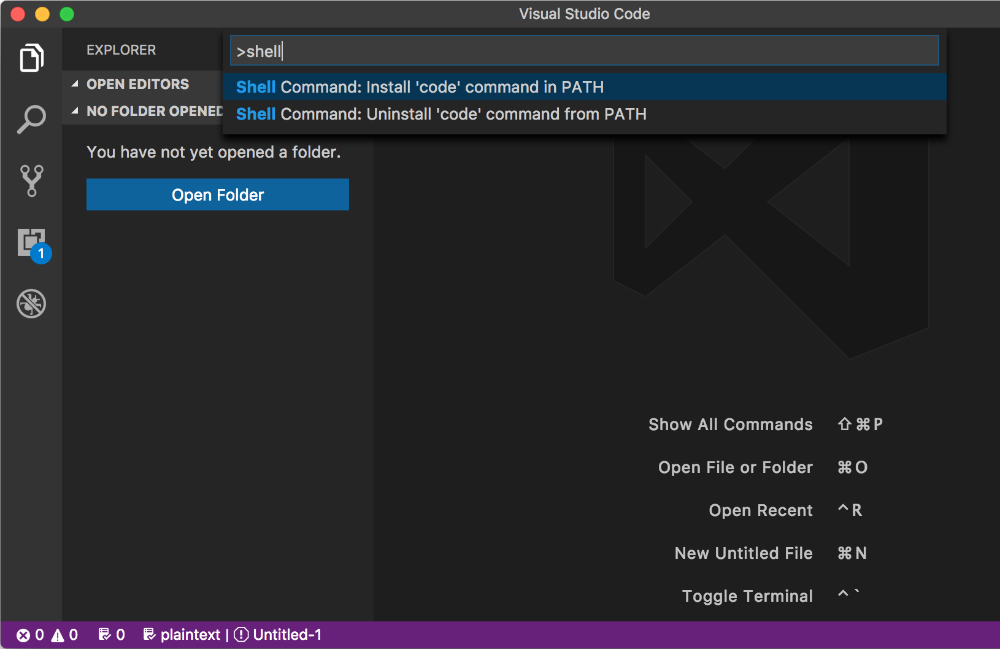

# Git, GitHubとは？ - 準備手順

## コンテンツの目的
SC本部メンバーが。。。
  1. Git と GitHub について理解できた
  2. GitHub でコードを管理できるようになった

## Overview

| Gitの基本                                  | GitHubの基本                                     | ハンズオン                                                                                                |
| ------------------------------------------ | ------------------------------------------------ | --------------------------------------------------------------------------------------------------------- |
|  |  | <ul><li>Gitをインストールする。</li><li>GitHubアカウントを作成する</li><li>リポジトリを作成する</li></ul> |

## GitHub アカウント


### GitHubアカウントを作成する
  - GitHubアカウントを作成する --> [github.com](https://github.com/)
  - 2要素認証を追加する ([help doc](https://help.github.com/en/github/authenticating-to-github/configuring-two-factor-authentication))
    - GitHub設定画面に移動します
    - プロフィール写真> Settings > Security > Two\-factor authentication
    - [https://github.com/settings/security](https://github.com/settings/security)
  - Authenticator Appを作成する:
    - 例: [Microsoft](https://www.microsoft.com/en-us/account/authenticator), [Authy](https://authy.com/guides/github/), [Enpass](https://www.enpass.io/)




### コマンドラインの個人アクセストークン
パーソナルアクセストークンを生成する
  - Settings > Developer settings > Personal access tokens
  - [github.com/settings/tokens/new](https://github.com/settings/tokens/new)

このtokenはターミナル経由でGitHubアカウントにアクセスする時に使用します
  - Passwordの代わりにトークンを使用します
  - ユースケースごとにtokenを生成します

GitHubの検証のためのtokenを作って保存してください。

GitHub Docs: [個人アクセストークンを使用する](https://docs.github.com/ja/github/authenticating-to-github/creating-a-personal-access-token)

---

## Visual Studio Code + Command Line

コマンドラインからVSコードを実行する
  - VS Codeを開く
  - Command Paletteを開く
  - `Command` \+ `Shift` \+ `P`
  - Shellと入力して& Shell Command: `Install code in PATH`を選択する
  - Terminalを再起動する
  - `code .` と入力することでVSCodeが開きます

Visual Studio Code Download Link:  
[code.visualstudio.com](https://code.visualstudio.com/)

| Install VS Code             | Shell Command: Install 'code' command in PATH |
| --------------------------- | --------------------------------------------- |
|  |                      |

## MacOS - Gitのインストール

### 1. Homebrew の確認
インストールされていなければ、最初にHomebrewをインストールします。
  - [brew.sh](https://brew.sh/)

既にインストールされている場合、アップグレードしてください。
  - `$ brew update && brew upgrade`

### 2. Homebrew で git をインストール
`$ brew install git`

### 3. インストールの確認
`$ git --version`

Gitのバージョンが表示されれば成功です！
  - `git version 2.31.1`

もし次の結果が返ってきた場合
  - `git version 1.7.10.2 (Apple Git-33)`

このコマンドを実行してください！
  - `$ brew link --force git`

またはこちらを実行してください！
  - `export PATH=/usr/local/bin:$PATH`

詳細: [Git - Gitのインストール](https://git-scm.com/book/ja/v2/%E4%BD%BF%E3%81%84%E5%A7%8B%E3%82%81%E3%82%8B-Git%E3%81%AE%E3%82%A4%E3%83%B3%E3%82%B9%E3%83%88%E3%83%BC%E3%83%AB)

---

## Windows 10 - Gitのインストール

＃3 Gitを構成する

＃1 Linux用のWindowsサブシステム（WSL）をインストールする

＃2 WSLを構成する

Ubuntu 18\.04 LTS

[github\.com/hangxingliu/wslgit](https://github.com/hangxingliu/wslgit)

git clone git@github\.com:user / a\.git


## WSLに必要な環境

Start button

> Settings

> Update & Security

> Windows Update

必ずWindows OSを更新してください

Windows 10 Version1709（OS build16299）以降である必要があります。


## インストール Windows Subsystem for Linux (WSL)

dism\.exe /online /enable\-feature / featurename:Microsoft\-Windows\-Subsystem\-Linux /all / norestart

  - 「Linux用Windowsサブシステム」オプション機能を有効にする
  - 管理者としてPowerShellを開き、コマンドを実行します
  - Open PowerShell as Administrator
  - プロンプトが表示されたらコンピュータを再起動します。
  - [https://docs\.microsoft\.com/ja\-jp/windows/wsl/install\-win10](https://docs.microsoft.com/ja-jp/windows/wsl/install-win10)

dism\.exe /online /enable\-feature / featurename:Microsoft\-Windows\-Subsystem\-Linux /all / norestart

両方のコードブロックは同じです。小さなものは、コピー＆ペーストのためです。


  - 選択したLinuxディストリビューションをインストールする
  - Microsoft Storeからダウンロードしてインストールします（以下を参照）
  - [Ubuntu 18\.04 LTS](https://www.microsoft.com/store/apps/9N9TNGVNDL3Q)
  - [microsoft\.com/store/apps/9N9TNGVNDL3Q](https://www.microsoft.com/store/apps/9N9TNGVNDL3Q)

[https://docs\.microsoft\.com/ja\-jp/windows/wsl/install\-win10](https://docs.microsoft.com/ja-jp/windows/wsl/install-win10)

## WSLの初期化

\, this may take a few minutes\.\.\.

Please create a default UNIX user account\. The username does not need to match your Windows username\.

For more information visit: https:// aka\.ms / wslusers

Enter new UNIX username: panda

Enter new UNIX password:

Retype new UNIX password:

passwd: password updated successfully

Installation successful\!

To run a command as administrator \(user "root"\)\, use " sudo \<command>"\.

See "man sudo\_root " for details\.

  - ディストリビューションを起動します（Ubuntu 18\.04）
  - Microsoft Storeアプリの launch ボタンをクリックします
  - 新しいLinuxユーザーアカウントの設定
  - このユーザーアカウントはWindowsユーザー名に影響しません
  - sudoコマンドを実行するときにこの設定されたパスワードが必要です

## Gitをインストールする

  - ディストリビューションのパッケージを更新してアップグレードする
  - 「続行しますか？\[Y / n\]」と尋ねられたら、Yを入力します。
  - gitをインストールする

sudo apt update && sudo apt upgrade

sudo apt install git

## WSLを構成する

  - [wslgit](https://github.com/hangxingliu/wslgit)リポジトリをダウンロードする
  - [wslgit](https://github.com/hangxingliu/wslgit)はgitのすべてのリクエストをWSLに転送するツール
  - wslgitフォルダー内に移動
  - wslgit\.shファイルを/usr/binのWSL実行可能ファイルの場所に移動します
  - ホームフォルダーに戻る

$ git clone https:// github\.com / hangxingliu / wslgit

$ cd wslgit /

$ sudo mv wslgit\.sh / usr /bin/ wslgit\.sh

$ cd


## WSL - VS Code

  - Remote \-WSL VS Code Extensionをダウンロード
    - [https://marketplace\.visualstudio\.com/items?itemName=ms\-vscode\-remote\.remote\-wsl](https://marketplace.visualstudio.com/items?itemName=ms-vscode-remote.remote-wsl)
  - VSコード設定に移動して、git\.pathオブジェクトを変更します。
  - _WindowsUSER_ と _UbuntuUSER_ を独自のものに置き換えます。

<span style="color:#D4D4D4"> \{ </span>

<span style="color:#9CDCFE"> " </span> <span style="color:#9CDCFE"> git\.path </span> <span style="color:#9CDCFE"> " </span> <span style="color:#D4D4D4"> : </span> <span style="color:#CE9178"> "C: </span> <span style="color:#F44747"> \\U </span> <span style="color:#CE9178"> sers </span> <span style="color:#F44747"> \\ </span> _WindowsUSER_ <span style="color:#F44747"> \\ </span> <span style="color:#F44747"> A </span> <span style="color:#CE9178"> ppData </span> <span style="color:#F44747"> \\L </span> <span style="color:#CE9178"> ocal </span> <span style="color:#F44747"> \\P </span> <span style="color:#CE9178"> ackages </span> <span style="color:#F44747"> \\C </span> <span style="color:#CE9178"> anonicalGroupLimited\.Ubuntu18\.04onWindows\_79rhkp1fndgsc </span> <span style="color:#F44747"> \\ </span> <span style="color:#F44747"> L </span> <span style="color:#CE9178"> ocalState </span> <span style="color:#D7BA7D"> \\ </span> <span style="color:#D7BA7D"> r </span> <span style="color:#CE9178"> ootfs </span> <span style="color:#F44747"> \\h </span> <span style="color:#CE9178"> ome </span> <span style="color:#F44747"> \\ </span> _UbuntuUSER_ <span style="color:#F44747"> \\ </span> <span style="color:#F44747"> w </span> <span style="color:#CE9178"> slgit </span> <span style="color:#F44747"> \\ </span> <span style="color:#F44747"> g </span> <span style="color:#CE9178"> it\.bat </span> <span style="color:#CE9178"> " </span>

<span style="color:#D4D4D4"> \} </span>

## Ubuntuの日本語版

sudo apt \-y install language\-pack\-ja

sudo update\-locale LANG=ja\_JP\.UTF8

sudo apt \-y install manpages \-ja manpages \-ja\-dev

  - 日本語パックをインストールする
  - 現地の言語を日本語に設定する
  - Ubuntuを再起動します
  - 日本語のマニュアルをインストールする

## Git + GitHub設定

[GitHub.com/settings](https://github.com/settings/)
  - [SSH and GPG Keys](https://github.com/settings/keys)
    - [New SSH key ボタン](https://github.com/settings/ssh/new)


  - タイトルにWindows WSLと入力します.
  - 公開キー (public key) を貼り付けます
    - > Add SSH keyボタン


  - $ ssh \-keygen
  - Generating public/private rsa key pair\.
  - Enter file in which to save the key \(/home/user/\. ssh / id\_rsa \):
  - Created directory '/home/user/\. ssh '\.
  - Enter passphrase \(empty for no passphrase\):
  - Enter same passphrase again:
  - Your identification has been saved in /home/user/\. ssh / id\_rsa \.
  - Your public key has been saved in /home/user/\. ssh / id\_rsa\.pub \.
  - …

SSHキーを生成する

GitHubとのリンクが必要です

質問は空白のままにして、そのまま入力してください

キーをクリップボードにコピーします

これは、GitHub\.comの設定ページに貼り付ける必要があります。

cat ~/\. ssh / id\_rsa\.pub | clip\.exe

GitHub\.com/settings

> SSH and GPG Keys

> New SSH key ボタン

タイトルにWindows WSLと入力します\.

公開キー\(public key\)を貼り付けます

> Add SSH key ボタン

## 設定を確認
次のコマンドで設定を確認します

```terminal
$ ssh -T git@github.com
The authenticity of host 'github.com (13.114.40.48)' can't be established.
RSA key fingerprint is SHA256:xxx.
Are you sure you want to continue connecting (yes/no)? yes
Warning: Permanently added 'github.com,13.114.40.48' (RSA) to the list of known hosts.
Hi ahandsel! You've successfully authenticated, but GitHub does not provide shell access.
```

## VS Code + Explorer

現在のLinuxフォルダーからエクスプローラーを開くには、次のように入力します。
  - `explorer.exe .`

現在のLinuxフォルダーからVS Codeを開くには、次のように入力します。
  - エラーがある場合は、UbuntuとVSコードを再起動してください
  - `code .`

詳細: [Windows 10 に WSL をインストールする | Microsoft Docs](https://docs.microsoft.com/ja-jp/windows/wsl/install-win10)

## Windows + WLS と GitHub
HTTPSを使用する代わりに -->  SSHを使用
  - `git clone https://github.com/.../a.git`
  - `git clone git@github.com:.../a.git`

## Gitの設定をする
  - **git config** コマンドを使用して、Gitのユーザー名とメールを設定します。
  - _GitHub\_UserName_ と _example@email\.com_ 以下を自分のものに置き換えてください
  - Mac : Terminalを使用
  - Windows : Ubuntuを使用

```terminal
$ git config --global user.name "GitHub_UserName"
$ git config --global user.email "example@email.com"
$ git config --global color.ui auto
$ git config --global --list
```

詳細: [Git - 最初のGitの構成](https://git-scm.com/book/ja/v2/%E4%BD%BF%E3%81%84%E5%A7%8B%E3%82%81%E3%82%8B-%E6%9C%80%E5%88%9D%E3%81%AEGit%E3%81%AE%E6%A7%8B%E6%88%90)
